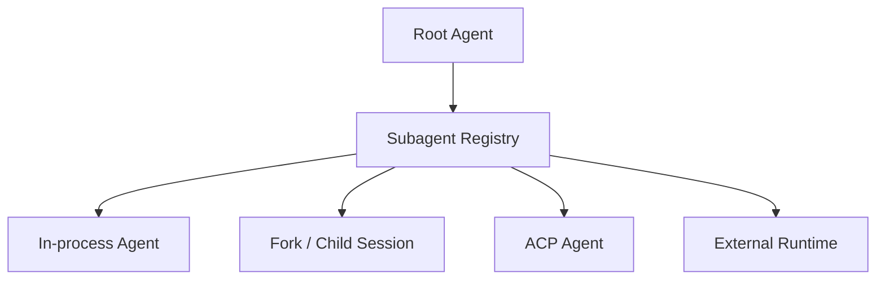
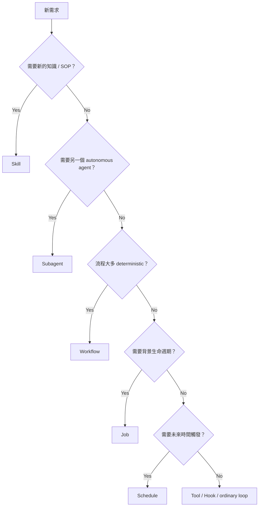

# Skills、Subagents、Workflows 與長生命週期工作

DeepSeek Harness 的擴充不只是一個泛稱「Plugin」。對 Model 可見的工作能力已經被拆成多個不同語意的 subsystem：

```text
Skill
Subagent
Workflow
Job
Schedule
Goal / Feedback
```

理解這些差異，可以避免把所有需求都塞回 Agent Loop。

## Skill：按需知識與 SOP

Skill 的核心是 progressive disclosure：

```text
先提供 catalog / summary
→ Agent 判斷相關
→ 再載入完整 Skill definition
```

這讓大量 SOP 不需要永久佔據每個 Step 的 context。

Skill provider 也可以替換，所以 discovery 不必只綁某個本地目錄。

## Subagent：把工作委派給另一個 Agent Runtime

DeepSeek 的 Subagent 是 provider registry，而不是只允許「同 process clone 自己」。



因此 delegation 可以跨 Harness / runtime boundary。

重要問題是：

```text
parent 傳哪些 context？
child 擁有哪些 tools？
結果怎麼回收？
child lifecycle 誰負責 teardown？
background job 如何觀察？
```

## Workflow：不是另一個 Agent

如果工作本身是相對固定的流程，不一定要再建立一個會自由推理的 Agent。

```text
Subagent
→ delegated autonomous reasoning

Workflow
→ explicit workflow engine / worker
```

例如：

```text
checkout repo
→ run scanner
→ parse report
→ create structured result
```

這類 deterministic sequence 可以由 Workflow 承擔，避免浪費 Model round trips。

## Jobs：長時間背景工作

Agent Turn 不一定適合持有所有長生命週期 task。

Jobs 可以提供：

```text
start
status
cancel
collect result
lifecycle / ownership
```

讓背景工作成為正式 runtime object，而不是偷偷留一個 Promise 或 process handle 在 memory。

## Schedule / Goal / Feedback

這些 subsystem 顯示 DeepSeek 的 scope 已經超過一次性 coding loop。

可以把它們分成：

| 能力 | 主要責任 |
|---|---|
| Schedule | 何時重新觸發工作 |
| Goal | 同一 Session 中持續存在的 objective |
| Feedback | 把外部評價 / correction 回饋到 agent lifecycle |
| Jobs | 泛用背景工作 |
| Workflow | 明確流程引擎 |

不要把它們都叫「Agent 自己再跑一次」。

## 什麼時候用哪一種？



## Delegation 與 Context Ownership

Subagent 最容易出錯的地方不是「開幾個 Agent」，而是 context duplication。

不應該預設：

```text
Root 的全部 Session
→ 複製給每個 child
```

更好的設計是傳遞：

```text
明確 work packet
essential constraints
必要 evidence / locator
expected output contract
```

然後 child 自己取得需要的 repository facts。

這也讓 multi-agent orchestration 不會因 context multiplication 成本爆炸。

## Workflow 與 Code Mode 的邊界

兩者都可以減少 Model round trips，但層次不同。

### Code Mode

Model 在當前 Step 產生一段受控 TypeScript，組合多個 tool operations。

### Workflow

Runtime 有獨立 workflow engine，可以承擔更明確、可重用、可能跨較長時間的流程。

```text
Code Mode = model-generated local orchestration
Workflow  = runtime-owned reusable process
```

## Production 要關心 Ownership

每個長生命週期 object 都要知道：

```text
誰建立？
誰取消？
誰持有 handle？
Session 結束後是否還能活著？
Plugin unload 時怎麼 teardown？
結果如何 durable？
```

Cordis reversible effects 與 AgentHandle / Job lifecycle 的價值，就在避免 background work 變成無主資源。

## 本章重點

1. **Skill、Subagent、Workflow、Job 是不同 abstraction，不應混成 Plugin。**
2. **Subagent provider 可以跨 runtime，不一定只是 clone 同一個 Agent。**
3. **Deterministic 流程優先考慮 Workflow，而不是每一步都交回 Model。**
4. **長生命週期工作必須有 ownership / cancellation / teardown model。**
5. **Multi-agent 的核心成本之一是 Context 與 State ownership，不只是 Agent 數量。**

## 官方來源

- [Skills subsystem](https://github.com/deepseek-ai/deepseek-harness/blob/master/docs/subsystems/skills.md)
- [Subagent subsystem](https://github.com/deepseek-ai/deepseek-harness/blob/master/docs/subsystems/subagent.md)
- [Workflow subsystem](https://github.com/deepseek-ai/deepseek-harness/blob/master/docs/subsystems/workflow.md)
- [`packages/README.md`](https://github.com/deepseek-ai/deepseek-harness/blob/master/packages/README.md)
