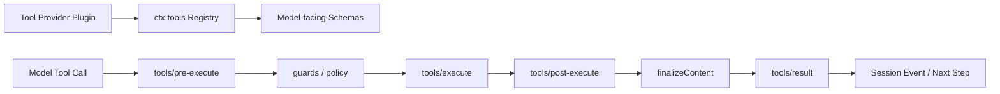
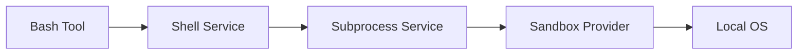
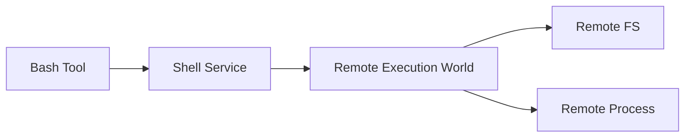
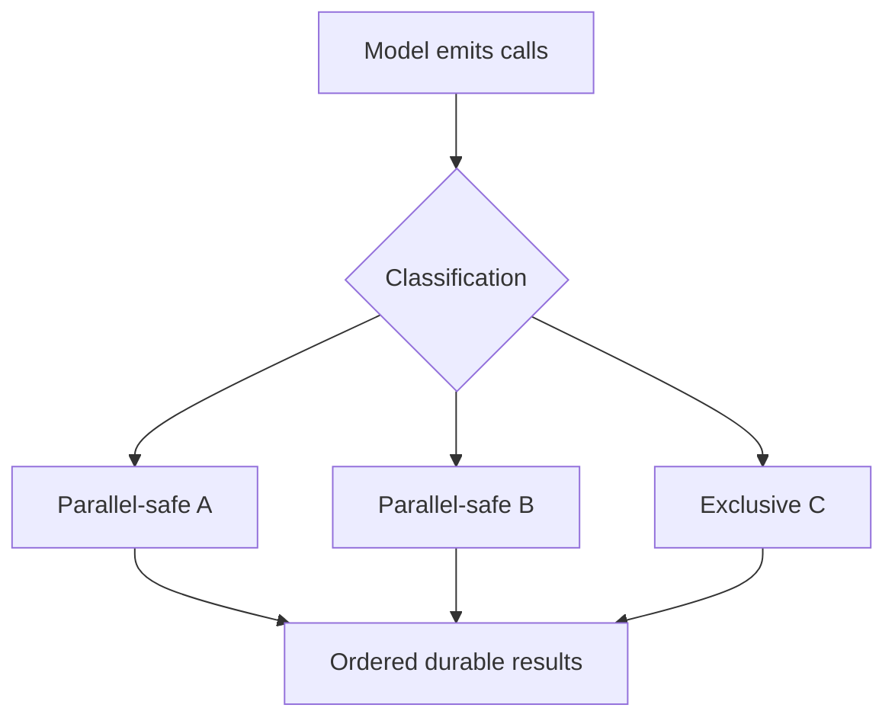
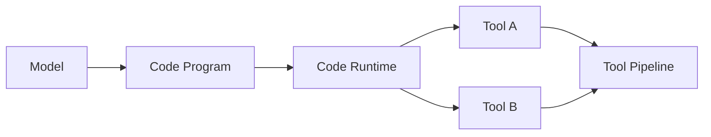

# Tool Execution：Registry、Guard、Sandbox 與 Result Pipeline

DeepSeek Harness 的 Tool 並不是「Agent Loop 裡的一個 switch-case」。Tool Registry、policy interception、executor、sandbox、result finalization 都有各自的 boundary。

## Tool 從註冊到執行



這條 pipeline 很重要，因為「Tool 能被 Model 看見」和「Tool 真正造成 side effect」是兩件事。

## Registry：Model 可以看到什麼？

Tool provider 把 definitions 註冊到 `ctx.tools`。

Definition 至少需要表達：

```text
name
purpose
input schema
execution behavior
result rendering / finalization
```

Model-facing schema 是 capability exposure；真正 executor 可以再依賴更底層 service，例如 filesystem、subprocess、shell 或 remote execution backend。

## `tools/pre-execute`：執行前攔截

這是加入 policy、approval、classification 的主要位置之一。

典型問題：

```text
這個 call 是否允許？
需要 approval 嗎？
它可以平行嗎？
要用哪個 sandbox mode？
是否要改寫或拒絕參數？
```

因此 permission 不需要硬寫進每一個 Tool implementation。

## Guard：Owner Policy 應該 Monotonic

`ctx.tools.guard()` 適合做不可被較低層放寬的限制。

可以把它理解成：

```text
上層 owner 說「最多只能到 workspace-write」
↓
下層 plugin 可以更嚴格
↓
不能偷偷改成 danger-full-access
```

這種 monotonic policy 對 plugin-first runtime 很重要，否則較晚 mount 的 plugin 可能無意間擴權。

## `tools/execute`：真正的 Capability Boundary

Tool implementation 不一定自己直接呼叫 Node API。

例如 Bash tool 可以是：



也可以在另一個 composition 中變成：



所以 Model-facing tool 可以不變，但真正 execution world 已被替換。

## `tools/post-execute` 與 Result Finalization

Tool 執行成功，不代表原始 return value 就應直接塞進 Model context。

Post-execution 可以處理：

- policy decision；
- normalization；
- truncation；
- metadata；
- telemetry；
- model-facing content finalization。

最後 `tools/result` 才形成完整 observation。

這對巨大 logs 或 structured result 特別重要。

## Tool Result 為什麼要 Durable？

如果某個 Tool Result 已被下一輪 Model 看見，它就影響了 trajectory。

因此 DeepSeek 的 event-sourced 原則要求：

> **Model-visible durable facts 必須能從 Session Log 重建。**

所以 Tool Call / Result 不只是 UI log；它們也是 resume / replay correctness 的一部分。

## Parallel Tool Calls

DeepSeek Agent Loop 可以平行執行被分類為 safe 的 calls，但 exclusive calls 會形成 barrier。



真正要維持的是：

```text
concurrent dispatch
≠
nondeterministic history
```

## Native Tool Calling 與 Code Mode 共用 Tool Boundary

Code Mode 看起來像另一套系統：Model 產生 TypeScript program，一次呼叫多個 bindings。

但底層 Tool operation 仍然應走同一組 capability / policy boundary。



所以 Code Mode 不應成為繞過 approval / guard / sandbox 的捷徑。

## MCP 在這裡扮演什麼角色？

MCP Server 可以被 Plugin 發現後，將其 tools 註冊進 `ctx.tools`。

```text
MCP Server
→ MCP Plugin
→ ctx.tools
→ normal tool execution pipeline
```

這讓 MCP 不需要成為 Agent Loop 的特殊分支。

## 新增一個 Tool 時應該先問什麼？

1. Model-facing schema 是什麼？
2. 這是 read、write、process、network 還是 destructive capability？
3. 哪個 service 真正執行 side effect？
4. 是否需要 approval？
5. 是否能 parallel？
6. result 要怎麼 truncate / render？
7. 哪些 facts 必須 durable？
8. 如何在 test environment 換成 fake provider？

這八題比「在哪個檔案寫 function」更重要。

## 本章重點

1. **Tool Registry 與 Tool Execution 是不同責任。**
2. **pre-execute / guard / execute / post-execute / result 形成完整 policy pipeline。**
3. **Tool 可以依賴 Shell / FS / Sandbox 等 capability seam，而不是直接碰 OS。**
4. **Code Mode 仍應走相同的 Tool security boundary。**
5. **Tool Call / Result 是 trajectory state，不只是 console output。**

## 官方來源

- [Tools subsystem](https://github.com/deepseek-ai/deepseek-harness/blob/master/docs/subsystems/tools.md)
- [Extension cookbook](https://github.com/deepseek-ai/deepseek-harness/blob/master/docs/cookbook/extension-cookbook.md)
- [Sandbox subsystem](https://github.com/deepseek-ai/deepseek-harness/blob/master/docs/subsystems/sandbox.md)
