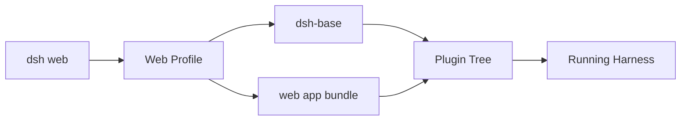
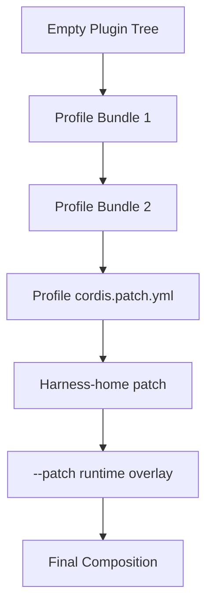
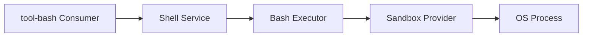

# 使用方式：Profiles、Bundles 與啟動組合

前面講的是 DeepSeek Harness 的架構思想，這一章回答更實際的問題：

> **一個 `dsh` 到底是怎麼被啟動成「某一種 Agent」的？**

DeepSeek 的答案不是「binary 裡寫死一套功能」，而是：

```text
Profile
+ Bundles
+ cordis.patch.yml
+ optional runtime patch
= 實際 boot 的 Plugin Tree
```

## 先看最簡單的啟動方式

官方目前提供的 Quick Start 之一是：

```bash
npx @deepseek-ai/dsh web
```

概念上這不是「開啟唯一的 DeepSeek Harness」，而是選擇一個產品 surface / composition。

可以先把它想成：



## 官方 Web UI 實際長什麼樣？

DeepSeek Harness 官方文件本身就附有 Web UI 截圖。這張是 **設定 → 模型** 頁面，可以直接看到 DeepSeek Provider 卡片，以及「新增提供方 / 新增自訂提供方」入口：


*官方原始素材：[`docs/user/guide/providers-models-page.zh.png`](https://github.com/deepseek-ai/deepseek-harness/blob/b150a551b8d465e31e418e1b2eaf5e79bbb7d28e/docs/user/guide/providers-models-page.zh.png)，由官方中文 [模型設定指南](https://github.com/deepseek-ai/deepseek-harness/blob/b150a551b8d465e31e418e1b2eaf5e79bbb7d28e/docs/user/guide/providers.zh.md) 使用；來源 repository 採 MIT License。*

這張圖很適合拿來對照前面講的「Model Adapter 是 composition component」：使用者看到的是 Provider / Model 設定介面，但底層對應的是 `ctx.llm` 與各種 adapter/provider 組合，而不是把 DeepSeek Model 寫死在 Harness 裡。

官方也提供 **自訂 Provider** 的實際表單：


*官方原始素材：[`docs/user/guide/providers-custom-form.zh.png`](https://github.com/deepseek-ai/deepseek-harness/blob/b150a551b8d465e31e418e1b2eaf5e79bbb7d28e/docs/user/guide/providers-custom-form.zh.png)。畫面中的 Provider ID、API 地址、協議與憑據欄位，正好把「custom LLM provider」從抽象架構落到實際產品 UX。*

因此後面讀 Profile / Bundle 時要記得：DeepSeek Harness 的 composability 並不只存在原始碼或 Mermaid 圖裡，它也會被投影成使用者真正操作的 Web UI。

## Profile 是什麼？

Profile 是一個**具名的 Harness 組合**。

它決定：

- 疊哪些 bundles；
- 額外安裝哪些 out-of-tree plugins；
- 使用者自己的 `cordis.patch.yml`；
- 最後 boot 出哪一棵 plugin tree。

官方架構文件目前以 `web` 與 `headless` 作為代表性的 profile template。

### Web

適合互動式 browser UI。

可以理解成：

```text
dsh-base
+ web host/client
+ interaction surfaces
+ runtime services
```

### Headless

適合一次性、無 Web Server 的執行方式。

```text
dsh-base
+ headless runner
```

它比較接近 automation / non-interactive use case。

## Bundle 是什麼？

Bundle 不是單一 capability，而是**一組 Cordis config rows 的發行單位**。

例如 `dsh-base` 會把 Agent 常用基礎能力一次組進來：

```text
model adapters
agent loop
session / persistence
tools
shell / fs
sandbox / approval
settings / credentials
telemetry
subagent providers
```

這和 Codex 的 config 心智模型很不一樣。

Codex 比較像：

```text
既有 Runtime
+ config 選項
+ extension surfaces
```

DeepSeek 則更像：

```text
empty composition
+ bundle A
+ bundle B
+ patches
= Runtime
```

## Composition 的覆寫順序

官方架構目前把層次描述成：



越後面的 layer 可以覆寫前面的 row。

這有點像 config precedence，但要注意：

> 它覆寫的不只是「設定值」，而可能是在改**Plugin Composition**。

## `--dump-config` 是最重要的 Debug 工具之一

如果你在讀 DeepSeek Harness，最值得記住的指令不是一堆 flags，而是：

```bash
dsh --profile web --dump-config
```

它回答：

> **我現在這個 profile 實際會 boot 哪些 plugin？每個 row 的 config 是什麼？**

這對 troubleshooting 很重要，因為同一套 source code 可以被不同 profile 組成非常不同的 runtime。

### 常見 Debug 思路

如果某個 Tool 沒出現，不要只問：

```text
這個 package 有沒有安裝？
```

要問：

```text
這個 package 有沒有被目前 profile mount？
它需要的 Service Provider 有沒有存在？
它的 row 是否被後面的 patch disable / replace？
```

## Profile 和 Agent Preset 不完全一樣

容易混淆的地方是：

```text
Profile
Agent Preset
Permission Preset
```

它們解決不同層次。

### Profile

決定**整個 Harness process / product surface 的 plugin composition**。

### Agent Preset

決定某個 Agent / Session 應採用哪一組 agent-level composition 或行為組合。

### Permission Preset

把：

```text
Sandbox Mode
+
Approval Policy
```

組成使用者看得懂的權限選項。

因此不要把三種 preset 都當成「設定檔別名」。

## 使用 DeepSeek 時要習慣先問「我 boot 的是哪一棵 Tree？」

Codex 使用者常見心智模型：

```text
Codex Runtime 在這裡
→ 我調 config
→ 我加 Skill / MCP / Hook
```

DeepSeek 更應該想成：

```text
有哪些 Plugins？
→ 哪些被這個 Profile 組進來？
→ 哪個 Provider 正在提供 capability？
→ 哪個 Consumer 把它暴露給 Model / UI？
```

## 一個具體例子：Shell

你看到 model 有 Bash tool，不代表背後只有一個 package。

概念上可能是：



換一個 profile / patch，可以把 provider 換掉，model-facing tool 不一定需要跟著重寫。

這就是 DeepSeek 的「composition-first」實務含義。

## 和 Codex `config.toml` 的差異

| 問題 | Codex | DeepSeek Harness |
|---|---|---|
| Runtime 中心 | 既有 Codex runtime | Plugin tree composition |
| 設定主要目的 | 調整 runtime 行為 | 同時可改 config 與 composition |
| 專案層覆寫 | `.codex/config.toml` 等 precedence | Profile / home / runtime patch layers |
| 查看最終組合 | 看有效 config / runtime | `--dump-config` 看完整 plugin tree |
| 換 backend | 依 extension point | 通常替換 provider row |

## 版本敏感提醒

DeepSeek Harness 仍處於 developer preview，所以：

- CLI command names；
- profile templates；
- package names；
- patch schema

都可能演進。

比較穩定、值得記的是：

```text
Profile = named composition
Bundle = reusable composition layer
Patch = later override layer
Dump Config = inspect actual boot tree
```

## 本章重點

1. **DeepSeek Harness 不是只有一套固定 runtime；不同 Profile 可以 boot 出不同 composition。**
2. **Bundle 是 Plugin Composition 的發行單位，不只是設定集合。**
3. **`--dump-config` 是理解實際 runtime 最重要的工具之一。**
4. **Profile、Agent Preset、Permission Preset 是三個不同層次。**
5. **Troubleshooting 時要追 Plugin → Service → Provider → Consumer，而不是只看 package 是否存在。**

## 官方來源

- [DeepSeek Harness](https://deepseek.com/harness/en/)
- [官方 Web UI 模型設定指南](https://github.com/deepseek-ai/deepseek-harness/blob/b150a551b8d465e31e418e1b2eaf5e79bbb7d28e/docs/user/guide/providers.zh.md)
- [Architecture：Profiles and bundles](https://github.com/deepseek-ai/deepseek-harness/blob/master/docs/architecture.md)
- [`dsh-base`](https://github.com/deepseek-ai/deepseek-harness/blob/master/packages/bundle/base/README.md)
- [`packages/README.md`](https://github.com/deepseek-ai/deepseek-harness/blob/master/packages/README.md)
