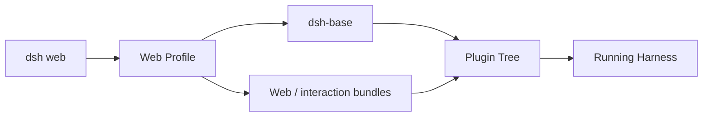
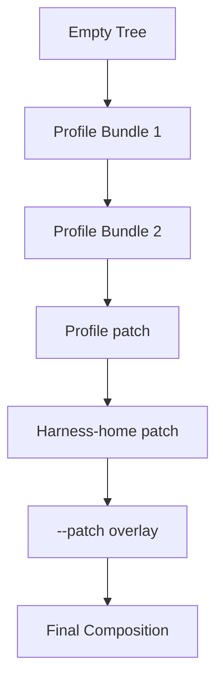
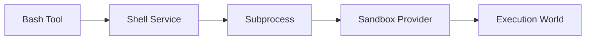

# 使用方式：Profiles、Bundles 與啟動組合

這一章回答一個最實際的問題：

> **一個 `dsh` process 到底是怎麼被啟動成某一種 Agent Runtime？**

DeepSeek Harness 的答案是：

```text
Profile
+ Bundles
+ cordis.patch.yml
+ optional runtime patch
= 實際 boot 的 Plugin Tree
```

## Quick Start

官方目前可用：

```bash
npx @deepseek-ai/dsh web
```

這會啟動 Web-oriented composition，而不是唯一固定 runtime。



## 官方 Web UI

DeepSeek 官方文件提供 Model / Provider 設定畫面：


*官方原始素材：[`providers-models-page.zh.png`](https://github.com/deepseek-ai/deepseek-harness/blob/b150a551b8d465e31e418e1b2eaf5e79bbb7d28e/docs/user/guide/providers-models-page.zh.png)，來源 repository 採 MIT License。*

自訂 Provider 也有正式 UI：


*官方原始素材：[`providers-custom-form.zh.png`](https://github.com/deepseek-ai/deepseek-harness/blob/b150a551b8d465e31e418e1b2eaf5e79bbb7d28e/docs/user/guide/providers-custom-form.zh.png)。*

這兩張圖很適合把「Model Adapter 是 composition component」從架構抽象拉回真實產品 UX。

## Profile

Profile 是**具名的 Harness composition**。

它決定：

- 疊哪些 bundles；
- 額外加入哪些 plugins；
- 使用哪些 patch；
- 最後 boot 出哪一棵 plugin tree。

代表性 profile 包含：

```text
web
headless
```

也可以建立 company / benchmark / specialized profile。

## Bundle

Bundle 是一組 reusable composition rows 的發行單位。

例如 base bundle 可以一次組入：

```text
model adapters
agent loop
sessions / persistence
tools
shell / filesystem
sandbox / approval
settings / credentials
telemetry
subagent providers
```

Bundle 解的是「一組 Runtime capability 如何一起發行」，不是單一 feature toggle。

## Composition Precedence



越後面的 layer 可以覆寫前面的 row。

這與一般 config precedence 的差異是：**被覆寫的可能是 Provider / Plugin composition 本身。**

## `--dump-config`

最值得記住的 debug command：

```bash
dsh --profile web --dump-config
```

它回答：

> **當前 profile 真正會 mount 哪些 Plugin，以及它們的 effective config 是什麼？**

遇到 Tool / Service 不存在時，debug 順序應是：

```text
Plugin row 存在？
→ dependency satisfy？
→ provider mount？
→ 是否被後層 patch replace / disable？
→ consumer 是否拿到 service？
```

## Profile、Agent Preset、Permission Preset

三者解決不同層次：

### Profile

整個 Harness process / product surface 的 composition。

### Agent-level configuration / preset

某個 Agent / Session 的 provider、model、cwd、behavior 等 runtime choice。

### Permission Preset

把 sandbox mode + approval policy 組成產品級權限選項。

不要把三者都當成 config alias。

## Shell 例子

Model 看見一個 Bash Tool，底層可能是：



換 profile / provider 後，Model-facing Tool 可以不變，但真正 execution backend 已經不同。

## 版本敏感內容怎麼學？

Developer Preview 階段，CLI flag / package name / schema 可能變。

更值得記住的穩定模型是：

```text
Profile = named composition
Bundle = reusable composition layer
Patch = later override
Dump Config = inspect actual boot tree
```

## 本章重點

1. **DeepSeek Harness 的 runtime 是 composition 結果，不是一個固定功能集合。**
2. **Profile 決定整體產品 / process composition。**
3. **Bundle 是 reusable runtime capability layer。**
4. **Patch 可以替換 composition，不只是改 scalar config。**
5. **Troubleshooting 應從 `--dump-config` 與 Provider graph 開始。**

## 官方來源

- [DeepSeek Harness](https://deepseek.com/harness/en/)
- [官方 Provider Guide](https://github.com/deepseek-ai/deepseek-harness/blob/b150a551b8d465e31e418e1b2eaf5e79bbb7d28e/docs/user/guide/providers.zh.md)
- [Architecture](https://github.com/deepseek-ai/deepseek-harness/blob/master/docs/architecture.md)
- [`dsh-base`](https://github.com/deepseek-ai/deepseek-harness/blob/master/packages/bundle/base/README.md)
