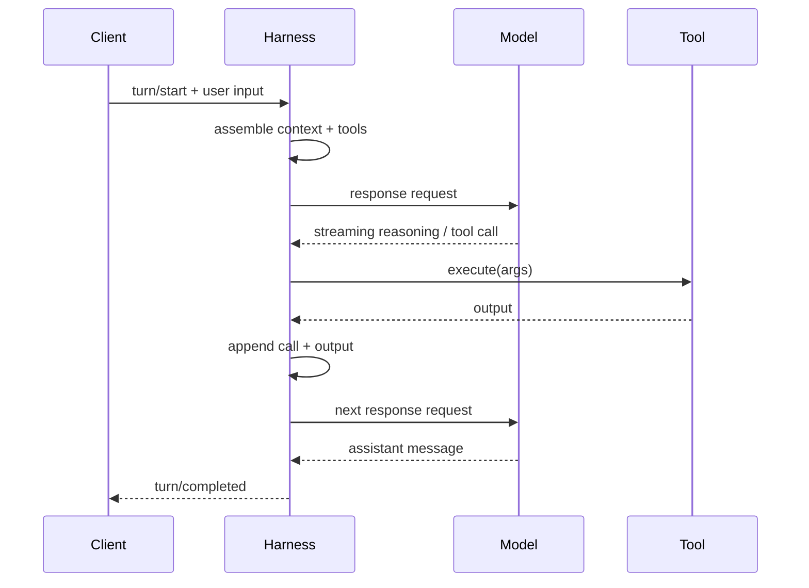

# Agent Loop：一次 Turn 到底怎麼跑

Codex 最值得理解的不是某個 prompt，而是 **agent loop**。只要掌握這個 loop，你就能推導出工具、sandbox、MCP、events、history、compaction 為什麼存在。

## 第一輪：組 Prompt

一個簡化版的輸入可以想成：

```text
instructions = model/base instructions
input = [
  developer: sandbox + approval + project policy,
  developer: optional developer instructions,
  user: AGENTS.md + skill inventory / instructions,
  user: environment context,
  ...history,
  user: current request
]
tools = [shell, apply_patch, ..., MCP tools]
```

實際欄位與訊息型態會依 provider / feature 演進，但設計目標很穩定：**在模型開始推理前，harness 先把操作環境描述完整**。

## 第二輪：呼叫 Model Provider

Codex 主要透過 Responses-style API 取得串流事件。不同登入/Provider 可以指向不同 endpoint；harness 的工作是把 provider 差異包起來，對上層維持一致的 turn 語意。



## Tool call 不是 Turn 的終點

這是理解 agent 的第一個關鍵。模型可能回：

```json
{
  "type": "function_call",
  "name": "shell",
  "arguments": {"command": "npm test"}
}
```

Harness 會：

1. 驗證 tool 與 arguments。
2. 套用 sandbox / rule / approval。
3. 執行工具。
4. 收集 stdout/stderr、exit code 或 structured result。
5. 把「call + result」變成新的 context item。
6. 再次呼叫模型。

所以「一次 user message」可以包含十幾次甚至更多 model/tool 往返。

## 為什麼 Context 常採 append-only

OpenAI 的 agent-loop 說明特別強調一個效能特性：每一輪盡量保留前一輪 request 的**精確前綴**，只在尾端追加新 event。這讓 provider 端比較容易命中 prompt caching。

```text
Round 1: [A B C D]
Round 2: [A B C D E F]
Round 3: [A B C D E F G H]
                   ^ 只追加
```

如果 harness 每次都重新排序或改寫前面 context：

```text
Round 2: [A C B D E F]
```

即使語意接近，也可能破壞 prefix cache。這也是為什麼 production harness 的 context builder 應該追求**穩定、增量、可預測**。

## 何時停止？

簡化來說，當模型產生「正常 assistant message 且沒有待執行 tool call」時，當前 turn 可以完成。實際 runtime 還會處理：

- queued / steered input；
- interruption / cancellation；
- tool error 與 retry；
- context compaction；
- required MCP failure；
- background process lifecycle；
- subagent completion。

目前 `codex-core` 的 regular task 甚至會在完成一次 `run_turn` 後檢查是否有 pending input；如果有，就在同一個 task lifecycle 內繼續處理。

## Agent loop 的三種 Failure

### Model failure

rate limit、connection reset、provider unavailable、invalid response。適合 transport/API retry，但必須注意重送的副作用。

### Tool failure

command exit non-zero、MCP timeout、file conflict。通常把 error 作為 tool result 交回模型，讓模型有機會修正。

### Policy failure

命令被 rule 阻擋、permission 不足、approval 被拒。這不是「工具壞掉」，而是 harness 對 action 的合法否決；應把原因明確回饋模型。

## 最小可用 Harness 偽碼

```ts
async function runTurn(state, userInput) {
  state.append(userInput)

  while (true) {
    const request = buildRequest(state)
    const response = await streamModel(request)
    const actions = collectActions(response)

    if (actions.length === 0) {
      state.commit(response.finalMessage)
      return response.finalMessage
    }

    for (const action of actions) {
      const decision = await authorize(action, state.policy)
      const result = decision.allowed
        ? await execute(action)
        : {error: decision.reason}

      state.append(action)
      state.append(result)
    }
  }
}
```

後面的整套 Codex 架構，可以視為把這段偽碼的每一行做到 production-grade。

## 延伸閱讀

- [Unrolling the Codex agent loop](https://openai.com/index/unrolling-the-codex-agent-loop/)
- [`codex-rs/core/src/tasks/regular.rs`](https://github.com/openai/codex/blob/main/codex-rs/core/src/tasks/regular.rs)
