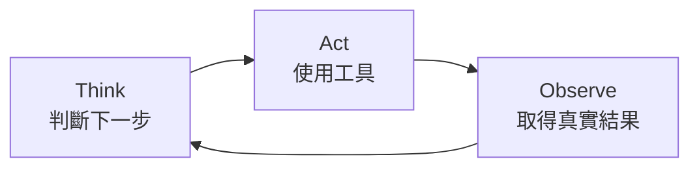
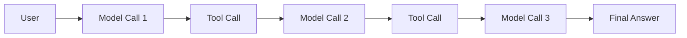
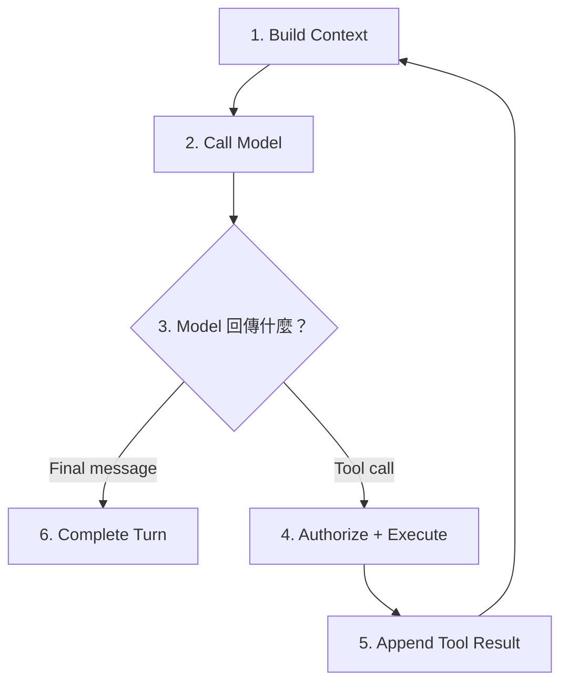
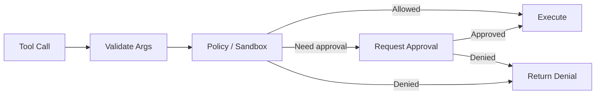
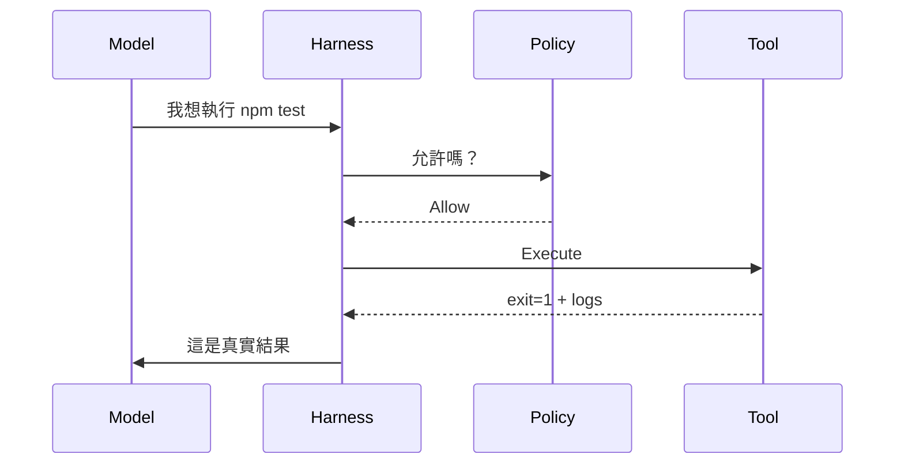
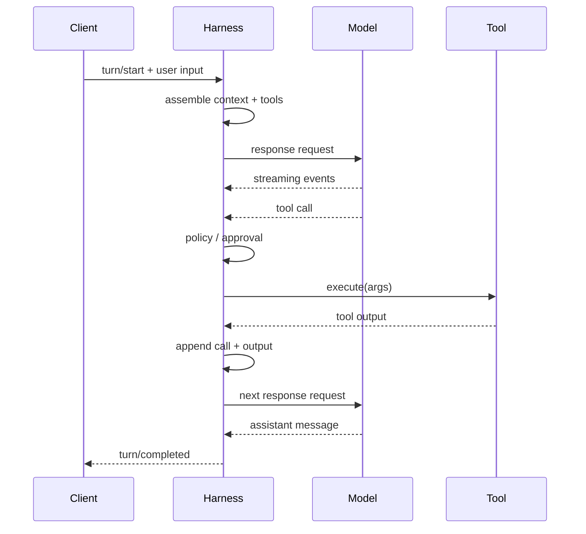
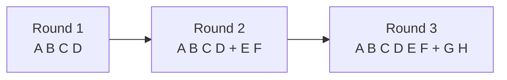
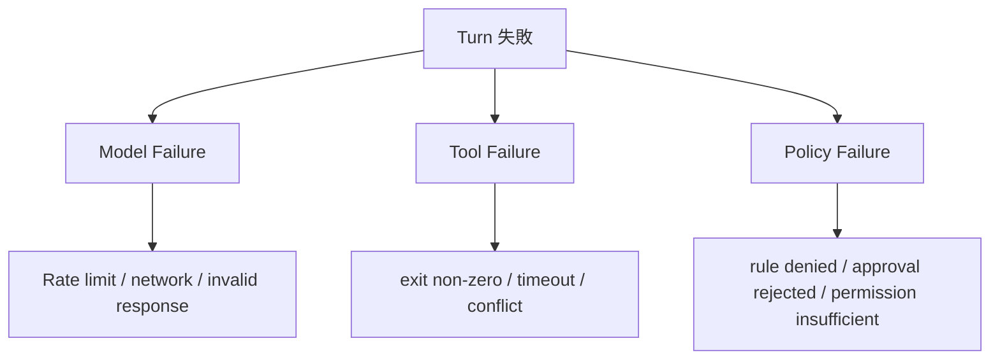
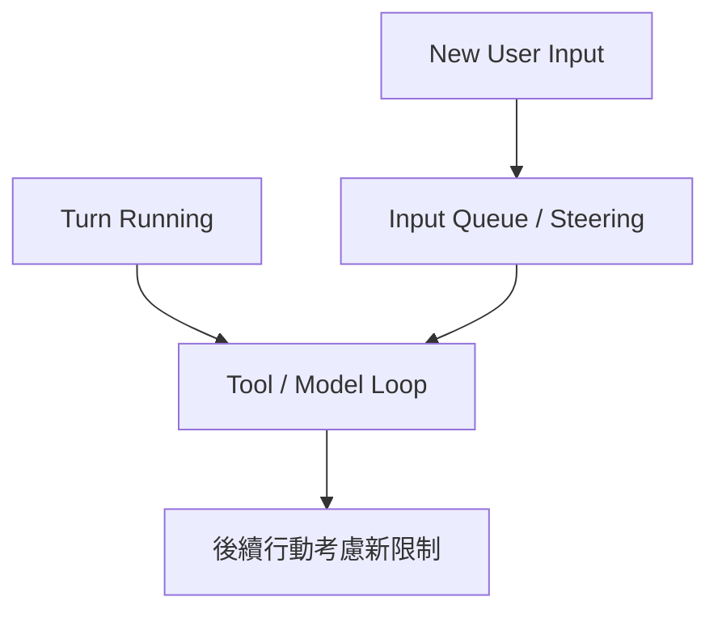

# Agent Loop：一次 Turn 到底怎麼跑

如果 Harness 是 Codex 的控制中心，那 **Agent Loop 就是控制中心反覆執行的主流程**。

先不要想 API。最簡單的版本只有三步：



只要任務還沒完成，這個循環就繼續。

## 用「修一個 Bug」理解 Agent Loop

假設你說：

> 登入一直失敗，幫我找原因並修好。

Codex 可能實際做的是：

```text
Think   → 先找登入入口
Act     → 搜尋 login / auth
Observe → 找到 src/auth/login.ts

Think   → 讀這個檔案
Act     → read file
Observe → 發現 expiry 計算可疑

Think   → 找相關測試
Act     → search + run tests
Observe → 測試重現錯誤

Think   → 修改邏輯
Act     → apply patch
Observe → 修改成功

Think   → 驗證
Act     → npm test
Observe → tests passed

Think   → 任務完成
Act     → 回覆使用者
```

Model 沒有一次知道所有答案，而是在**真實結果回來後重新判斷**。

這就是 Agent 和普通聊天模型最大的差別之一。

## 一次 User Message 不等於一次 Model Call

這點非常重要。

很多人會直覺認為：

```text
User → Model → Answer
```

Coding agent 更接近：



所以：

> **一個 Turn 可以包含很多次 Model Call 與 Tool Call。**

## 正式一點：Harness 每輪做什麼？

可以拆成六個步驟。



### 1. Build Context

Harness 先組出模型這一輪能看到的世界：

```text
Instructions
+ Project guidance
+ AGENTS.md
+ Skill metadata
+ Tool schemas
+ Environment context
+ History
+ Current user input
```

### 2. Call Model

Harness 把 context 與 tools 送給 model provider。

### 3. Model 決定下一步

Model 可能回：

- 一段最終回答；
- 一個 shell tool call；
- 一個 file read；
- 一個 MCP call；
- 其他可用 action。

### 4. Authorize + Execute

如果是 tool call，Harness 先檢查：



然後才真的執行。

### 5. Append Tool Result

執行結果會變成新的 context item。

例如：

```text
Tool call: npm test
Tool result:
  exit_code: 1
  stderr: expected 200, received 401
```

Model 下一輪才會看到這個真實結果。

### 6. Complete Turn

當 Model 回傳正常 assistant message，且沒有待執行 action，這個 turn 才結束。

## Tool Call 只是「行動提案」

模型可能輸出：

```json
{
  "type": "function_call",
  "name": "shell",
  "arguments": {"command": "npm test"}
}
```

這不代表 `npm test` 已經跑了。

真正流程是：



這也是為什麼 Harness 是安全邊界的一部分。

## Codex 的完整 Turn 長什麼樣？

接近實際 runtime 的概念流程：



## 為什麼 Context 常是 Append-only？

假設第一輪 context 是：

```text
[A B C D]
```

工具結果回來後，最理想的下一輪是：

```text
[A B C D E F]
```

再下一輪：

```text
[A B C D E F G H]
```



前面穩定、後面追加，有利於 prompt caching。

如果 Harness 每輪都重新排序：

```text
[A C B D E F]
```

即使意思相近，也可能讓 prefix cache 失效。

所以 Context Builder 的工程目標通常是：

- deterministic；
- stable prefix；
- append new events；
- 必要時才 compact。

## 三種常見 Failure，不要混在一起



### Model failure

例如：

- rate limit；
- connection reset；
- provider unavailable。

通常是 transport / provider 層問題。

### Tool failure

例如：

- test exit code 1；
- MCP timeout；
- file conflict。

很多時候應把 error 當成 observation 再交回 Model，讓它修正。

### Policy failure

例如：

- command 被禁止；
- network 不允許；
- approval 被拒絕。

這不是 Tool 壞掉，而是系統**刻意不讓 action 發生**。

## Steering：Agent 工作到一半，你又補充一句

假設 Codex 正在修改程式時，你說：

> 先不要改 DB schema。

成熟 Harness 不能假設「只有 Agent 停下來後 User 才會說話」。

概念上會變成：



所以 coding agent 更接近一個**持續協調的 runtime**，不只是 chatbot request-response。

## 最小可用 Harness 偽碼

看懂概念後，再看程式就容易很多：

```ts
async function runTurn(state, userInput) {
  state.append(userInput)

  while (true) {
    const request = buildRequest(state)
    const response = await streamModel(request)
    const actions = collectActions(response)

    if (actions.length === 0) {
      state.commit(response.finalMessage)
      return response.finalMessage
    }

    for (const action of actions) {
      const decision = await authorize(action, state.policy)
      const result = decision.allowed
        ? await execute(action)
        : {error: decision.reason}

      state.append(action)
      state.append(result)
    }
  }
}
```

後面的整套 Codex 架構，可以理解成：

> **把這段簡單 loop 的每一行，都做成 production-grade。**

## 常見誤解

### 誤解 1：一個 Turn 就是一個 API Request

不是。一個 Turn 可以有很多輪 model/tool 往返。

### 誤解 2：Tool Call 就代表 Tool 成功

不是。Tool 可能被拒絕、失敗、timeout。

### 誤解 3：Model 自己知道 Tool 執行結果

不知道。Harness 必須把 result 放回 context。

### 誤解 4：Agent Loop 只是 while(true)

Demo 是；production 還要處理 permission、streaming、state、cancel、retry、queue、compaction 等問題。

## 本章只要記住

1. **Agent 核心循環是 Think → Act → Observe。**
2. **一個 Turn 可以包含很多次 Model Call。**
3. **Tool Call 是提案，Harness 才負責執行。**
4. **Tool Result 必須回到下一輪 Context。**
5. **Codex Harness 的大部分架構，都是在讓這個 Loop 更可靠。**

下一章會回答：每一輪送給 Model 的「Context」到底是怎麼組成的？

## 延伸閱讀

- [Unrolling the Codex agent loop](https://openai.com/index/unrolling-the-codex-agent-loop/)
- [`codex-rs/core/src/tasks/regular.rs`](https://github.com/openai/codex/blob/main/codex-rs/core/src/tasks/regular.rs)
