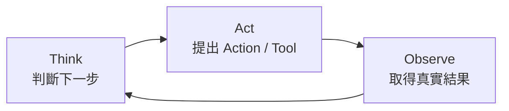
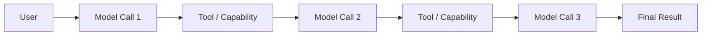
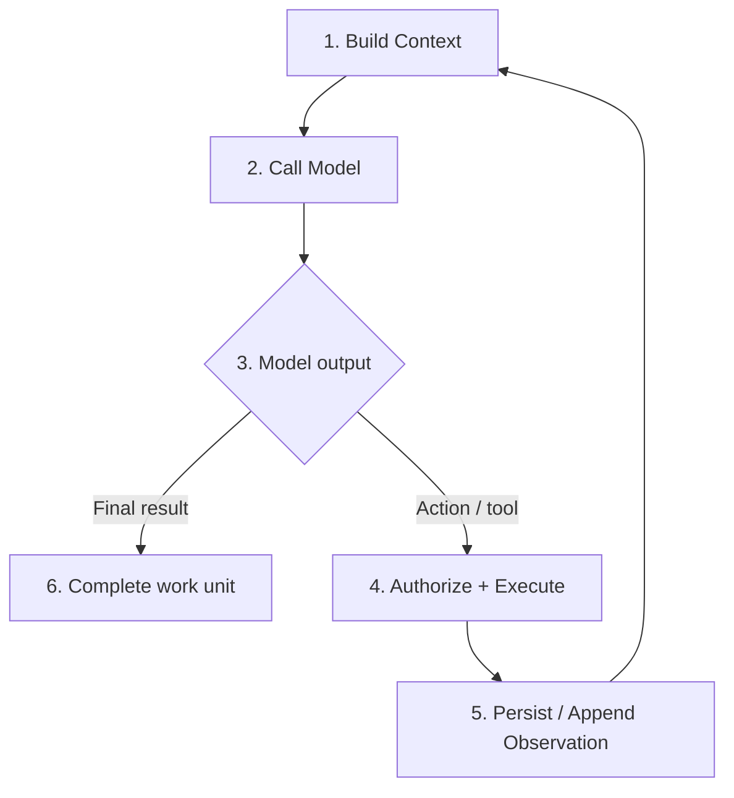
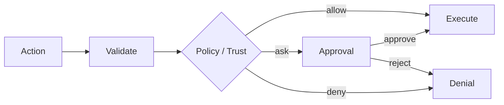
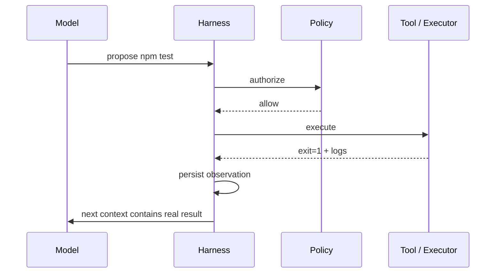
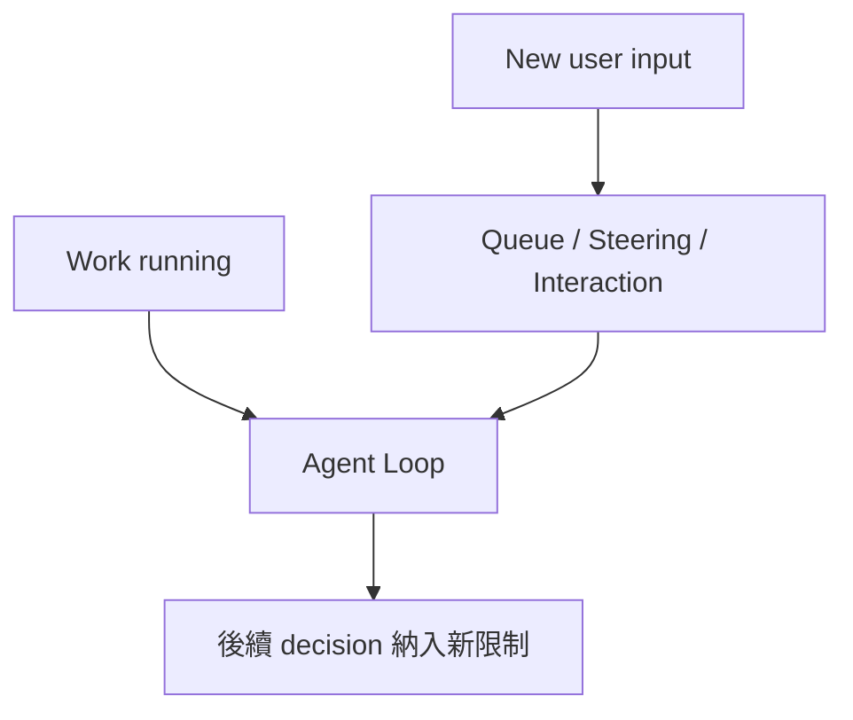
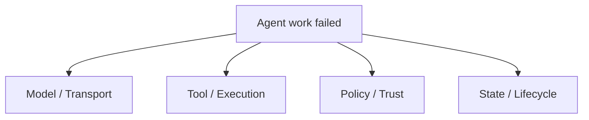

# Agent Loop：一次任務到底怎麼跑

如果 Harness 是控制中心，**Agent Loop 就是控制中心反覆執行的主流程**。

最簡單的版本只有三步：



只要任務還沒完成，這個循環就會繼續。

這個模型不屬於 Codex、DeepSeek Harness 或 Pi 任一套產品；三套系統真正不同的是：**誰擁有 loop、每輪的 boundary 怎麼定義、結果如何保存、哪些步驟可以被替換。**

## 用「修一個 Bug」理解 Agent Loop

假設你說：

> 登入一直失敗，幫我找原因並修好。

一個 coding agent 可能實際做的是：

```text
Think   → 先找登入入口
Act     → 搜尋 login / auth
Observe → 找到 src/auth/login.ts

Think   → 讀這個檔案
Act     → read
Observe → 發現 expiry 計算可疑

Think   → 找相關測試
Act     → search + test
Observe → 測試重現錯誤

Think   → 修改邏輯
Act     → edit / patch
Observe → 修改成功

Think   → 驗證
Act     → run tests
Observe → tests passed

Think   → 任務完成
Act     → 回覆使用者
```

Model 不是一次知道所有答案，而是在**新的 observation 回來後重新決策**。

## 一次 User Request 通常不等於一次 Model Call



因此更精確的說法是：

> **一次使用者工作單位，可以包含多次 Model Request、Tool Execution 與 State Update。**

至於這個工作單位叫 Turn、Session interval、還是其他名稱，要看 Harness 的資料模型。

## Harness 每一輪至少做六件事



### 1. Build Context

組出這一輪 Model 可見的 world snapshot：

```text
instructions
project / runtime guidance
tool schemas
selected history
current user input
runtime context
```

### 2. Call Model

透過 model provider / adapter 發出 request，並處理 streaming、usage、error、cancel。

### 3. Interpret Model Output

Model 可能產生：

- 最終文字；
- tool call；
- 多個 tool calls；
- structured output；
- reasoning / intermediate events。

### 4. Authorize + Execute

Action 不會因為 Model 產生了它就自動執行。



### 5. Persist / Append Observation

執行結果要回到 Harness state，之後才能被下一輪 context 使用。

例如：

```text
Action: npm test
Observation:
  exit_code: 1
  stderr: expected 200, received 401
```

### 6. Complete Work Unit

當沒有更多待執行工作、或 lifecycle 進入 completed / failed / cancelled，這次工作才真正結束。

## Tool Call 是「提案」，不是現實



這一層分離是安全、retry、audit、remote execution 的基礎。

## 三套 Harness 如何落實同一個 Loop？

### Codex：Loop 位於產品化 Runtime 中心

可以先用：

```text
Thread
→ Turn
→ model / tool 往返
→ Items / state updates
→ Turn completed
```

理解。

Codex 的重點是把 loop 和 tool execution、sandbox、approval、repository workflow、client events 深度整合成 production coding runtime。

### DeepSeek Harness：Loop 本身就是 Capability Seam

DeepSeek 明確把：

```text
Turn
→ Step
→ model request
→ tool calls
→ SessionEvents
```

做成 lifecycle vocabulary。

其中：

```text
Step = 一次 model request + 該 request 產生的 tool calls
```

而 `agent-loop` 本身可作為 service / plugin 被替換。這讓「保持其他 capability 不變，只換 loop」成為一級架構實驗。

### Pi：低階 Agent Loop + 高階 AgentSession

Pi 把責任分成兩層：

```text
pi-agent-core Agent
→ model / tool iteration

AgentSession
→ session、resources、extensions、compaction、UI / lifecycle
```

所以 loop 不必同時擁有所有 coding-agent product behavior；很多高階行為由 `AgentSession` 與 Extension Runtime 補上。

## 一張三方 Loop 對照

| 問題 | Codex | DeepSeek Harness | Pi |
|---|---|---|---|
| Loop 中心 | `codex-core` runtime | `agent-loop` service | `pi-agent-core` Agent |
| 高階 lifecycle | Thread / Turn / Items | Session / Turn / Step / Events | AgentSession / Session Entries |
| Loop 可替換性 | 有限、產品語意較固定 | 明確 capability seam | 可直接使用低階 Agent，也可在 Session / Extension 層改行為 |
| Tool policy | 深度接 sandbox / approval | tool events / guards / approval / sandbox providers | extension interception + tool implementation + external boundary |
| State append | runtime / thread state | durable SessionEvent log | JSONL Session Entry Tree |

不要把這張表理解成誰比較先進；它是在回答：**loop responsibility 被放在哪一層。**

## Context 為什麼常希望穩定成長？

如果 provider 支援 prefix caching，常見的有效策略是讓穩定內容維持 deterministic，新的 observations 往後追加：

```text
Round 1: [A B C D]
Round 2: [A B C D E F]
Round 3: [A B C D E F G H]
```

但「append-only」不是所有 Harness 的唯一資料模型。

- Codex 會管理 runtime history / compaction；
- DeepSeek 從 SessionEvent derive model-visible projection；
- Pi 從目前 branch 的 Session Entries 建 context，並可插入 compaction / branch summary。

真正不變的原則是：

> **Persisted history 與 Model 這一輪看到的 projection，不必是同一份資料結構。**

## Steering / Concurrent Input

成熟 Agent 不能假設只有「問一句、等完全做完、再問下一句」。



不同 Harness 的介面不同，但設計問題相同：

- 新輸入何時生效？
- 正在跑的 tool 要不要取消？
- 新 restriction 是否要寫入 durable state？
- client 如何知道目前狀態？

## 三類 Failure 不要混在一起



### Model / Transport Failure

例如 rate limit、provider unavailable、stream invalid。

### Tool / Execution Failure

例如 test exit 1、process timeout、file conflict。

很多時候這類 failure 本身應成為 observation，讓 Model 決定下一步。

### Policy / Trust Failure

例如 action 被 deny、approval rejected、sandbox unavailable、project untrusted。

這是系統刻意阻止 side effect，不等於 tool implementation 壞掉。

### State / Lifecycle Failure

例如 durable event 不完整、resume 後 context 不一致、branch lineage 損壞。

這類問題通常不是 prompt 可以修的。

## 最小 Harness 偽碼

```ts
async function runWork(state, input) {
  state.appendInput(input)

  while (!state.done) {
    const context = buildContext(state)
    const response = await callModel(context, state.tools)

    if (response.actions.length === 0) {
      state.complete(response.output)
      break
    }

    for (const action of response.actions) {
      const decision = await authorize(action, state)
      const observation = decision.allowed
        ? await execute(action)
        : {error: decision.reason}

      state.appendAction(action)
      state.appendObservation(observation)
    }
  }
}
```

Codex、DeepSeek、Pi 都可以被抽象回這段 loop；真正值得學的是它們如何把每一行拆成不同的 production boundary。

## 本章只要記住

1. **Agent Loop 是 Think → Act → Observe 的反覆協調。**
2. **一次工作通常包含多次 Model Call。**
3. **Action 是 proposal；Harness 才執行並產生 observation。**
4. **Codex 把 loop 放在產品化 runtime 中心；DeepSeek 把 loop 做成 capability seam；Pi 把低階 loop 與高階 AgentSession 分層。**
5. **Persisted state 與每輪 Model context 是兩個不同責任。**

下一章看每一輪真正送到 Model 面前的資料：[Context、Caching 與 Compaction](./context-and-caching.md)。

## 官方延伸閱讀

- [OpenAI：Unrolling the Codex agent loop](https://openai.com/index/unrolling-the-codex-agent-loop/)
- [DeepSeek Harness Agent Loop package](https://github.com/deepseek-ai/deepseek-harness/blob/master/packages/core/agent-loop/README.md)
- [Pi `pi-agent-core`](https://github.com/earendil-works/pi/tree/main/packages/agent)
