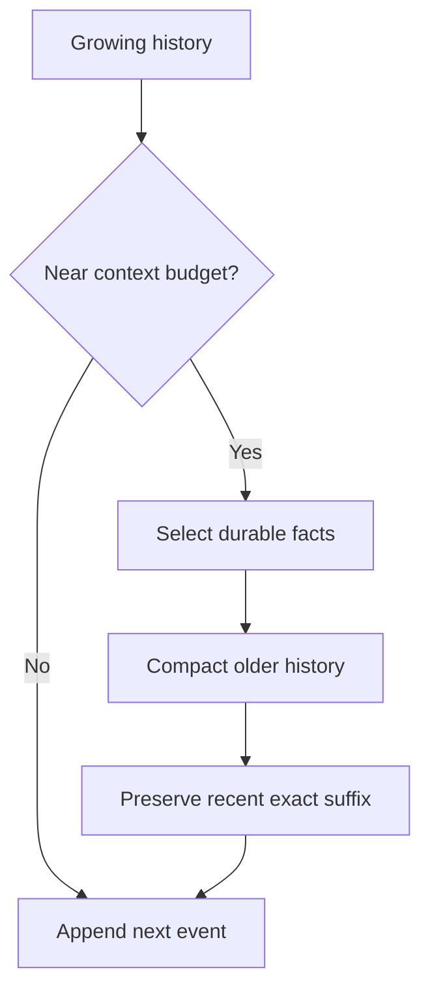

# Context、Instructions、Caching 與 Compaction

對 agent 而言，context 不是單純聊天紀錄，而是「當下世界模型」。Harness 的一項核心工作，就是把大量異質資訊轉成有限 context window 內的有效狀態。

## Context 的四種材料

### 穩定 instructions

模型級 base instructions、平台能力說明、安全/執行規則。它們應盡量穩定，因為是所有後續 request 的 prefix。

### 專案 instructions

AGENTS.md、project config 衍生資訊、開發慣例。它們的目標不是描述整個 repository，而是提供「模型無法從程式碼本身可靠推斷」的規則。

### 能力描述

Tool schemas、MCP tool metadata、Skills 的 name/description。這決定模型知道有哪些 action 可以選。

### 動態 history

User messages、reasoning items、tool calls、tool results、file edits、assistant messages。這是增長最快的一層。

## Instruction hierarchy 與「來源」是兩回事

使用 Codex 時常見錯誤，是把所有規則都塞進同一個 AGENTS.md。實際上應同時考慮：

- **語意優先權**：system / developer / user 等訊息角色。
- **檔案搜尋範圍**：global AGENTS、project root、nested directory。
- **config precedence**：CLI override、project config、profile、user config、system config。
- **policy enforcement**：rules / permissions 並不是靠模型「遵守文字」而已。

也就是說，一條「不要刪 production DB」若只寫在 prompt，是 advisory；若必須不可違反，應配合實際 permission / execution boundary。

## Prefix caching 的工程價值

對長任務，前綴可能包含大量 instructions、tools schema 與 history。若第 N 次 model call 可以重用前 N-1 次的完整前綴，成本與 latency 都更可控。

因此 context 的工程原則通常是：

1. Stable content 放前面。
2. Append new events，少改舊 event。
3. 不要無理由重新格式化 instructions。
4. tool schema 排序要 deterministic。
5. 真正需要重寫 history 時，才做 compaction。

## Compaction 不是普通 Summary

Context 快滿時，harness 必須把舊狀態壓縮。好的 compaction 要保存的是「後續決策所需狀態」，例如：

- user 的目標與硬性 constraints；
- 已讀過與已修改的關鍵檔案；
- 已驗證或已排除的假設；
- 尚未完成的工作；
- tool-side state 的必要 locator；
- 不能遺失的授權/安全脈絡。

而不是把對話寫成一篇漂亮摘要。

## Context pollution

常見污染來源：

- 工具一次回傳數萬行 log。
- 搜尋把大量不相關檔案全文塞進模型。
- Skill 一開始就把所有 reference 全載入。
- 每輪重複注入相同 repository description。
- 無限制保留 verbose reasoning/tool debug output。

這也是 Skills 採 **progressive disclosure** 的原因：初始 context 只放 name + description；需要時才載入完整 `SKILL.md` 與 references。

## 實務設計原則

### 小而穩定的 default context

預設 prompt 應該只包含每一輪都真的需要的資訊。

### Context 由事件增長，而不是由「重新描述狀態」增長

能保存結構化 item，就不要每次重新產生一段自然語言狀態。

### Tool output 必須可截斷

Harness 應知道 stdout 太長怎麼處理；最差的策略是把 10 MB log 原封不動交給模型。

### 「記住」與「可以重新取得」分開

Repository 原始碼可以再次 read；使用者剛剛批准的特殊動作或某次 tool 的 opaque identifier 可能不能。Context budget 應優先留不可重建狀態。

## 延伸閱讀

- [Agent loop engineering article](https://openai.com/index/unrolling-the-codex-agent-loop/)
- [`openai/codex` AGENTS.md](https://github.com/openai/codex/blob/main/AGENTS.md)
- [Skills](https://learn.chatgpt.com/docs/build-skills)
