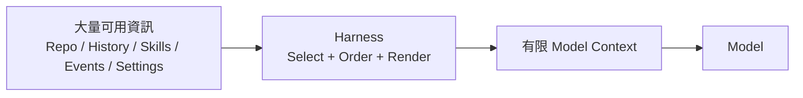
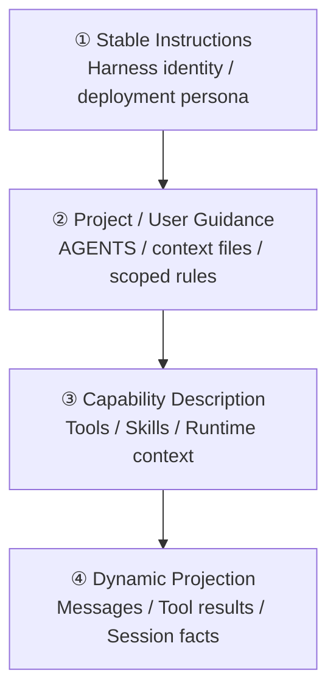
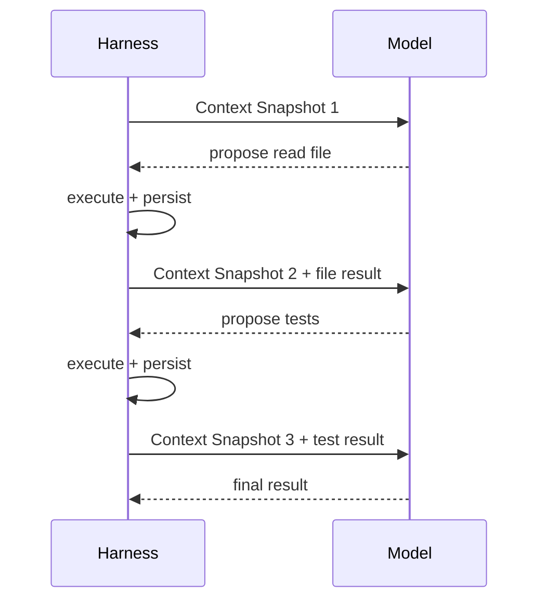
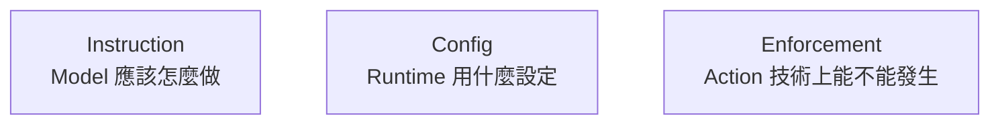
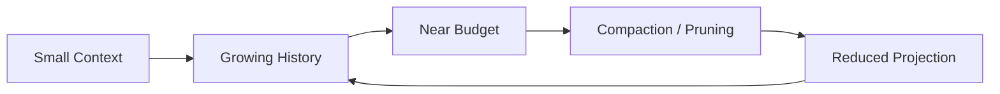

# Context、Instructions、Caching 與 Compaction

如果 Model 是大腦，**Context 就是它這一次 inference 真正看得到的工作桌**。

Model 不會永久記得整個 repository，也不會直接讀取 Harness 的全部 state。每一輪 Model Request 之前，Harness 都必須決定：

> **哪些資訊現在要被投影到 Model 面前？哪些資訊只需要留在 durable state？**

這就是 context orchestration。

## Context 像工作桌，不是整間倉庫



Agent 系統可能知道很多東西，但 Model 每一輪只應看到目前有用的 subset。

因此 Context 的品質不是：

```text
越多越好
```

而是：

```text
relevant
+ correctly ordered
+ stable where useful
+ recoverable
+ within budget
```

## Context 通常包含哪些層？

可以先用四層理解：



### 1. Stable Instructions

例如 Harness identity、產品級 instruction、deployment persona。

這一層通常希望相對穩定。

### 2. Project / User Guidance

例如：

- repository conventions；
- AGENTS.md / CLAUDE.md / context files；
- project-level persona / settings；
- task-specific constraints。

它們是 guidance，不應和真正的 OS enforcement 混淆。

### 3. Capability Description

讓 Model 知道現在能使用哪些能力：

```text
tool schemas
skill catalog
runtime bindings
subagent / workflow surface
```

不一定所有能力都要一次展開全文；progressive disclosure 往往更有效。

### 4. Dynamic Projection

從 durable state 與 live runtime 中投影出：

```text
user messages
assistant outputs
tool calls / results
selected events
summaries
current workspace context
```

這一層最容易快速長大。

## 一次 Model Call 看到的是 Snapshot



所以 Model 不需要「一直在線看著 Runtime」。Harness 每次重新建立一個足夠的 snapshot 即可。

## Durable State 與 Model Context 不要混為一談

這是理解三套 Harness 的關鍵。


Durable State 可能保留完整 trajectory，但 Model Context 可以只取：

- current branch；
- selected events；
- recent exact turns；
- compacted summary；
- relevant runtime context。

「有保存」不代表「每輪都要重新送給 Model」。

## 三套 Harness 如何擁有 Context？

### Codex：Runtime Context + Thread History

Codex 的 context orchestration 和 production agent loop 深度整合。

常見來源包括：

```text
base / developer instructions
AGENTS.md
skills metadata
tool schemas
thread / turn history
environment context
current user input
```

Codex 特別值得研究 stable prompt prefix、tool schema consistency、prompt caching 與 runtime compaction 如何互相影響。

### DeepSeek Harness：System Prompt Registry + Event Projection

DeepSeek 將 system prompt 組裝本身做成 service：

```text
ordered prompt sections
+ named variables
+ scoped runtime contexts
+ tool schemas
→ assembled once per Step
```

而 conversation state 來自 SessionEvents，再投影成 LLM message history。

所以它很適合用來理解：

> **Prompt contributor、durable event store、model-visible projection 可以是三個分離的 capability。**

DeepSeek 另外有 compaction capability family，包含 summarization backend 與 model-free tool-result pruning。

### Pi：ResourceLoader + Active Branch Context

Pi 的 context 來源很分層：

```text
AGENTS.md / CLAUDE.md
Skills
Prompt templates
Extension injection
System prompt override
Session branch
Compaction / branch summary
```

`ResourceLoader` 負責發現 project / global resources；`SessionManager` 則從目前 active branch 建立 session context。

因此 Pi 的重要問題是：

> **哪些內容應該是 resource，哪些應該是 durable session entry，哪些應該由 Extension 動態注入？**

## 三方 Context 對照

| 問題 | Codex | DeepSeek Harness | Pi |
|---|---|---|---|
| Guidance 來源 | AGENTS / Skills / config | prompt sections / contexts / Skills | context files / Skills / prompts |
| Durable history | Thread / rollout / state | SessionEvent log | JSONL Entry Tree |
| Model projection | runtime context builder | event projection + system-prompt assembly | active branch + ResourceLoader |
| Compaction | runtime-managed | compaction capability seam | durable compaction entries |
| Branch-specific knowledge | Thread / fork semantics | Session lineage / projections | branch summary + entry lineage |
| Runtime injection | runtime / extension surfaces | scoped prompt contributions / events | Extensions / ResourceLoader override |

## Instruction、Config、Enforcement 是不同東西



例如：

```text
不要刪 production database
```

放在 project guidance 裡，只是 instruction。

如果必須不可違反，就要再有：

```text
permission / approval
sandbox
credential boundary
external policy / execution isolation
```

不同 Harness 的 enforcement 位置可以不同，但文字 instruction 不能取代真正 boundary。

## Prompt Caching 為什麼是 Harness 問題？

Provider 是否支援 prompt caching 是 Model API 能力；但 Harness 決定 prompt 是否容易重用。

如果穩定部分保持 exact prefix：

```text
Round 1: [A B C D]
Round 2: [A B C D E F]
Round 3: [A B C D E F G H]
```

通常比每一輪任意重排：

```text
[A C B D ...]
```

更容易保留 prefix reuse。

因此 context builder 常會追求：

- deterministic ordering；
- stable tool schemas；
- stable instructions；
- append new observations where practical；
- 必要時才重寫或 compact。

但要注意：**cache-friendly layout 是工程策略，不等於 persisted state 必須是一條線性 append-only array。**

DeepSeek 可以從 event log derive projection；Pi 可以從 tree branch derive context；仍然可以在送到 Model 前產生穩定的 prompt ordering。

## Context 變長後怎麼辦？



好的 compaction 不只是聊天摘要，而是回答：

> **未來決策還需要哪些不可輕易重建的事實？**

應優先保留：

```text
user goal / constraints
important decisions
verified hypotheses
file changes / unresolved work
opaque identifiers
approval / trust context
branch knowledge that would otherwise disappear
```

可重新讀取的 repository source，通常不需要永久逐字塞在 context。

## 三套 Compaction 哲學

### Codex

重點在 production runtime 如何在長任務中維持可用 context、cache 與 state continuity。

### DeepSeek Harness

Compaction 是正式 capability family：summarization、token pressure、tool-result pruning 可以被 composition。

### Pi

有兩個容易混淆但不同的機制：

```text
Compaction
→ context 太長，壓縮較舊內容

Branch Summarization
→ 切離一條 session branch 時，保留該分支的重要知識
```

這和 Pi 的 tree session data model 直接相關。

## Context Pollution

常見來源：

```text
巨大 logs
無關檔案
把所有 Skills 一次載入
重複 repo 說明
過多 tool schemas
大量不再需要的 tool output
```

好的 Harness 會用：

- truncation；
- search / retrieval；
- progressive disclosure；
- tool-result pruning；
- compaction；
- durable locator；
- branch-aware projection

控制 context，而不是只依賴更大的 model context window。

## Context Builder 真正要最佳化什麼？

| 目標 | 意義 |
|---|---|
| Relevance | 現在真正有用 |
| Stability | 不無故改變 stable prefix |
| Ordering | deterministic、可預期 |
| Budget | token / latency / cost 可控 |
| Recoverability | 可重讀的資料不必永久佔位 |
| Durability | 不可輕易重建的 facts 不遺失 |
| Safety | secrets / untrusted content 有邊界 |
| Traceability | 知道某段 context 從哪裡來 |

## 本章只要記住

1. **Context 是 Model 這一次看得到的 projection，不等於 Harness 全部 state。**
2. **Stable ordering 可以改善 caching，但 state model 不必因此變成單一路徑。**
3. **Codex、DeepSeek、Pi 分別展示 Runtime-centric、event-projection、branch/resource-driven 的 Context 組裝方式。**
4. **Compaction 的目標是保存未來決策需要的 durable knowledge。**
5. **Instruction、Config、Enforcement 是不同責任。**

下一章直接比較三套 state/lifecycle 模型：[State Models 與 Lifecycle](./state-models-and-lifecycle.md)。

## 官方延伸閱讀

- [OpenAI：Unrolling the Codex agent loop](https://openai.com/index/unrolling-the-codex-agent-loop/)
- [DeepSeek `system-prompt`](https://github.com/deepseek-ai/deepseek-harness/blob/master/packages/core/system-prompt/README.md)
- [DeepSeek `compaction`](https://github.com/deepseek-ai/deepseek-harness/blob/master/packages/compaction/README.md)
- [Pi Compaction & Branch Summarization](https://pi.dev/docs/latest/compaction)
