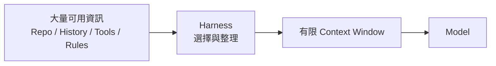
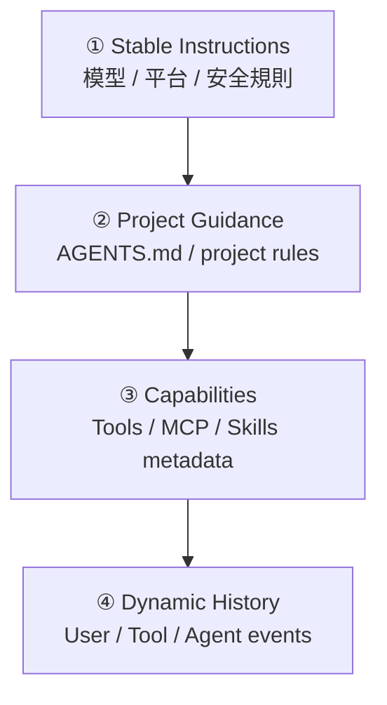
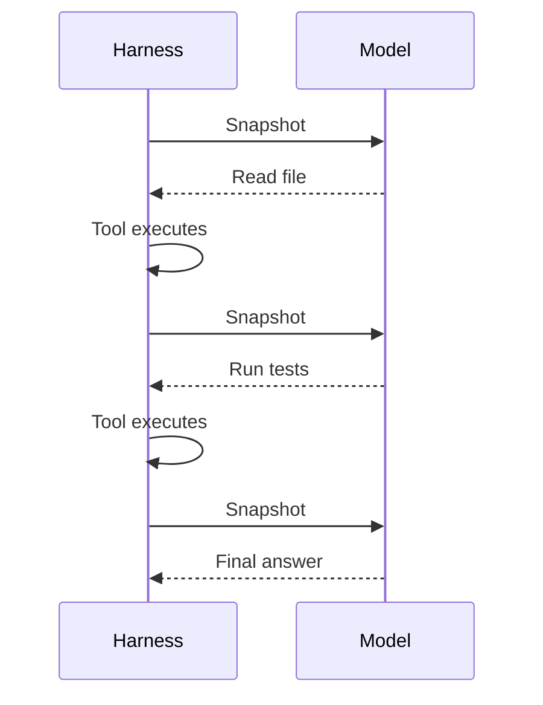
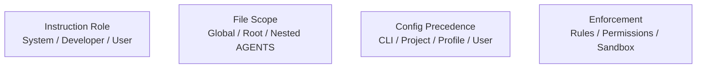
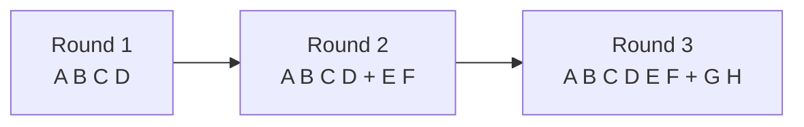
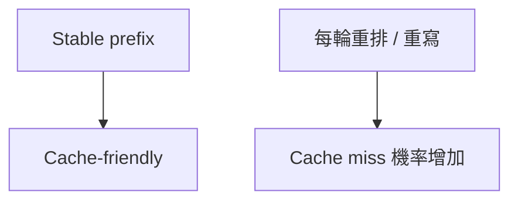
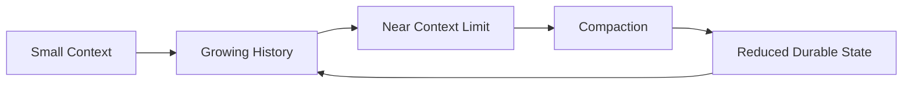
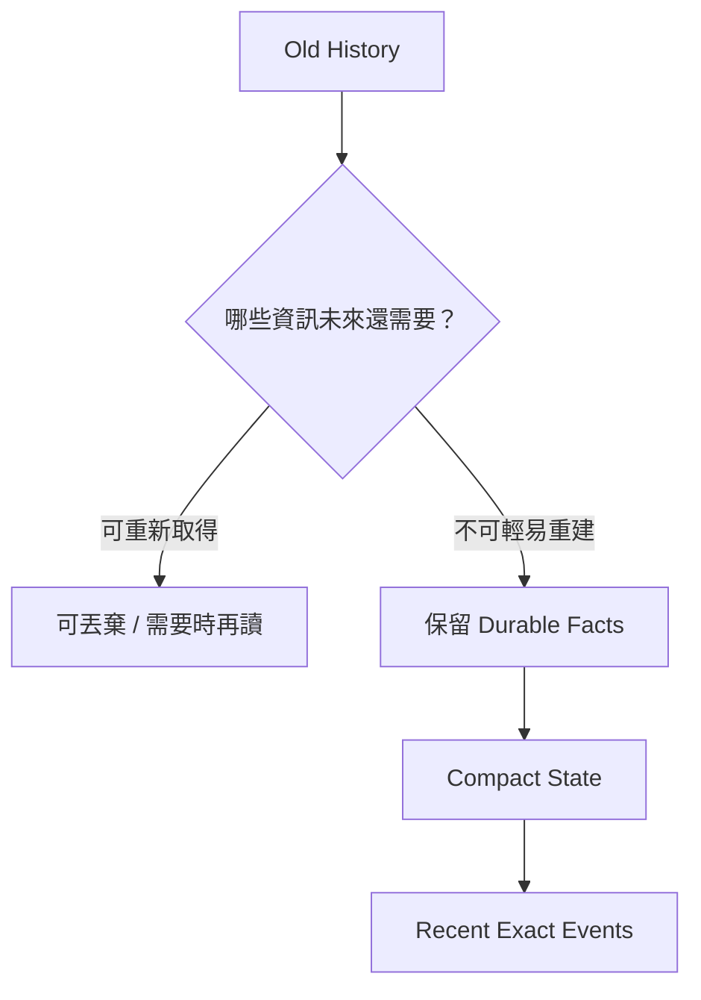
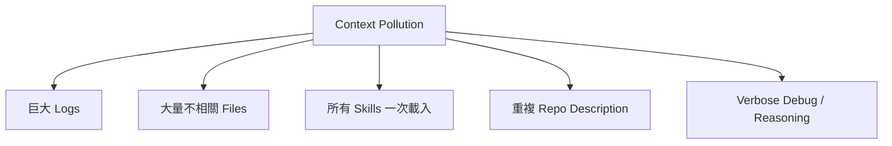
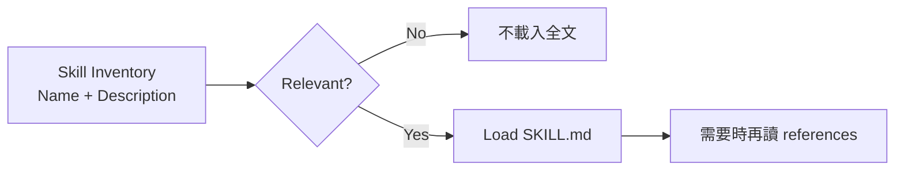

# Context、Instructions、Caching 與 Compaction

如果 Model 是大腦，那 **Context 就是它此刻桌面上能看到的全部資料**。

Model 不會自動知道整個 repository，也不會永久記得前面所有事情。Harness 每一輪都要決定：

> **這次到底要把哪些資訊放到 Model 面前？**

這就是 context orchestration。

## 初學者版：Context 像工作桌，不是整間倉庫

想像你在修一台機器。

倉庫裡可能有：

- 幾萬個零件；
- 幾百本手冊；
- 過去所有維修紀錄；
- 各種工具。

但你不會把整個倉庫全部搬到工作桌上。

你只會放：

- 這次維修的目標；
- 相關手冊；
- 現在正在拆的零件；
- 需要的工具；
- 剛剛測量出的結果。

Agent 的 context 也是一樣。



**Context 的目標不是越多越好，而是「現在最有用的資訊」越完整越好。**

## Context 通常由哪些東西組成？

可以先分成四層。



### 1. Stable instructions

幾乎每輪都需要，例如：

- base instructions；
- 平台能力說明；
- 安全與執行規則。

這些通常放在前面，並且盡量穩定。

### 2. Project guidance

例如：

- AGENTS.md；
- repository conventions；
- 專案特定限制。

它們提供「從程式碼本身不一定看得出來」的規則。

### 3. Capabilities

讓 Model 知道自己有哪些 action 可以選：

- shell tool schema；
- file tools；
- MCP tools；
- Skill name / description。

### 4. Dynamic history

任務跑起來後持續增加：

- user messages；
- tool calls；
- tool results；
- file edits；
- agent messages；
- reasoning / events。

這一層通常是最容易把 context 撐大的地方。

## 一次 Model Call 看到的是「Context Snapshot」

不要把 Model 想成一直在線、一直看著你的電腦。

比較接近：



每一次 inference，Harness 都要重新提供 Model 所需的世界狀態。

## Instruction hierarchy 和「資訊來源」不要混在一起

這裡有四個不同概念，很容易混淆。



它們回答的是不同問題：

- **Instruction role**：語意上誰優先？
- **File scope**：哪個目錄下應套用哪份 guidance？
- **Config precedence**：多份設定衝突時誰覆蓋誰？
- **Enforcement**：某件事是真的做不到，還是只有文字叫 Model 不要做？

例如：

```text
「不要刪 production DB」
```

如果只寫在 AGENTS.md，它仍主要是 instruction。

如果這件事必須不可違反，就要再搭配真正的 permission / execution boundary。

## Prompt Caching 為什麼和 Harness 有關？

假設第一輪 context 是：

```text
[A B C D]
```

第二輪只是追加新的 tool call / result：

```text
[A B C D E F]
```

第三輪：

```text
[A B C D E F G H]
```



前綴保持完全一致時，provider 比較容易重用 prefix cache。

所以 Harness 不只在乎「內容意思差不多」，還在乎：

- 順序是否穩定；
- 格式是否穩定；
- tool schema 是否 deterministic；
- 是否只追加新的 events。

## 為什麼「每輪重新整理成漂亮摘要」可能反而不好？

假設上一輪是：

```text
[A B C D]
```

下一輪 Harness 自作聰明改成：

```text
[A C B D]
```

語意可能沒有差很多，但 exact prefix 已經變了。



所以 production context builder 通常追求：

1. Stable content 放前面。
2. 新 event 往尾端 append。
3. 不要無理由重寫舊內容。
4. Tool schema 排序 deterministic。
5. 真正需要時才 compaction。

## Context 會一直長，怎麼辦？

Agent 每讀一個檔案、跑一個命令、得到一段 log，history 都可能變長。

Eventually：



這就是 compaction 出現的原因。

## Compaction 不是「聊天摘要」

好的 compaction 不是把歷史改寫成一篇漂亮文章。

它要保留的是：

> **未來做正確決策還需要哪些狀態？**

例如：

- User 的真正目標；
- 不可違反的 constraints；
- 已驗證的假設；
- 已排除的方向；
- 已修改哪些檔案；
- 尚未完成的工作；
- 重要 tool identifier；
- 不能遺失的授權脈絡。



## 「可以重新取得」和「必須記住」要分開

這是很實用的 context budget 原則。

### 可以重新取得

例如：

- repository 原始碼；
- package.json；
- 某個公開文件。

需要時可以再讀。

### 不容易重新取得

例如：

- User 剛剛新增的限制；
- 某次 approval 的脈絡；
- tool 回傳的 opaque ID；
- 已經驗證過的複雜推論結果。

這些更值得留在 durable state。

## Context Pollution：資訊太多也會讓 Agent 變差

常見污染來源：



### 例子：10 MB Log

最差做法：

```text
把整份 log 原封不動送進 Model
```

較好的 Harness 會：

- 截斷；
- 摘取 error vicinity；
- 保存 locator；
- 讓 Model 需要時再查。

### 例子：Skills

如果有 30 個 Skills，不代表一開始就把 30 份 `SKILL.md` 全部放進 context。

更好的策略是 progressive disclosure：



## Context Builder 真正要最佳化什麼？

不是只有 token 數量。

好的 Context Builder 同時追求：

| 目標 | 意義 |
|---|---|
| Relevance | Model 看到的是現在真的有用的資訊 |
| Stability | Stable prefix 不無故改變 |
| Ordering | 重要資訊順序 deterministic |
| Budget | 不超出合理 context 成本 |
| Recoverability | 可重建的資訊不用永久佔位 |
| Safety | Secret / sensitive data 不亂進 context |

## 常見誤解

### 誤解 1：Context 越大越好

不是。無關資訊也會增加成本與干擾。

### 誤解 2：Model 會永久記得前一輪

不是。Harness 必須把必要 history / state 帶進下一輪。

### 誤解 3：Compaction 就是摘要整段聊天

不是。它是 durable state compression。

### 誤解 4：Caching 只是 Model Provider 的事

不是。Harness 如何排列 context，會直接影響 cache 是否容易命中。

## 本章只要記住

1. **Context 是 Model 此刻能看到的工作桌。**
2. **Harness 決定什麼資訊要放上工作桌。**
3. **Stable prefix + append-only events 有利於 caching。**
4. **Context 太長時要 compact，但要保存未來決策需要的狀態。**
5. **資訊不是越多越好，relevance 比 volume 更重要。**

下一章會把 history 裡的基本資料模型拆成 [Thread、Turn、Item](./thread-turn-item.md)。

## 延伸閱讀

- [Agent loop engineering article](https://openai.com/index/unrolling-the-codex-agent-loop/)
- [`openai/codex` AGENTS.md](https://github.com/openai/codex/blob/main/AGENTS.md)
- [Skills](https://learn.chatgpt.com/docs/build-skills)
