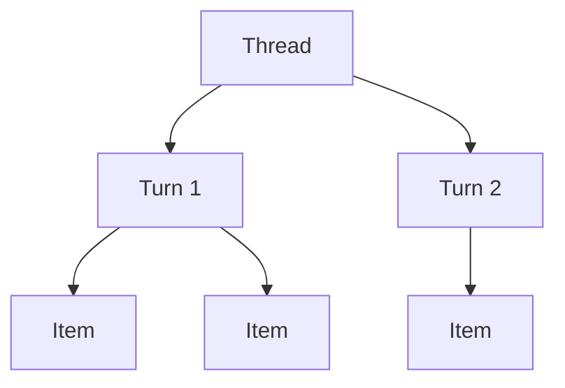
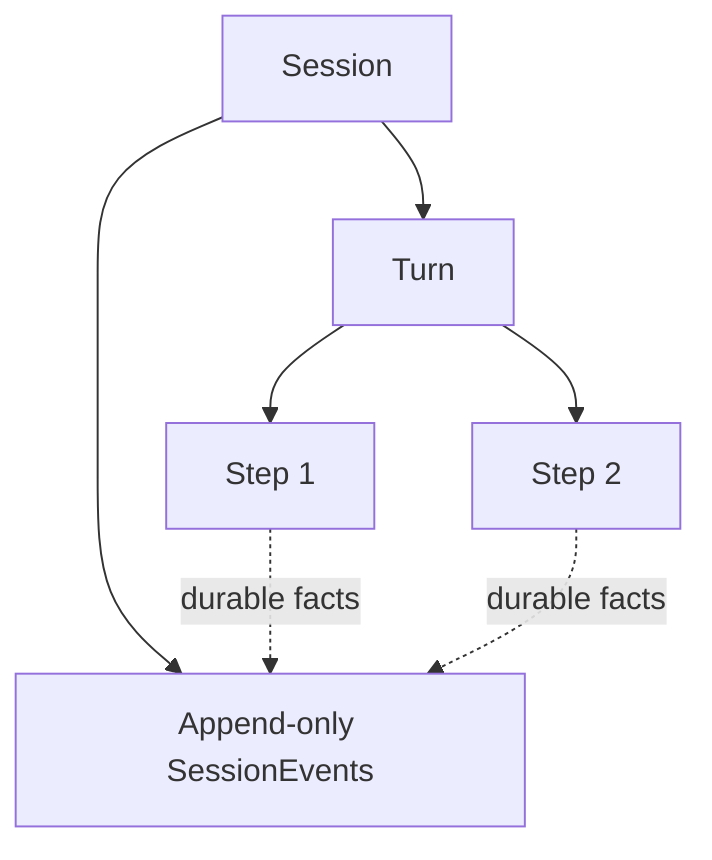
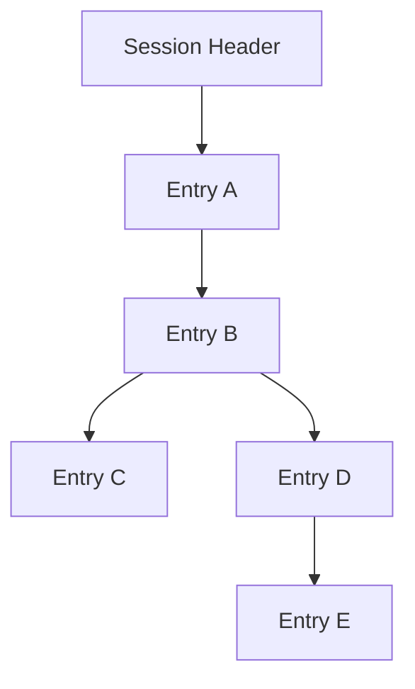
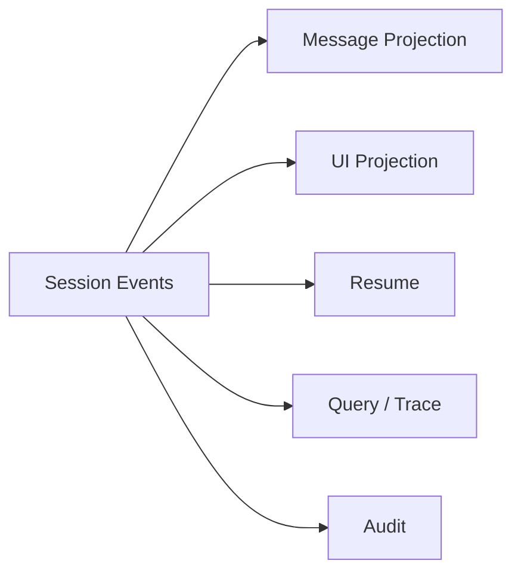
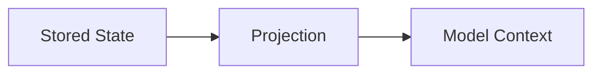

# State Models 與 Lifecycle：三套 Harness 怎麼記住工作

Agent 如果只能完成一次無狀態 function call，就很難稱為完整工作系統。

Production Harness 至少要回答：

```text
這段工作如何被識別？
一次任務從哪裡開始、在哪裡結束？
Tool / Model 活動怎麼記錄？
怎麼 resume？
怎麼 fork / branch？
哪些資料要 durable？
Model 下一輪看到的 context 怎麼從 state 重建？
```

Codex、DeepSeek Harness、Pi 在這題給了三個非常值得並讀的答案。

## 先看三種資料模型

### Codex：Thread → Turn → Item



直覺上：

```text
Thread = 一整段可延續工作
Turn   = 一次 user request 到完成 / 失敗 / 中斷
Item   = Turn 內可被產品呈現的細粒度 activity
```

這個模型非常適合 Rich Client：UI 可以自然顯示 message、reasoning、shell、file edit、MCP invocation 等活動。

### DeepSeek Harness：Session → Turn → Step → SessionEvent



核心思想是：

> **Durable state 以 append-only events 為 source of truth，再由 projection 重建 message history、UI、resume 與 query。**

DeepSeek 還把 Step 明確定義為一次 Model Request 與該 request 產生的 Tool Calls。

### Pi：Session JSONL Entry Tree



每個 entry 有：

```text
id
parentId
```

所以 persisted session 本身就是 tree，而不是先有線性 history、再由 UI 模擬 branch。

## 三套 State Model 的穩定中心不同

| 問題 | Codex | DeepSeek Harness | Pi |
|---|---|---|---|
| 最主要 durable boundary | Thread / runtime history | Session | Session JSONL file |
| 一次 user work | Turn | Turn | active branch 上的一段 agent work |
| Model request 粒度 | Turn 內部多輪 request | Step 是正式 lifecycle primitive | Agent iteration，不要求對外固定成 Step |
| 細粒度活動 | Item / runtime events | SessionEvent + live Agent events | Session entries + Agent events |
| UI model | Thread / Turn / Item 很直接 | 由 event projection derive | TUI 直接映射 active session / tree |
| Branch | Thread fork / history semantics | Session lineage / fork | `id / parentId` tree 原生 |
| Replay | runtime history / rollout | event sourcing 是核心 | 沿 entry lineage 重建 context |

三者不是同一套命名換字而已，而是不同 product / runtime priority 的反映。

## Codex：Thread / Turn / Item 為什麼適合產品 UI？

假設同一個 Thread 裡有兩個工作：

```text
Thread
├─ Turn 1：理解專案
│  ├─ user message
│  ├─ file search
│  ├─ file read
│  └─ agent message
└─ Turn 2：修登入 bug
   ├─ shell command
   ├─ file edit
   ├─ test run
   └─ agent message
```

UI 很容易直接回答：

- 目前是哪個 Turn？
- 哪個 Item 正在執行？
- 哪些 Tool / Edit 已完成？
- 要中斷的是本次 Turn 還是整個 Thread？

App Server 也因此能提供 thread start/resume/fork/read/list、turn start/steer 與 item lifecycle 等 client-friendly protocol。

這是 **product activity model** 的強項。

## DeepSeek：為什麼要把 Event Log 放在核心？

DeepSeek 的重要 invariant 可以先記成：

> **Model-visible durable fact 必須能由 Session Log 重建。**

典型 event stream 可能是：

```text
turn/start
user/message
step/start
request/header
assistant/message
tool/call
tool/result
step/end
turn/end
```

UI、context、resume、query 都不必成為第二套獨立真相。



這是 **event-sourced trajectory model** 的強項。

## Pi：為什麼 Session 直接做成 Tree？

假設原本走：

```text
A → B → C → D
```

在 B 回頭嘗試另一條路：

```text
        C → D
       /
A → B
       \
        E → F
```

Pi 不需要把舊路徑複製成另一份 conversation；entry 的 parent pointer 已經保留 lineage。

因此 `/tree`、fork、branch summary、context rebuild 都可以直接建立在 persisted tree 上。

這是 **branch-native session model** 的強項。

## Live Events 與 Durable Events 不一定相同

Agent Runtime 需要同時處理：

```text
Live Event
→ token delta
→ command started
→ progress
→ UI status

Durable Fact
→ user message
→ accepted assistant message
→ tool call / result
→ compaction
→ approval decision
```

如果把所有 live delta 都永久寫入 state，資料會非常吵；但如果完全不保存重要 facts，又無法 resume / audit。

### Codex

Item / runtime notifications 讓 client 能看到進度，durable history 由 Thread runtime 管理。

### DeepSeek

明確分 Session events、Agent events、Capability events；durable 與 live semantics 分得最清楚。

### Pi

Agent / Extension events 提供 live lifecycle，而 Session Entries 保存需要跨 resume 保留的 facts；Extension 也能 append custom durable entries。

## Resume 的真正問題不是「重新打開聊天」

Resume 必須重建至少四件事：

```text
durable history
current branch / lineage
model / runtime configuration
下一輪 Model 需要的 context projection
```

### Codex

```text
Thread Store / rollout / history
→ load thread
→ rebuild runtime context
→ continue work
```

### DeepSeek

```text
Session persistence
→ load SessionEvents
→ validate invariants
→ derive messages / projections
→ resume Agent
```

### Pi

```text
SessionManager.open / continueRecent
→ parse JSONL tree
→ select branch
→ buildSessionContext
→ restore model / thinking metadata
→ AgentSession
```

## Fork / Branch 也有不同語意

### Codex

更接近從 product Thread / history boundary 建立另一段工作。

### DeepSeek Harness

Fork 可以建立新的 Session lineage，並用 durable event / seed boundary 重建 child trajectory。

### Pi

Branch 是同一份 JSONL tree 的天然一部分；`/tree` 甚至可以直接在既有 branch 間切換。

如果產品非常重視「從任何一個歷史節點回去試另一條路」，Pi 的 data model 很值得研究。

## Compaction 是 State Model 的一部分

Context 超過 window 時，不只是刪 messages。

需要回答：

```text
壓縮結果是否 durable？
哪些舊 facts 被 shadow？
resume 後如何知道 cut point？
branch knowledge 是否會消失？
```

### Codex

Compaction 由 production runtime 管理，目標是維持長任務 continuity。

### DeepSeek

Compaction 是正式 capability family，可以由 plugin/provider 決定 summarization / pruning。

### Pi

Compaction 會建立 durable compaction entry；另外還有 branch summarization，專門保存離開某條探索路徑時的重要知識。

## State 與 Context 的關係

永遠記住：



所以：

- 保存完整 trajectory，不代表每次都送全部 trajectory。
- UI projection 不一定等於 Model projection。
- Live event 不一定要 durable。
- Compaction 可以改變 projection，而不必破壞完整 lineage / audit model。

## 如果你自己做 Harness，先決定哪一種 Source of Truth

常見選擇：

### Product-object centric

```text
Conversation / Thread objects
→ Turns / Items
```

優點：client-friendly。

### Event-sourced

```text
Append-only events
→ derive everything else
```

優點：replay / audit / invariants 強。

### Branch-native log

```text
Entries + parent pointers
→ active branch projection
```

優點：fork / tree navigation 自然。

也可以混合，但必須明確指定哪一層才是 source of truth，否則 persistence、UI 與 Model history 很容易 drift。

## 本章只要記住

1. **State Model 是 Harness architecture，不只是資料庫格式。**
2. **Codex 的 Thread / Turn / Item 很適合產品 activity model。**
3. **DeepSeek 的 SessionEvent 很適合 replay、audit、projection 與 invariant。**
4. **Pi 的 JSONL Entry Tree 把 branch / fork 直接做進 persisted structure。**
5. **Durable State、Live Events、UI Projection、Model Context 是四個不同概念。**

下一步開始進入第一套完整 case study：Codex。

## 官方延伸閱讀

- [Codex App Server](https://developers.openai.com/codex/app-server)
- [DeepSeek Session subsystem](https://github.com/deepseek-ai/deepseek-harness/blob/master/packages/core/session/README.md)
- [Pi Sessions](https://pi.dev/docs/latest/sessions)
- [Pi Session File Format](https://pi.dev/docs/latest/session-format)
