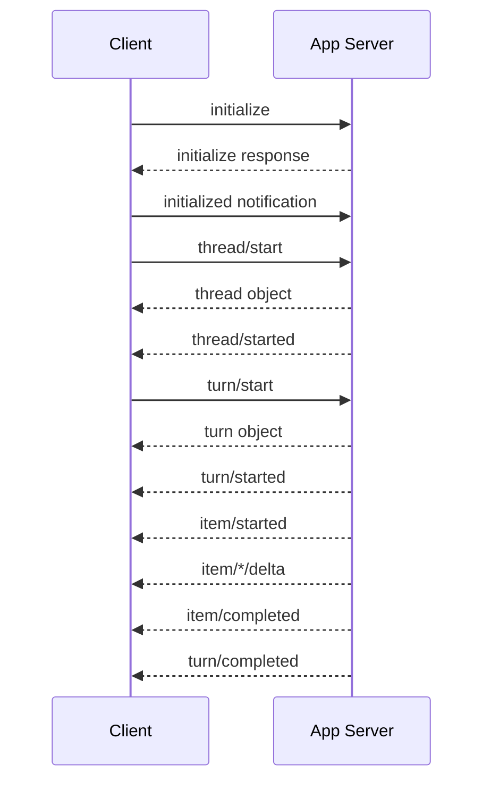

# Thread、Turn、Item 與 Lifecycle

App Server 把 Codex 的互動抽象成三個最重要的 domain primitives：**Thread → Turn → Item**。這套模型也很適合作為自製 agent 系統的資料模型。

## Thread

一段可延續的 agent conversation。它保存跨 turn 的 history 與設定脈絡。

常見操作：

- `thread/start`：新對話。
- `thread/resume`：重新載入既有 thread。
- `thread/fork`：從既有 history 分支。
- `thread/read` / `thread/list`：讀取與列舉。
- ephemeral thread：只存在記憶體，不建立持久化 session path。

## Turn

一次「從 user input 開始，到 agent 完成或被中斷」的工作單位。Turn 裡可以有大量工具與模型往返。

```text
Thread A
├─ Turn 1:「先理解專案」
│  ├─ Item: user message
│  ├─ Item: reasoning
│  ├─ Item: shell command
│  ├─ Item: shell output
│  └─ Item: agent message
├─ Turn 2:「修改登入流程」
│  ├─ ...
│  └─ ...
└─ Turn 3
```

## Item

最細粒度的可觀察事件/內容單位，例如：

- user message；
- agent message；
- reasoning；
- shell command；
- file edit；
- MCP invocation；
- tool output。

「Item」比「message」更適合 agent，因為 coding agent 的大部分活動根本不是自然語言聊天。

## Lifecycle

App Server client 的典型 lifecycle：



## 為什麼 Thread 與 Turn 要分開？

若只有 conversation message list，會遇到幾個 production 問題：

- 一次 user request 中有多個 tool call，如何表達進度？
- 如何只 interrupt 當前 execution，不刪除整段 conversation？
- 如何標記一個 turn failed，但保留 thread 可繼續？
- 如何對 token usage / latency 做 turn-level telemetry？
- 如何 fork 到某一個歷史邊界？

Turn 正好提供 transaction-like boundary。

## Steering 與 Queue

Agent 正在跑時，使用者可能補一句：「先不要改 DB schema。」成熟 harness 不能假設 user 只會在 agent 停止時輸入。

Codex 的 runtime 因此有 steer / queued input 類機制。這表示 UI 與 core 的關係是**雙向長連線式協調**，不是 request-response chatbot。

## Fork 的工程價值

Fork 不是複製聊天畫面而已，它可以支援：

- 同一問題試兩種修法；
- 保留已完成的 repository exploration，從同一 context 分支；
- 多 agent 分支研究；
- UI 中「從這一步重來」。

如果自製 harness，建議 history item 使用 immutable id + parent/turn boundary，而不是只有可變陣列。

## Durable vs Ephemeral

**Durable thread** 適合使用者工作、UI resume、audit、long-running project。

**Ephemeral thread** 適合 CI、一次性子任務、敏感情境、不希望累積 history 的操作。

兩者最好共享相同 runtime 語意，只改 persistence policy，避免維護兩套 agent loop。

## 延伸閱讀

- [App Server docs](https://learn.chatgpt.com/docs/app-server)
- [`codex-rs/app-server/README.md`](https://github.com/openai/codex/blob/main/codex-rs/app-server/README.md)
- [`codex-rs/core/src/codex_thread.rs`](https://github.com/openai/codex/blob/main/codex-rs/core/src/codex_thread.rs)
