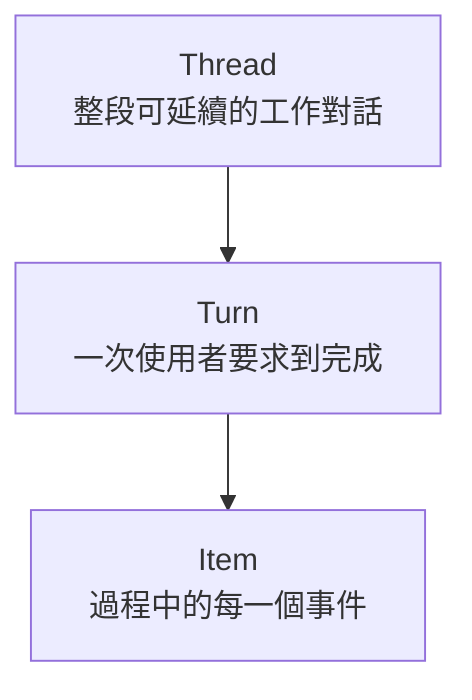
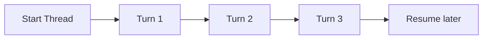
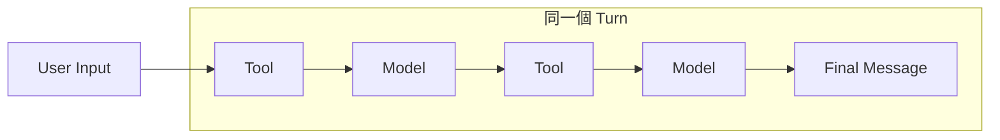
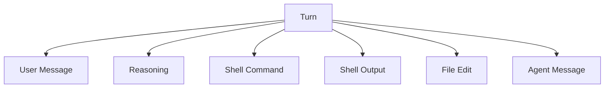
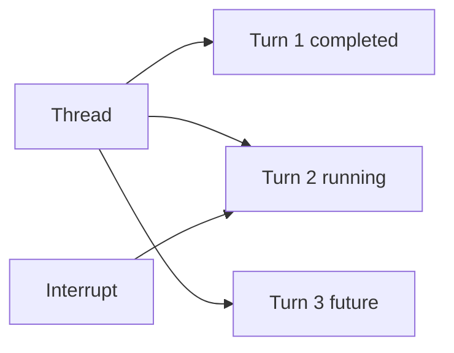
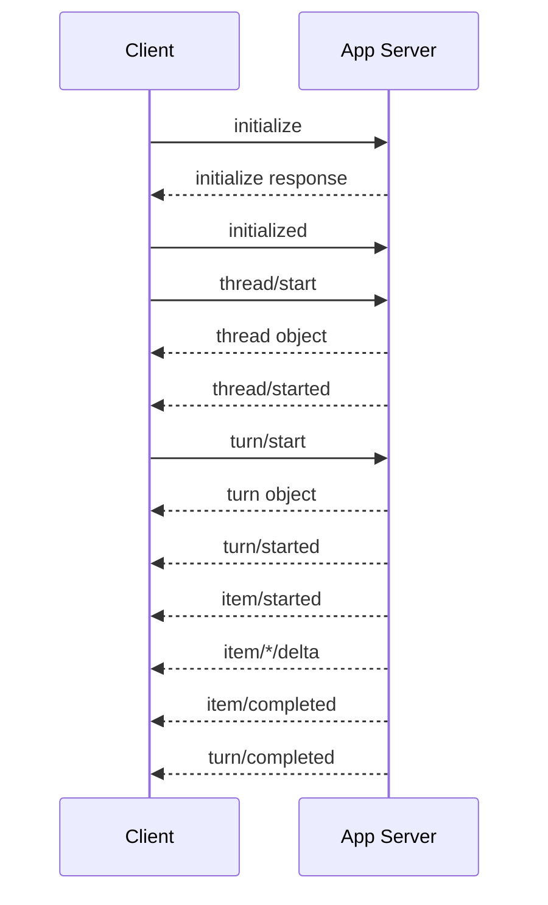
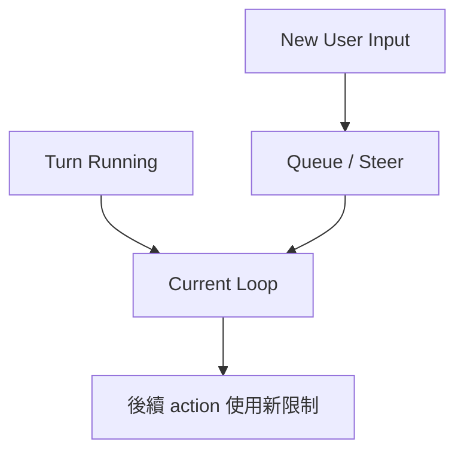
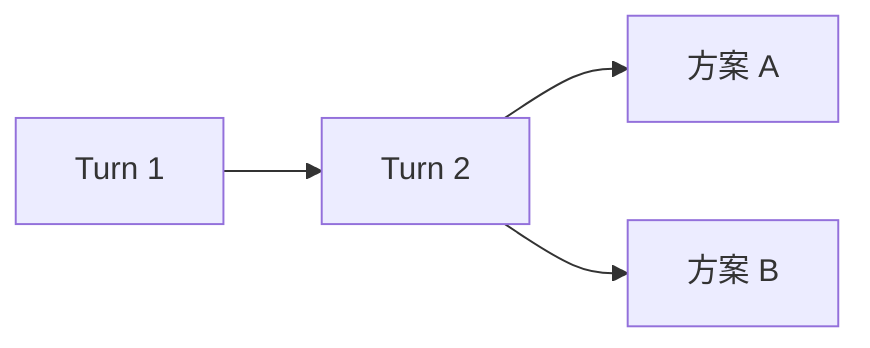
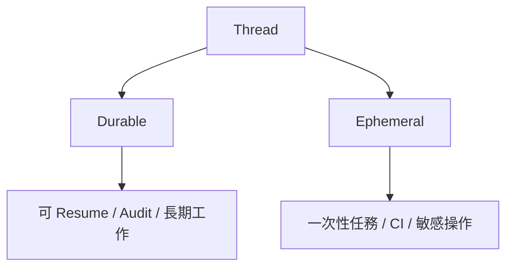
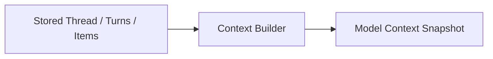

# Thread、Turn、Item 與 Lifecycle

如果你把 Codex 當成一個會工作的系統，就需要回答一個問題：

> **它怎麼記錄「這段工作」？**

App Server 用三個最重要的資料層次來描述：



最簡單的比喻是：

```text
Thread = 一本工作筆記
Turn   = 筆記裡的一次任務
Item   = 這次任務中的每一筆事件
```

## 先看一個完整例子

你先說：

> 幫我理解這個專案。

之後又說：

> 現在幫我修登入 bug。

這是同一個 Thread 裡的兩個 Turns。

```text
Thread: codex-harness-work
│
├─ Turn 1:「先理解專案」
│  ├─ Item: user message
│  ├─ Item: file search
│  ├─ Item: file read
│  ├─ Item: reasoning
│  └─ Item: agent message
│
└─ Turn 2:「修登入 bug」
   ├─ Item: user message
   ├─ Item: shell command
   ├─ Item: shell output
   ├─ Item: file edit
   ├─ Item: test command
   └─ Item: agent message
```

## Thread：整段工作關係

Thread 是一段可以延續的 agent conversation。

它不是單純「聊天視窗」，而是跨 Turn 的工作容器。

通常會包含：

- history；
- settings；
- project / environment context；
- fork / resume 關係；
- persistence metadata。

概念上：



常見操作：

- `thread/start`：新建 Thread。
- `thread/resume`：重新載入既有 Thread。
- `thread/fork`：從既有歷史分支。
- `thread/read` / `thread/list`：讀取與列舉。

## Turn：一次「工作交易」

Turn 是：

> **從一個 user input 開始，到 agent 完成、失敗或被中斷為止。**

例如：

```text
User: 修掉這個 bug
↓
搜尋檔案
↓
讀程式碼
↓
跑測試
↓
修改檔案
↓
再跑測試
↓
Agent: 完成
```

這全部仍然只是一個 Turn。



## Item：Turn 裡真正發生的每件事

Item 是最細粒度的可觀察工作單位。

可能包括：

- user message；
- agent message；
- reasoning；
- shell command；
- shell output；
- file edit；
- MCP invocation；
- tool result。

為什麼不只叫 Message？

因為 coding agent 很多重要活動根本不是自然語言訊息。



## 為什麼要分成三層？

如果只有一條 message array，很多 production 問題會很難處理。

### 問題 1：Agent 跑到哪裡了？

有 Item 才能顯示：

```text
Searching files...
Running tests...
Editing auth.ts...
```

### 問題 2：怎麼只中斷這次任務？

Turn 提供清楚 boundary。



中斷 Turn 2，不代表整個 Thread 要刪掉。

### 問題 3：怎麼量測成本？

Turn 可以當 telemetry 邊界：

- latency；
- token usage；
- tool count；
- failure status。

### 問題 4：怎麼 Fork？

Thread + Turn boundary 可以讓你說：

> 從 Turn 3 之前的狀態分一條新路。

## Lifecycle：App Server Client 怎麼驅動這些東西？

典型流程：



這表示 App Server 不是簡單 HTTP chatbot API，而是一套有 lifecycle 與 streaming events 的 integration protocol。

## Steering：Turn 還在跑時，User 又說話

假設 Agent 正在改程式，你突然補充：

> 不要改資料庫 schema。

此時系統可能需要：



這說明 Thread runtime 必須支援**雙向協調**，不是只會等「一問一答」。

## Fork：從同一段歷史分出另一條路

Fork 很像 Git branch 的概念。



用途包括：

- 同一問題試兩種修法；
- 保留已完成的 repository exploration；
- 多 agent 分支研究；
- UI 中「從這一步重來」。

## Durable vs Ephemeral

Thread 不一定都要永久保存。



### Durable Thread

適合：

- 使用者長期工作；
- UI resume；
- audit；
- project history。

### Ephemeral Thread

適合：

- CI；
- 一次性子任務；
- 不希望持久化的敏感情境。

兩者最好共用同一套 agent loop，只替換 persistence policy。

## Thread / Turn / Item 和 Context 有什麼關係？

這三個是**保存與描述工作歷史的 domain model**。

Context 則是：

> 從這些歷史與設定中，挑出本次 Model Call 需要看到的內容。



所以：

- Persistence 不等於 Context。
- 保存所有 Item，不代表每次都要把所有 Item 送給 Model。

這是很重要的架構分離。

## 常見誤解

### 誤解 1：Thread = 一次 User Request

不是，那是 Turn。

### 誤解 2：Turn = 一次 Model Call

不是。一個 Turn 可以有很多 Model Calls 和 Tools。

### 誤解 3：Item = Chat Message

不只。Tool、Edit、Reasoning 都可以是 Item。

### 誤解 4：保存 History = 全部放回 Context

不是。Persistence 和 Context projection 是兩件事。

## 本章只要記住

```text
Thread = 整段可延續工作
Turn   = 一次任務
Item   = 任務中的每個事件
```

再加一句：

> **State Store 負責保存，Context Builder 負責挑選 Model 這次要看到什麼。**

理解這一點後，就可以往下看 Codex Harness 的真正系統架構。

## 延伸閱讀

- [App Server docs](https://learn.chatgpt.com/docs/app-server)
- [`codex-rs/app-server/README.md`](https://github.com/openai/codex/blob/main/codex-rs/app-server/README.md)
- [`codex-rs/core/src/codex_thread.rs`](https://github.com/openai/codex/blob/main/codex-rs/core/src/codex_thread.rs)
