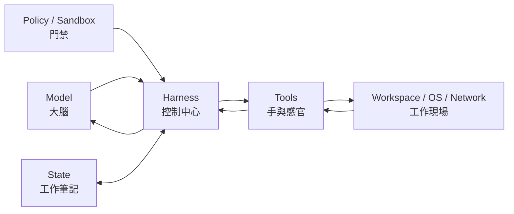
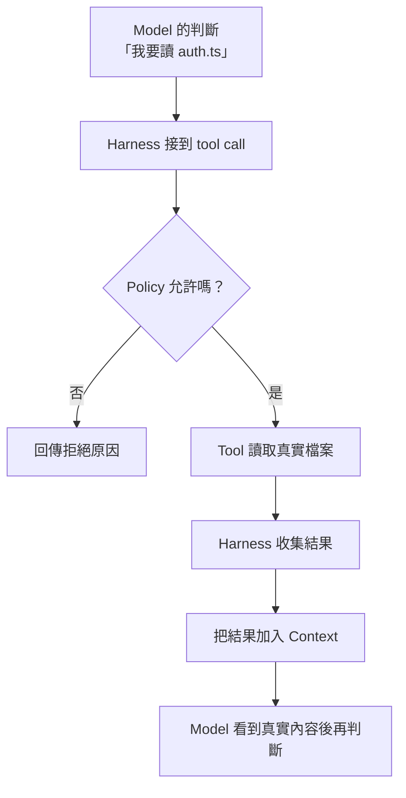
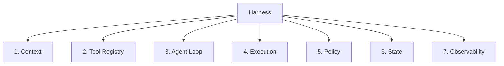
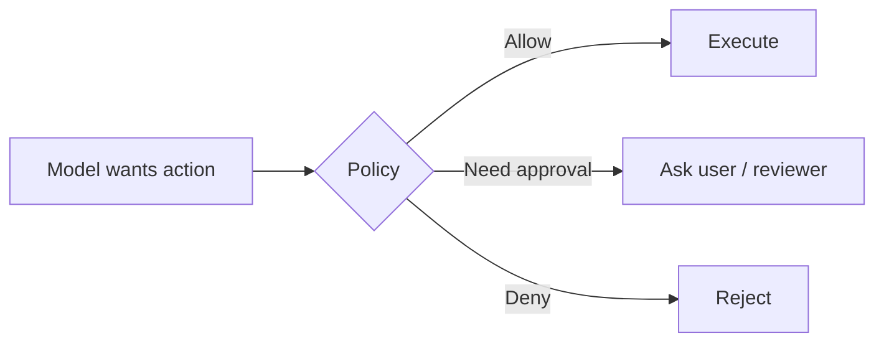
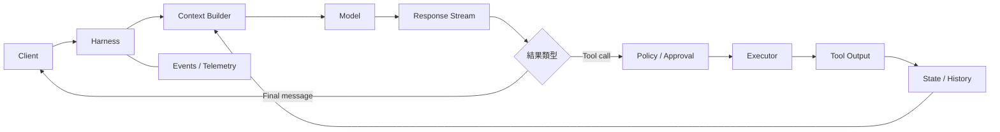
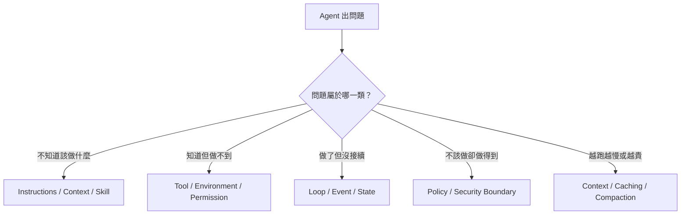

# 什麼是 Harness？

如果只記一句話：

> **Model 負責想，Harness 負責把「想法」變成可執行、可觀察、可限制的工作。**

這一章先不碰 Rust source，先把責任邊界建立清楚。

## 初學者版：把 Codex 想成一個受控工作室

一個 coding agent 可以想成這樣：



角色可以對照成：

| 元件 | 生活化理解 | 工程上的工作 |
|---|---|---|
| Model | 大腦 | 理解、推理、選擇下一步 |
| Harness | 控制中心 | 組 context、驅動 loop、執行工具、保存狀態 |
| Tools | 手與感官 | 讀檔、搜尋、Shell、Patch、MCP |
| Environment | 工作現場 | Repo、OS、Git、Network、External Services |
| Policy / Sandbox | 門禁 | 限制哪些 action 能真的發生 |
| State | 工作筆記 | 保存 thread、turn、item、history、進度 |

這張圖比「Codex 是一個 AI 模型」更接近實際情況。

## 為什麼 Model 不能自己完成所有事？

Model 本身只能根據送進去的 context 產生輸出。

它不會憑空知道：

- 你的 repository 現在有哪些檔案；
- `npm test` 真正跑出了什麼；
- 某個檔案是否真的已被修改；
- 目前 shell 是否可以連網；
- 使用者是否批准了某個危險操作；
- 這個 thread 上一輪做了什麼。

這些都要由 Harness 和 Tools 把真實世界資訊帶回來。



**Tool call 是一個提案，不是現實世界已經發生的事情。**

## 模型與 Harness 的責任分界

| 問題 | Model | Harness |
|---|---|---|
| 下一步要讀哪個檔案？ | 推理與選擇 | 提供搜尋 / 讀檔能力 |
| 命令能否碰網路？ | 可以提出需求 | 實際限制與執行 |
| 是否需要使用者批准？ | 可以解釋原因 | 根據 policy 決定是否要求 approval |
| shell 結果是什麼？ | 必須等待結果 | 執行、截斷、回傳 stdout/stderr |
| conversation 如何延續？ | 只看到本輪 context | 保存並重建 thread / turn / items |
| MCP server 怎麼連線？ | 只看到 tool schema | 管理 transport、auth、timeout、exposure |
| context 太長怎麼辦？ | 無法自行擴大 window | 管理 budget、cache、compaction |

這個分界是整份教材最重要的架構基礎。

## Harness 的七個核心責任

可以把 Harness 想成七個彼此合作的子系統。



### 1. Context orchestration

把模型真正需要的資訊整理成 context：

- base instructions；
- developer / project guidance；
- AGENTS.md；
- skills metadata；
- environment context；
- conversation history；
- current user request。

重點不是「把所有資訊都塞進去」，而是讓模型看到**正確、足夠、順序穩定**的資訊。

### 2. Tool registry

告訴模型有哪些能力，以及每個能力要用什麼參數。

例如：

```text
shell
read_file
apply_patch
search
MCP tools
```

Model 只能選擇 Harness 暴露給它的能力。

### 3. Agent loop

Model 回傳 tool call 時，工作還沒有完成。

Harness 必須：

```text
Model → Tool Call → Execute → Tool Result → Model → ... → Final Message
```

直到沒有待執行 action，turn 才真正完成。

### 4. Execution environment

負責真實執行：

- cwd；
- process；
- environment variables；
- PTY；
- filesystem；
- background process；
- network；
- OS sandbox。

這些都不是語言模型本身的能力。

### 5. Policy / authorization

Model 想做某件事，不代表系統應該允許。



安全的 agent 必須把「推理能力」和「執行權限」分開。

### 6. State and lifecycle

負責保存：

- Thread；
- Turn；
- Item；
- History；
- Rollout；
- Resume / Fork；
- Interrupt；
- Ephemeral session。

Model 不會自己持久化這些狀態。

### 7. Observability and integration

把 agent 內部進度轉成外部世界可以消費的事件，例如：

- reasoning progress；
- shell command started；
- tool completed；
- file changed；
- message delta；
- turn completed。

這讓 CLI、IDE、App Server client、CI 能顯示與記錄同一套 runtime。

## Harness 不只是「工具呼叫器」

最小 function-calling demo 可能只有：

```ts
while (true) {
  const response = await model(context, tools);
  if (!response.toolCall) return response.text;
  const result = await execute(response.toolCall);
  context.push(response.toolCall, result);
}
```

但 production harness 還要補上很多東西：



真正困難的地方不是 `await model()`，而是**如何持續協調 model 和真實世界**。

## 三種程度的人，可以看到不同層次

### 初學者只要先懂

- Model 是大腦。
- Harness 是控制中心。
- Tools 才真的碰檔案與系統。
- Policy 決定哪些 action 能發生。

### 工程師再理解

- Context 如何組成；
- Tool schema 如何暴露；
- Tool result 如何回到下一輪 inference；
- State 如何保存與恢復。

### 架構設計者要再往下

- Provider abstraction；
- retry / idempotency；
- sandbox implementation；
- event protocol；
- persistence；
- trust boundary；
- observability。

## 一個非常實用的除錯分類

遇到 agent 問題時，先不要急著改 prompt。



這五類問題會貫穿後面的所有章節。

## 常見誤解

### 誤解 1：Harness 就是 system prompt

不是。Prompt 只是 Harness 管理的一部分。

### 誤解 2：Model 呼叫 shell 就代表 shell 已經執行

不是。Model 只產生 tool call，Harness 才會決定是否執行。

### 誤解 3：Agent 做錯事都靠提示詞修

不是。Timeout、sandbox、credentials、state、retry 等都應由 Harness 解決。

### 誤解 4：模型越強，Harness 越不重要

通常相反。模型能力越強、能做的事情越多，越需要好的 execution 和 policy boundary。

## 本章只要記住

1. **Model 決策，Harness 執行與協調。**
2. **Tools 是 Model 接觸真實世界的介面。**
3. **Policy 讓「想做」和「能做」分離。**
4. **State 讓 Agent 不只是一次性的 function call。**
5. **很多 Agent 問題其實是 Harness 問題，不是 Prompt 問題。**

下一章會把 Harness 最核心的控制迴路拆開：[Agent Loop：一次 Turn 到底怎麼跑](./agent-loop.md)。

## 延伸閱讀

- [Unrolling the Codex agent loop](https://openai.com/index/unrolling-the-codex-agent-loop/)
- [App Server architecture article](https://openai.com/index/unlocking-the-codex-harness/)
