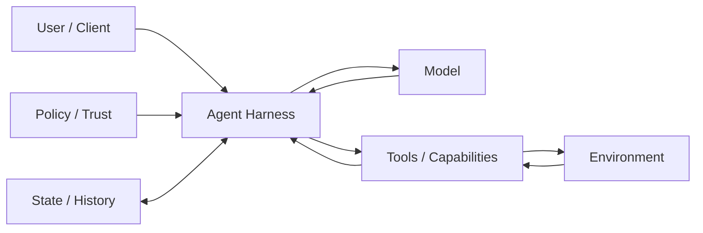
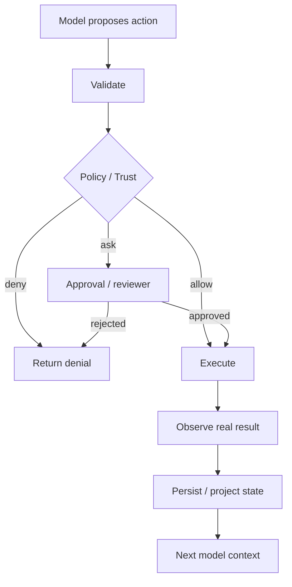
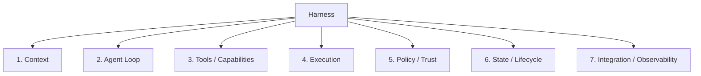
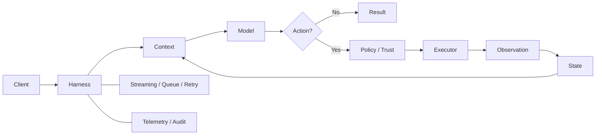
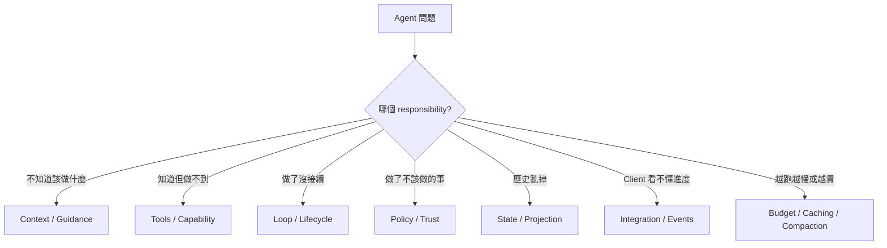

# 什麼是 Harness？

如果只記一句話：

> **Model 負責判斷下一步；Harness 負責把這個判斷變成可執行、可觀察、可限制、可恢復的工作流程。**

這一章先不綁定任何單一產品。後面再用 Codex、DeepSeek Harness、Pi 三套實作去看：同一組 Harness 責任，可以被放在完全不同的架構層。

## 最小心智模型



可以先把角色想成：

| 元件 | 直覺角色 | 工程責任 |
|---|---|---|
| Model | 大腦 | 理解、推理、選擇下一步 |
| Harness | 控制中心 | 組 context、驅動 loop、調度工具、保存與投影狀態 |
| Tools / Capabilities | 手與感官 | 讀檔、搜尋、Shell、API、外部工具 |
| Environment | 工作現場 | Repository、OS、Network、Remote Worker、External Services |
| Policy / Trust | 門禁與治理 | 決定 action 是否允許、需要 approval、或必須被隔離 |
| State | 工作記錄 | 保存 trajectory、resume/fork 所需資料與 durable facts |

**Model 不會直接碰你的電腦。真正把模型連到現實世界的是 Harness。**

## 為什麼 Model 不能自己完成所有事？

Model 每次 inference 只看得到送進去的 context。它不會自動知道：

- repository 現在有哪些檔案；
- 測試實際跑出了什麼；
- 某個寫入是否真的成功；
- process 是否 timeout；
- network 或 filesystem 是否允許；
- 使用者是否批准危險操作；
- 上一次工作停在哪裡；
- 哪一段歷史已被 compact、fork 或 replay。

因此一次 tool call 更精確的理解是：

> **Model 提出一個 action proposal，Harness 再決定如何驗證、授權、執行、記錄與回傳。**



## Harness 的七個核心責任

這份教材後面會一直用同一組責任讀三套系統。



### 1. Context orchestration

決定這一輪 Model 真正看到什麼：

```text
base instructions
project guidance
runtime context
tool schemas
skill catalog
conversation / session history
current user input
```

重點不是把所有資訊塞進去，而是**把現在需要的資訊，以穩定且可控的方式組起來**。

### 2. Agent Loop

把一次任務拆成多輪：

```text
Model
→ Action
→ Observation
→ Model
→ ...
→ Final result
```

Production Harness 還要處理 streaming、cancel、steering、retry、queue、compaction 與 failure semantics。

### 3. Tools / Capabilities

Harness 決定 Model 能看到哪些能力，以及如何描述它們。

能力可能來自：

- 內建 file / shell tools；
- MCP server；
- Plugin / Extension；
- Workflow / Subagent；
- Remote execution provider。

「Tool」只是其中一種 presentation；更底層的系統常會把 filesystem、subprocess、sandbox、model adapter 都視為 capability。

### 4. Execution

真正處理 side effect：

```text
filesystem
process / PTY
network
working directory
environment variables
remote worker
container / sandbox
```

這些都是 Harness 與 machine world 的交界。

### 5. Policy / Trust

把「Model 想做」與「系統允許做」分開。

可能包含：

```text
allow / deny
approval
sandbox mode
project trust
credential boundary
rules / guards
external policy engine
```

安全不是一句 prompt，而是一組 runtime boundary。

### 6. State / Lifecycle

Harness 必須能回答：

```text
這段工作怎麼保存？
一次工作單位怎麼界定？
怎麼 resume？
怎麼 fork / branch？
context 太長怎麼 compact？
哪些 facts 必須 durable？
```

不同 Harness 在這一題的資料模型差異非常大。

### 7. Integration / Observability

Agent 不一定只由一個 CLI 使用。Harness 還要讓：

```text
TUI
IDE
Web UI
SDK
RPC client
CI / automation
telemetry / audit system
```

都能理解同一個 runtime 的進度與結果。

## 三套 Harness 怎麼映射這七個責任？

先只看第一層，不急著深入 API。

| 責任 | Codex | DeepSeek Harness | Pi |
|---|---|---|---|
| Runtime center | `codex-core` | Cordis composition + services | `pi-agent-core` + `AgentSession` |
| Context | core context / instructions | `system-prompt` + session projection | `ResourceLoader` + session context |
| Loop | production agent loop | replaceable `agent-loop` service | `Agent` loop + `AgentSession` lifecycle |
| Tools | built-in tools / MCP / exec | `ctx.tools` + capability providers | built-in tools + extension tools |
| Security | sandbox / approval / rules | sandbox / approval / credentials seams | Project Trust + extension policy + external isolation |
| State | Thread / Turn / Item / rollout | Session / Turn / Step / SessionEvent | JSONL Session Entry Tree |
| Integration | CLI / SDK / App Server | Web / SDK / JSON-RPC / ACP / Host | TUI / Print / JSON / RPC / SDK |

這張表不是排行榜，而是後面閱讀三套系統的索引。

## 三種不同的「穩定中心」

三套 Harness 最大差異之一，是它們各自選擇了什麼東西不應輕易被替換。

### Codex

```text
Productized Runtime
→ 固定較多 Coding Agent semantics
→ 用高階 extension surfaces 客製
```

適合研究：**如何把完整 Coding Agent 做成熟。**

### DeepSeek Harness

```text
Composable Runtime Framework
→ responsibility 本身變成 service / provider / plugin seam
```

適合研究：**如何讓 Runtime 基礎設施本身可重組。**

### Pi

```text
Minimal Harness
→ core 保持小
→ workflow / UI / policy 大量交給 extension 與 environment
```

適合研究：**哪些能力其實不需要進 core。**

## Harness 不只是「function calling loop」

最小 demo 可以只有：

```ts
while (true) {
  const response = await model(context, tools);
  if (!response.toolCall) return response.text;
  context.push(await execute(response.toolCall));
}
```

但 production Harness 真正困難的是旁邊這些責任：



所以 Harness 的品質通常決定：Agent 能否長時間工作、能否安全執行、能否恢復、能否被產品穩定整合。

## 一個實用的除錯分類

遇到 Agent 表現不好時，先問是哪一類問題：



這比把所有問題都歸因到 Prompt Engineering 更有效。

## 常見誤解

### Harness = System Prompt？

不是。Prompt 只是 Context orchestration 的一部分。

### Tool Call = Action 已經發生？

不是。Tool Call 是 proposal；Harness 才處理 execution 與 policy。

### Model 越強，Harness 越不重要？

通常相反。Model 能做的 action 越多，越需要可觀察、可限制、可恢復的 execution boundary。

### 所有 Harness 都應該有同一套 Sandbox / Subagent / Session 模型？

不是。Codex、DeepSeek、Pi 恰好展示了三種不同答案；這正是本教材要並讀它們的原因。

## 本章只要記住

1. **Model 決策，Harness 協調真實世界。**
2. **Tool Call 是 action proposal，不是 side effect 本身。**
3. **Context、Loop、Capability、Execution、Policy、State、Integration 是七個核心責任。**
4. **不同 Harness 的差異，主要在這些責任被放在哪一層、由誰擁有。**
5. **Codex、DeepSeek Harness、Pi 都是完整案例，但穩定中心不同。**

下一章看所有 Harness 共同需要解決的控制問題：[Agent Loop：一次任務到底怎麼跑](./agent-loop.md)。

## 官方延伸閱讀

- [OpenAI：Unrolling the Codex agent loop](https://openai.com/index/unrolling-the-codex-agent-loop/)
- [DeepSeek Harness Architecture](https://github.com/deepseek-ai/deepseek-harness/blob/master/docs/architecture.md)
- [Pi Documentation](https://pi.dev/docs/latest)
