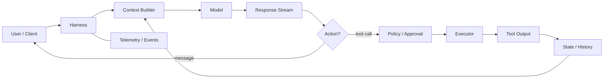

# 什麼是 Harness？

如果把 LLM 比喻成 CPU，harness 比較像「作業系統 + runtime + driver + policy layer」：它不代替模型推理，卻決定模型能看到哪些資源、能採取哪些動作、動作如何執行，以及失敗後如何繼續。

## 模型與 Harness 的責任分界

| 問題 | 模型 | Harness |
|---|---|---|
| 下一步要讀哪個檔案？ | 推理 | 提供搜尋/讀檔工具 |
| 命令能否碰網路？ | 可提出需求 | 執行與限制 |
| 是否需要使用者批准？ | 可說明原因 | 依 policy 決定與發出 approval request |
| shell 執行結果是什麼？ | 不知道，必須等工具回傳 | 執行、截斷、回傳結果 |
| conversation 如何延續？ | 只看到送入的 context | 保存 thread/turn/items，重建 context |
| MCP server 怎麼啟動？ | 只知道 tool schema | 管理連線、timeout、auth、tool exposure |
| context 太長怎麼辦？ | 可被要求摘要 | 追蹤 budget、compact、重建後續 prompt |

這個分界非常重要。很多「prompt engineering 解不了」的問題，本質上應該在 harness 解：例如 command timeout、秘密遮蔽、tool retries、filesystem boundary、event persistence、idempotency。

## Harness 的七個核心責任

### 1. Context orchestration

把 base instructions、developer/project guidance、AGENTS.md、skill metadata、環境資訊、conversation history 與當前 user input 組成一個對模型可理解、順序穩定的 prompt/context。

### 2. Tool registry

告訴模型「有哪些能力」以及每個能力的 schema。能力可能是 Codex 自帶的 shell / apply patch，也可能是 hosted tools 或 MCP tools。

### 3. Agent loop

模型回傳 tool call 時，harness 不能把它當成最終答案；必須執行工具，把 output 附加回 context，再次呼叫模型，直到模型真的結束 turn。

### 4. Execution environment

真正執行命令、處理 cwd、環境變數、PTY、背景程序、檔案寫入、network access，以及跨 OS 的 sandbox 差異。

### 5. Policy / authorization

「模型想做」不等於「允許做」。Harness 把推理能力與執行權限分離，透過 sandbox、permissions、rules、approvals、managed policy 等機制收斂 blast radius。

### 6. State and lifecycle

Thread、turn、item、history、rollout、fork/resume、interrupt、ephemeral session 都屬於 runtime state，而非模型能力。

### 7. Observability and integration

把 reasoning/tool progress/message delta 轉成事件，供 TUI、IDE、App Server client、CI 或其他產品 UI 顯示、記錄與測試。

## Harness 不只是「工具呼叫器」

最小 function-calling demo 常寫成：

```ts
while (true) {
  const response = await model(context, tools);
  if (!response.toolCall) return response.text;
  const result = await execute(response.toolCall);
  context.push(response.toolCall, result);
}
```

這確實是骨架，但 production harness 還必須解決：



重點在「協調」：harness 是一個會重複走訪 model ↔ environment 的控制迴路。

## 一個實用判斷法

遇到 agent 行為問題時先問：

- **不知道該做什麼** → 多半是 instructions / context / skill 問題。
- **知道但做不到** → 多半是 tool / environment / permission 問題。
- **做了但結果沒接回去** → agent loop / event / state 問題。
- **不該做卻做得到** → policy / security boundary 問題。
- **做久了越來越笨或越貴** → context growth / compaction / caching 問題。

這五類問題會貫穿後面的所有章節。

## 延伸閱讀

- [Unrolling the Codex agent loop](https://openai.com/index/unrolling-the-codex-agent-loop/)
- [App Server architecture article](https://openai.com/index/unlocking-the-codex-harness/)
