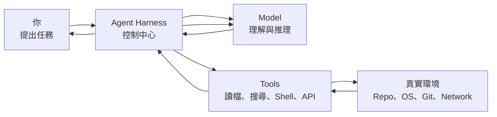
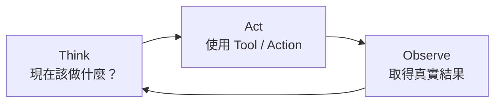
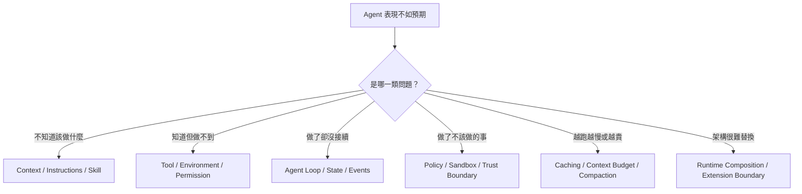

# 導論：Model 不等於 Agent

> 最後核對：2026-08-24。Codex、DeepSeek Harness 與 Pi 都仍快速演進；本教材會把「穩定的架構概念」與「版本敏感的 API / Plugin / Extension」分開說明。

如果你對 Coding Agent 說：

> 幫我找出登入失敗的原因，修好它，然後跑測試。

直覺上很容易把整件事想成：

```text
你 → AI 模型 → 修改完成
```

但實際上中間還有一整套系統在工作。



**Model 負責決定下一步；Harness 負責讓下一步真正發生。**

這就是整份教材最重要的出發點。

## 為什麼現在用三套 Harness？

這份教材使用三套開源實作當 case study，因為它們剛好代表三種很不同的設計哲學。

### Codex：完整、opinionated 的 Coding Agent Runtime

Codex 很適合先建立 production-grade 心智模型：

```text
Agent Loop
Context
Thread / Turn / Item
Tool Execution
Sandbox / Approval
Skills / MCP / Hooks / Rules
App Server
```

它代表：

> **有明確 Runtime Core，再提供高階 extension surfaces。**

### DeepSeek Harness：Runtime 本身就是 Composition

DeepSeek Harness 把更多責任變成可替換 Plugin / Service：

```text
Model Adapter
Agent Loop
Session
Tools
Sandbox
Storage
Scheduler
UI
```

它代表：

> **Runtime responsibility 本身可以被重新組合。**

### Pi：Minimal、Self-extensible Harness

Pi 官方直接把自己定位成 minimal terminal coding harness。

它把核心刻意維持得很小：

```text
pi-ai
pi-agent-core
AgentSession
SessionManager
基本 coding tools
```

而把很多高階產品行為留給：

```text
TypeScript Extensions
Skills
Prompt Templates
Pi Packages
外部 tools / containers / tmux
```

它代表：

> **不是所有常見 Agent feature 都必須進 core。**

所以三套並讀，不是做品牌競賽，而是看見：

> **同一個 Harness 問題，可以有三種非常不同的 architectural answer。**

## 先用一個生活化比喻

把 Coding Agent 想成一位在工作室裡工作的工程師：

- **Model** 是工程師的大腦：會分析、推理、決定下一步。
- **Harness** 是工作室的控制系統：組 Context、管理工具、記錄進度、處理執行流程。
- **Tools** 是工程師手上的工具：搜尋、Shell、Patch、Git、MCP / API。
- **Environment** 是工作現場：repository、作業系統、網路與外部服務。
- **Sandbox / Permission** 是門禁與隔離：決定 Action 是否真的能發生。
- **State** 是工作筆記：記住已看過什麼、做過什麼、目前在哪條工作路徑。

先記住：

```text
Agent
≈ Model
+ Harness
+ Tools
+ Environment
+ Policy
+ State
```

只有 Model，還不等於一個能在真實專案裡可靠工作的 Agent。

## 一個任務其實怎麼完成？

Agent 的工作方式通常不是「一次想完」，而是不斷循環：



例如修 bug：

1. Model 判斷先讀哪個檔案。
2. Harness 執行讀檔工具。
3. 真實檔案內容回到 Model。
4. Model 要求搜尋 symbol。
5. Harness 執行搜尋。
6. Model 提出修改。
7. Harness 根據 policy / environment 執行修改。
8. Model 要求跑測試。
9. Harness 執行測試並把結果送回去。
10. Model 確認完成，才回覆你。

後面看到的 Agent Loop、Tool Execution、Sandbox、Context、Thread / Turn / Item、SessionEvent、JSONL Session Tree，本質上都在回答：

> **怎麼把 Think → Act → Observe 做到 production-grade？**

## 很多 Agent 問題其實不是 Model 問題



如果只懂 Prompt，很容易把所有問題都當成 Prompt Engineering；真正答案很多都在 Harness。

## 這份教材的路線

### 1. 先建立共同語言

理解：

```text
Model / Agent / Harness
Agent Loop
Context
Tool Call
State
Policy
Sandbox
```

### 2. 用 Codex 看完整 Production Runtime

理解：

```text
codex-core
App Server
Thread / Turn / Item
Model Provider
Tool Execution
Sandbox / Approval
Skills / MCP / Hooks / Rules
```

### 3. 用 DeepSeek 看 Runtime Composition

理解：

```text
Cordis
Service / Provider / Consumer
Replaceable Agent Loop
SessionEvent
Profiles / Bundles
Code Mode
Sandbox / Approval seams
SDK / ACP / Host
```

### 4. 用 Pi 看 Minimal Runtime

理解：

```text
pi-ai
pi-agent-core
AgentSession
SessionManager
JSONL Tree
ResourceLoader
TypeScript Extensions
RPC / SDK
Project Trust / external isolation
```

### 5. 最後進入第九章比較、選型與採用

這時不再只是列功能，而依序問：

```text
應該比較哪些 responsibility？
三套 boundary 到底差在哪？
放進具體產品情境怎麼選？
真正採用前如何 PoC 與驗證？
```

## 三種 State Model 是最值得並讀的例子

### Codex

```text
Thread
└─ Turn
   └─ Item
```

### DeepSeek

```text
Session
→ SessionEvents
→ Projection / Context / Replay
```

### Pi

```text
Session JSONL
→ Entry(id, parentId)
→ Tree / Branch
```

三套都在保存 Agent 工作狀態，但 data model 直接反映不同產品哲學。

## 三種 Extension Philosophy

### Codex

```text
AGENTS.md
Skill
MCP
Hook
Rule
Subagent
App Server
```

重點是**用途分類清楚**。

### DeepSeek

```text
Plugin
Service Definition
Provider
Consumer
Typed Event
Profile / Bundle
```

重點是**底層 composition mechanism 一致**。

### Pi

```text
ExtensionAPI
ResourceLoader
Skills
Prompt Templates
Pi Packages
```

重點是**core minimal，但 extension 可以深入 lifecycle**。

## Security 也有三種不同答案

```text
Codex
→ Security 深度產品化進 Runtime

DeepSeek
→ Security 是 formal / replaceable capability seam

Pi
→ Project Trust 管 resource loading；真正 isolation 預設交給 OS / container / sandbox
```

Pi 官方明確提醒 Project Trust 不是 sandbox。這個差異在做 enterprise architecture 時非常重要。

## 不同程度的人怎麼讀？

### 第一次理解 Agent

先讀：

1. [學習地圖：先建立全局觀](./learning-map.md)
2. [什麼是 Harness？](./foundations/what-is-harness.md)
3. [Agent Loop](./foundations/agent-loop.md)
4. [第九章導讀：如何比較 Agent Harness](./comparison/overview.md)

### 工程師 / Agent 重度使用者

先完整讀 Codex，再讀：

- [DeepSeek Harness：先建立正確心智模型](./deepseek/overview.md)
- [Pi Agent Harness：先建立正確心智模型](./pi/overview.md)
- [架構維度逐項比較](./comparison/architecture-comparison.md)
- [情境式選型](./comparison/scenario-selection.md)

### Agent / Platform 架構設計者

再深入：

- [三套 Harness 原始碼導讀入口](./reference/source-reading.md)
- [`openai/codex` Source Map](./reference/source-map.md)
- [`deepseek-ai/deepseek-harness` Source Map](./reference/deepseek-source-map.md)
- [`earendil-works/pi` Source Map](./reference/pi-source-map.md)
- [PoC、採用與混用策略](./comparison/adoption-playbook.md)

目標不是「會用三個 CLI」，而是能回答：

> **如果我要自己做 Agent Platform，哪些 responsibility 應該固定、哪些應該做 seam、哪些甚至應該移出 core？**

## 「Codex Harness」不是單一 crate

`codex-core` 是核心 runtime，但完整 Harness 還包含 App Server、Protocol、Tool Execution、Sandbox、Skills / MCP / Hooks、Thread Store 與各種 client surfaces。

## 「DeepSeek Harness」不是 DeepSeek Model 的 wrapper

Model Adapter 只是 Cordis composition 的一部分；Loop、Tools、Storage、Sandbox、UI 都可以是 plugin / service。

## 「Pi」也不是只有一個小 CLI

Pi 的核心分層是：

```text
pi-ai
→ Provider / Model runtime

pi-agent-core
→ stateful Agent / Tool execution

pi-coding-agent
→ AgentSession / Session / Extensions / TUI / RPC / SDK
```

Minimal 指的是**設計邊界**，不是「只有幾百行程式」。

## 來源策略

本教材優先交叉核對：

- OpenAI 官方 Codex 文件、工程文章與 `openai/codex` source；
- DeepSeek Harness 官方網站、architecture docs 與 `deepseek-ai/deepseek-harness` source；
- Pi 官方 `pi.dev` docs 與 `earendil-works/pi` source。

當正式文件與主分支 implementation 有落差時，會標示版本敏感，不把內部細節寫成永久 API。

## 讀完導論先記住五件事

1. **Model 不等於 Agent；Agent 還需要 Harness。**
2. **Agent 核心工作方式是 Think → Act → Observe。**
3. **Codex 偏 Productized / Opinionated Runtime。**
4. **DeepSeek 偏 Composable Runtime Framework。**
5. **Pi 偏 Minimal / Self-extensible Harness。**

下一步讀 [學習地圖](./learning-map.md)。

## 官方入口

### Codex

- [Codex documentation](https://learn.chatgpt.com/docs/codex)
- [`openai/codex`](https://github.com/openai/codex)

### DeepSeek Harness

- [DeepSeek Harness](https://deepseek.com/harness/en/)
- [`deepseek-ai/deepseek-harness`](https://github.com/deepseek-ai/deepseek-harness)

### Pi

- [Pi](https://pi.dev/)
- [Pi Documentation](https://pi.dev/docs/latest)
- [`earendil-works/pi`](https://github.com/earendil-works/pi)
