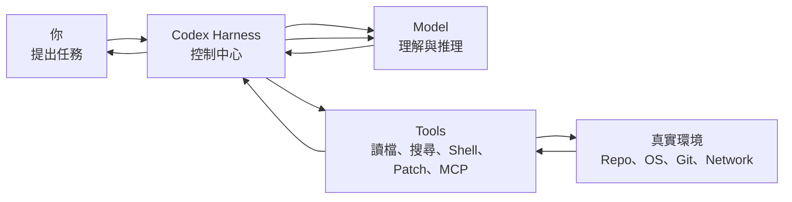
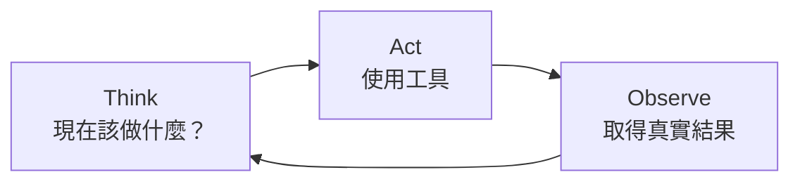
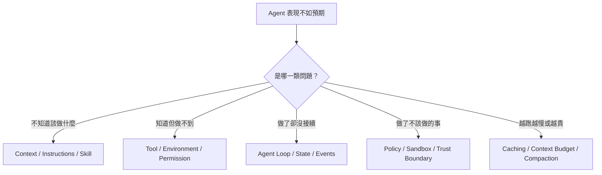
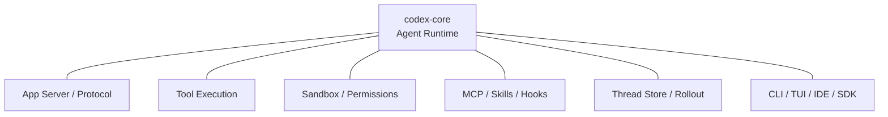

# 導論：Codex 不只是模型

> 最後核對：2026-08-23。Codex 的 App Server、permission profiles、subagents 等介面仍快速演進；本教材會把「穩定的架構概念」與「版本敏感的 API」分開說明。

如果你對 Codex 說：

> 幫我找出登入失敗的原因，修好它，然後跑測試。

直覺上很容易把整件事想成：

```text
你 → AI 模型 → 修改完成
```

但實際上中間還有一整套系統在工作。



**Model 負責決定下一步；Harness 負責讓下一步真正發生。**

這就是整份教材最重要的出發點。

## 先用一個生活化比喻

把一個 coding agent 想成一位在受控工作室裡工作的工程師：

- **Model** 是工程師的大腦：會分析、推理、決定下一步。
- **Harness** 是工作室的控制系統：把資料交給工程師、管理工具、記錄進度、限制危險操作。
- **Tools** 是工程師手上的工具：檔案搜尋、Shell、Patch、Git、MCP。
- **Environment** 是工作現場：repository、作業系統、網路與外部服務。
- **Sandbox / Permission** 是門禁：不是想做什麼就一定能做。
- **State** 是工作筆記：記住已經看過什麼、做過什麼、目前做到哪裡。

所以可以先記住：

```text
Coding agent
≈ Model
+ Harness
+ Tools
+ Environment
+ Policy
+ State
```

只有 Model，還不等於一個能在真實專案裡可靠工作的 agent。

## 一個任務其實怎麼完成？

Codex 的工作方式不是「一次想完」，而是不斷循環：



例如修 bug：

1. Model 判斷先讀哪個檔案。
2. Harness 執行讀檔工具。
3. 真實檔案內容被送回 Model。
4. Model 判斷要搜尋哪個 symbol。
5. Harness 執行搜尋。
6. Model 發現問題並提出修改。
7. Harness 檢查權限後修改檔案。
8. Model 要求跑測試。
9. Harness 執行測試並把結果送回去。
10. Model 確認完成，才回覆你。

後面你看到的 Agent Loop、Tool Execution、Sandbox、Context、Thread/Turn/Item，其實都只是在回答：**怎麼把這個循環做到 production-grade？**

## 為什麼要特別學 Harness？

因為很多 Codex 問題，並不是「模型不夠聰明」。



如果只懂 prompt，很容易把所有問題都當成 prompt engineering；但很多真正的答案其實在 Harness。

## 這份教材會回答哪些問題？

整體可以分成六個階段。

### 1. Agent 到底怎麼工作？

先理解：

- Harness 是什麼？
- Agent Loop 是什麼？
- Context 是怎麼形成的？
- Thread / Turn / Item 是什麼？

這是所有後續章節的地基。

### 2. Codex Harness 本身怎麼拆？

再理解：

- `codex-core`
- App Server
- Protocol
- Model provider
- Tool execution
- State / persistence

這一層開始進入真正的系統架構。

### 3. 安全怎麼做？

理解：

- sandbox
- approval
- permissions
- rules
- network policy
- trust boundary

這些都不是「模型自己乖一點」可以取代的。

### 4. 要怎麼擴充 Codex？

分清楚：

- Prompt
- AGENTS.md
- Skill
- Plugin
- MCP
- Hook
- Rule
- Subagent

每一種擴充點解決不同問題。

### 5. 實際要怎麼使用？

包含：

- Interactive CLI
- `codex exec`
- SDK
- App Server
- 自製 UI / integration

### 6. 如果我要自己做 Agent Harness 呢？

最後會把前面的概念重新組裝成 production architecture，包括：

- model abstraction
- tool runtime
- authorizer
- event store
- persistence
- observability
- security boundary

## 不同程度的人怎麼讀？

### 如果你是第一次理解 Agent

先讀：

1. [學習地圖：先建立全局觀](./learning-map.md)
2. [什麼是 Harness？](./foundations/what-is-harness.md)
3. [Agent Loop](./foundations/agent-loop.md)
4. [Sandbox 與 Approvals](./security/sandbox-and-approvals.md)

先懂概念，不需要急著看 Rust source。

### 如果你已經常用 Codex CLI

建議加讀：

- [Context、Caching 與 Compaction](./foundations/context-and-caching.md)
- [Thread、Turn、Item](./foundations/thread-turn-item.md)
- [系統架構總覽](./architecture/system-map.md)
- [行為到底該放哪裡？](./applications/where-should-behavior-live.md)

這會幫你解釋很多「為什麼 Codex 會這樣運作」。

### 如果你要做 Agent Platform / Integration

完整讀完架構、安全、App Server、State 與自製 Harness 章節，再搭配 source map 看 `openai/codex`。

## 「Codex Harness」不是單一 crate

目前開源 Codex 是大型 Rust workspace。

`codex-core` 是核心 agent runtime，但完整 Harness 還包含：



所以本教材說的 **Harness**，指的是「協調模型、context、工具、執行環境、安全政策與狀態的整體 runtime」，而不是某一個 Rust 檔案。

## 來源策略

本教材主要交叉核對三種來源：

- OpenAI 官方 Codex 文件：確認公開支援的使用方式與設定。
- OpenAI 工程文章：理解 agent loop 與 App Server 的設計意圖。
- `openai/codex` 主分支原始碼：核對真正的 runtime 與模組邊界。

當 `main` 上的實驗功能和正式文件有落差時，會標示為「版本敏感」或「實驗性」，避免把內部細節寫成永久 API。

## 讀完導論，你只需要先記住三件事

1. **Codex = Model + Harness，不只是 Model。**
2. **Agent 的核心工作方式是 Think → Act → Observe。**
3. **Harness 負責把模型的判斷安全、可控、可持續地連到真實世界。**

下一步先讀 [學習地圖](./learning-map.md)，再進入 Harness 本身。

## 官方入口

- [Codex documentation](https://learn.chatgpt.com/docs/codex)
- [Unrolling the Codex agent loop](https://openai.com/index/unrolling-the-codex-agent-loop/)
- [Unlocking the Codex harness: how we built the App Server](https://openai.com/index/unlocking-the-codex-harness/)
- [`openai/codex`](https://github.com/openai/codex)
