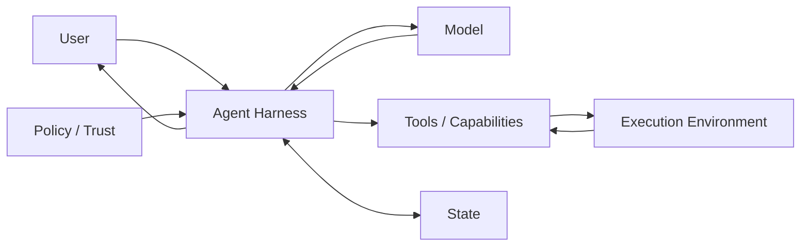
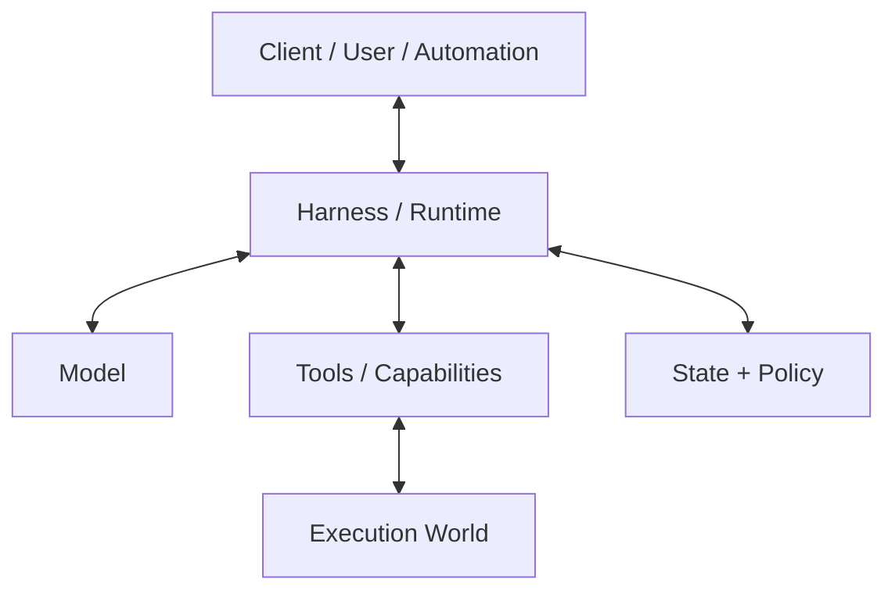
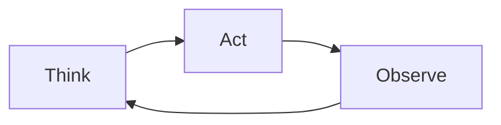

# 導論：Model 不等於 Agent

> 最後核對：2026-08-24。Codex、DeepSeek Harness 與 Pi 都快速演進；本教材把穩定的 architecture responsibilities 與版本敏感的 API / Plugin / Extension 分開說明。

如果你對 Coding Agent 說：

> 幫我找出登入失敗的原因，修好它，然後跑測試。

真正工作的不是只有 Model。



**Model 負責判斷；Harness 負責讓判斷在真實世界中被組織、執行、限制、保存與觀察。**

## 為什麼用三套 Harness？

這份教材不是以 Codex 為主、另外兩套當補充，而是把三套都視為完整 reference architecture。

```text
Codex
→ Productized / Opinionated Runtime

DeepSeek Harness
→ Composable Runtime Framework

Pi
→ Minimal / Self-extensible Harness
```

它們都要回答同一組問題：

```text
Model 怎麼接？
Agent Loop 怎麼跑？
Context 怎麼組？
Tools 怎麼執行？
State 怎麼保存 / resume / fork？
Security / Trust 放在哪？
怎麼擴充？
怎麼被 CLI / UI / SDK / automation 驅動？
Production responsibility 誰承擔？
```

差異在於：**三套把 responsibility boundary 放在不同位置。**

## 三套的最短心智模型

### Codex：Runtime 先替你決定較多產品語意

```text
codex-core
+ Thread / Turn / Item
+ Tool / Sandbox / Approval
+ Skills / MCP / Hooks / Rules
+ CLI / SDK / App Server
```

適合學「一套成熟 Coding Agent Runtime 應該替產品解決多少問題」。

### DeepSeek Harness：Runtime 本身就是 Composition

```text
Cordis
+ Service Definition
+ Provider / Consumer
+ SessionEvent
+ Profiles / Bundles
+ replaceable capability families
```

適合學「如果 Model、Loop、FS、Sandbox、Storage、UI 都可能替換，Runtime 怎麼拆」。

### Pi：核心保持 Minimal，能力往 Extension 與 Environment 移

```text
pi-ai
+ pi-agent-core
+ AgentSession / SessionManager
+ Resources / Extensions
+ CLI / RPC / SDK
+ external isolation
```

適合學「哪些常見 Agent feature 不一定要進 core」。

## 先建立廠商中立的六層模型



後面遇到任何名詞，都先問它在處理：

```text
Decision
Context
Capability
Execution
Enforcement
State
Integration
```

不要先找「另一套裡同名的東西」。

## 一個 Agent 任務不是一次 Model Call



Tool Call 是提案；Harness 真正執行、得到 Observation，再交回下一輪 Model Request。

所以 Agent Loop 的 production engineering 才會牽涉：

- context projection；
- tool validation；
- timeout / cancel；
- policy / approval；
- sandbox；
- durable state；
- streaming events；
- retries；
- compaction。

## State Model 是三套最值得並讀的地方

```text
Codex
Thread → Turn → Item

DeepSeek Harness
Session → SessionEvent → Projection / Replay

Pi
JSONL Session → Entry(id,parentId) → Tree / Branch
```

三者都合理，但直接反映不同產品目標。

## Extension Philosophy 也不同

```text
Codex
→ 多個語意清楚的高階 extension surfaces

DeepSeek
→ Plugin + Service + Provider / Consumer composition

Pi
→ 深度 TypeScript Extension + Resources + Packages
```

不要把「擴充能力多」簡化成 extension point 數量；真正要看的是 ownership、lifecycle、security、compatibility。

## Security 不是一張權限表

```text
Codex
→ Sandbox / Approval / Rules 深度產品化

DeepSeek
→ Sandbox / Approval / Credentials 是 formal capability seams

Pi
→ Project Trust 控 resource loading；真正 isolation 通常由 OS / container / sandbox 提供
```

特別注意：**Trust resource ≠ isolate execution。**

## 教材重新平衡後的閱讀路徑

### 第一章：共同基礎

先建立 vendor-neutral language：Harness、Loop、Context、State Models。

### 第二章：Codex 完整導讀

從架構、Security、Customization、Usage 一路讀到 Integration。

### 第三章：DeepSeek Harness 完整導讀

同樣回答 Model / Loop / Tools / Context / State / Extensions / Security / Usage / Production。

### 第四章：Pi 完整導讀

同樣回答 Model / Loop / Tools / Context / Session Tree / Resources / Extensions / Security / CLI / SDK / Production。

### 第五章：三套 Labs

每套三個 architecture-oriented hands-on exercises。

### 第六章：比較、選型與採用

依序：比較框架 → 架構維度 → 情境選型 → PoC / Adoption。

### 第七章：真實系統與實務

把三套抽象回通用 workflow、behavior placement、自製 Harness、production checklist。

### 第八章：參考資料與原始碼

三套 Source Map、Glossary、官方閱讀清單、LLM exports。

## 三種程度的人怎麼讀？

### 第一次理解 Agent

1. [學習地圖](./learning-map.md)
2. [什麼是 Harness？](./foundations/what-is-harness.md)
3. [Agent Loop](./foundations/agent-loop.md)
4. [State Models 與 Lifecycle](./foundations/state-models-and-lifecycle.md)

### 工程師 / Agent 重度使用者

三套都至少讀到：

- Overview / Architecture
- Model / Loop / Tools
- State / Context
- Security
- Usage / Integration

再進 [比較框架](./comparison/overview.md)。

### Agent Platform 架構設計者

再讀：

- [三套 Harness 原始碼導讀](./reference/source-reading.md)
- [PoC、採用與混用策略](./comparison/adoption-playbook.md)
- [從零設計自己的 Agent Harness](./applications/build-your-own-harness.md)
- [Production Harness Checklist](./applications/production-checklist.md)

## 來源策略

本教材優先使用：

- OpenAI 官方 Codex 文件、工程文章與 `openai/codex`；
- DeepSeek Harness 官方網站、architecture / subsystem docs 與 source；
- Pi 官方 `pi.dev` docs 與 `earendil-works/pi` source。

官方圖片 / screenshots 會明確標出 upstream source；教材自行重繪的圖也會清楚區分。

## 讀完導論先記住

1. **Model 不等於 Agent；Agent 需要 Harness。**
2. **三套都是完整 case study，不是主角與附錄。**
3. **先比較 responsibility boundary，不要先比較 feature checklist。**
4. **State、Security、Extension、Integration 的不同，往往比 Model 名稱更能反映 Harness 哲學。**
5. **最好的讀法是把三套當成同一組工程問題的三種答案。**

下一步讀 [學習地圖](./learning-map.md)。
