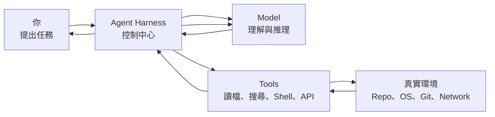
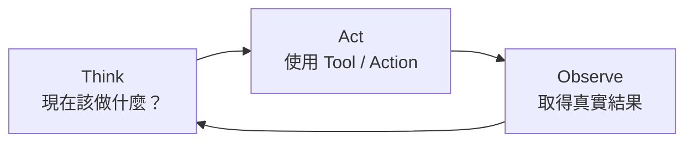
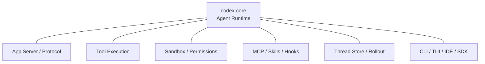
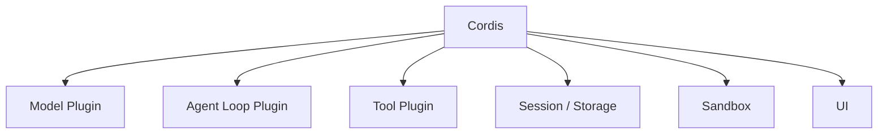

# 導論：Model 不等於 Agent

> 最後核對：2026-08-23。Codex 與 DeepSeek Harness 都仍快速演進；本教材會把「穩定的架構概念」與「版本敏感的 API / Plugin」分開說明。

如果你對 Coding Agent 說：

> 幫我找出登入失敗的原因，修好它，然後跑測試。

直覺上很容易把整件事想成：

```text
你 → AI 模型 → 修改完成
```

但實際上中間還有一整套系統在工作。



**Model 負責決定下一步；Harness 負責讓下一步真正發生。**

這就是整份教材最重要的出發點。

## 為什麼先講 Codex，再講 DeepSeek Harness？

這份教材現在使用兩套開源實作當 case study。

### Codex：先看一套完整 Coding Agent Runtime

Codex 很適合先建立 production-grade 心智模型：

```text
Agent Loop
Context
Thread / Turn / Item
Tool Execution
Sandbox / Approval
Skills / MCP / Hooks / Rules
App Server
```

它代表一種設計哲學：

> **有明確的 Runtime Core，再提供高階 extension surfaces。**

### DeepSeek Harness：再看另一種 Runtime Composition

DeepSeek Harness 則刻意把更多責任變成可組合 Plugin：

```text
Model Adapter
Agent Loop
Session
Tools
Sandbox
Storage
Scheduler
UI
```

它代表另一種哲學：

> **Runtime 本身就是 Plugin Tree。**

所以加入 DeepSeek 不是為了做品牌競賽，而是讓你看見：

> **同一個 Harness 問題，可以有非常不同的 architectural answer。**

## 先用一個生活化比喻

把一個 Coding Agent 想成一位在受控工作室裡工作的工程師：

- **Model** 是工程師的大腦：會分析、推理、決定下一步。
- **Harness** 是工作室的控制系統：把資料交給工程師、管理工具、記錄進度、限制危險操作。
- **Tools** 是工程師手上的工具：檔案搜尋、Shell、Patch、Git、MCP / API。
- **Environment** 是工作現場：repository、作業系統、網路與外部服務。
- **Sandbox / Permission** 是門禁：不是想做什麼就一定能做。
- **State** 是工作筆記：記住已經看過什麼、做過什麼、目前做到哪裡。

所以可以先記住：

```text
Agent
≈ Model
+ Harness
+ Tools
+ Environment
+ Policy
+ State
```

只有 Model，還不等於一個能在真實專案裡可靠工作的 Agent。

## 一個任務其實怎麼完成？

Agent 的工作方式不是「一次想完」，而是不斷循環：



例如修 bug：

1. Model 判斷先讀哪個檔案。
2. Harness 執行讀檔工具。
3. 真實檔案內容被送回 Model。
4. Model 判斷要搜尋哪個 symbol。
5. Harness 執行搜尋。
6. Model 發現問題並提出修改。
7. Harness 檢查權限後修改檔案。
8. Model 要求跑測試。
9. Harness 執行測試並把結果送回去。
10. Model 確認完成，才回覆你。

後面你看到的 Agent Loop、Tool Execution、Sandbox、Context、Thread / Turn / Item、SessionEvent，其實都只是在回答：

> **怎麼把這個循環做到 production-grade？**

## 為什麼要特別學 Harness？

因為很多 Agent 問題，並不是「模型不夠聰明」。


如果只懂 Prompt，很容易把所有問題都當成 Prompt Engineering；但很多真正的答案其實在 Harness。

## 這份教材的完整路線

### 1. Agent 到底怎麼工作？

先理解 Harness、Agent Loop、Context、Tool Call 與 State。

### 2. Codex Harness 本身怎麼拆？

進入 `codex-core`、App Server、Protocol、Model Provider、Tool Execution、State / Persistence。

### 3. 安全怎麼做？

理解 Sandbox、Approval、Permissions、Rules、Network Policy 與 Trust Boundary。

### 4. 要怎麼擴充 Codex？

分清楚 Prompt、AGENTS.md、Skill、Plugin、MCP、Hook、Rule、Subagent。

### 5. 實際怎麼使用 Codex？

包含 Interactive CLI、`codex exec`、SDK、App Server 與自製 UI / Integration。

### 6. 如果我要自己做 Agent Harness 呢？

把前面概念重新組裝成 Model Abstraction、Tool Runtime、Authorizer、Event Store、Persistence、Observability 與 Security Boundary。

### 7. DeepSeek Harness 又怎麼解同一題？

理解 Cordis、Everything is a Plugin、SessionEvent、Capability Seam、Code Mode 與可替換 Agent Loop。

### 8. Codex 與 DeepSeek 到底差在哪？

最後用同一組維度比較：

```text
Runtime center
Model provider
Agent loop
State model
Tool orchestration
Sandbox / execution
Extension system
UI / API
Production maturity
```

這時才做技術選型。

## 不同程度的人怎麼讀？

### 如果你是第一次理解 Agent

先讀：

1. [學習地圖：先建立全局觀](./learning-map.md)
2. [什麼是 Harness？](./foundations/what-is-harness.md)
3. [Agent Loop](./foundations/agent-loop.md)
4. [Sandbox 與 Approvals](./security/sandbox-and-approvals.md)
5. [Codex vs DeepSeek Harness](./comparison/codex-vs-deepseek.md)

先懂概念，不需要急著看 Rust 或 TypeScript source。

### 如果你已經常用 Codex

建議完整讀 Codex 一到六部分，再讀：

- [DeepSeek Harness：先建立正確心智模型](./deepseek/overview.md)
- [Cordis 與 Plugin 架構](./deepseek/architecture.md)
- [Code Mode、Capability 與 Runtime 組合](./deepseek/code-mode-and-plugins.md)

這會幫你分辨哪些行為是「Agent 必然如此」，哪些只是 Codex 的 design choice。

### 如果你要做 Agent Platform / Integration

除了 Codex App Server、State、Security、Source Map，也重點讀：

- [Session、Events 與可追溯狀態](./deepseek/session-and-events.md)
- [Codex vs DeepSeek：架構逐項比較](./comparison/codex-vs-deepseek.md)
- [如何選擇 Codex 或 DeepSeek Harness？](./comparison/selection-guide.md)

## 「Codex Harness」不是單一 crate

目前開源 Codex 是大型 Rust workspace。

`codex-core` 是核心 Agent Runtime，但完整 Harness 還包含：



## 「DeepSeek Harness」也不是 DeepSeek Model 的包裝器

DeepSeek Harness 是 Cordis 驅動的 Agent Runtime Framework；Model Adapter 本身只是 composition 的一部分。



所以比較兩者時，不應把「Harness 品牌」和「Model 品牌」綁死。

## 來源策略

本教材優先交叉核對：

- OpenAI 官方 Codex 文件與工程文章；
- `openai/codex` 主分支原始碼；
- DeepSeek Harness 官方網站與 architecture docs；
- `deepseek-ai/deepseek-harness` 主分支原始碼與 implemented design notes。

當正式文件、主分支與 developer-preview 功能有落差時，會標示版本敏感，不把內部實作寫成永久 API。

## 讀完導論，你只需要先記住四件事

1. **Model 不等於 Agent；Agent 還需要 Harness。**
2. **Agent 的核心工作方式是 Think → Act → Observe。**
3. **Codex 與 DeepSeek 都在解 Harness 問題，但固定與可替換的邊界不同。**
4. **先理解各自 architecture，再比較，才不會把產品成熟度、Model 能力與 Framework 自由度混成一件事。**

下一步先讀 [學習地圖](./learning-map.md)。

## 官方入口

### Codex

- [Codex documentation](https://learn.chatgpt.com/docs/codex)
- [Unrolling the Codex agent loop](https://openai.com/index/unrolling-the-codex-agent-loop/)
- [Unlocking the Codex harness: how we built the App Server](https://openai.com/index/unlocking-the-codex-harness/)
- [`openai/codex`](https://github.com/openai/codex)

### DeepSeek Harness

- [DeepSeek Harness](https://deepseek.com/harness/en/)
- [`deepseek-ai/deepseek-harness`](https://github.com/deepseek-ai/deepseek-harness)
- [DeepSeek Harness Architecture](https://github.com/deepseek-ai/deepseek-harness/blob/master/docs/architecture.md)
