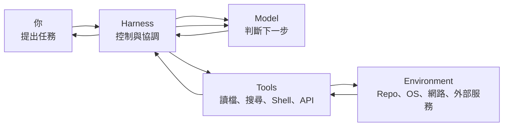
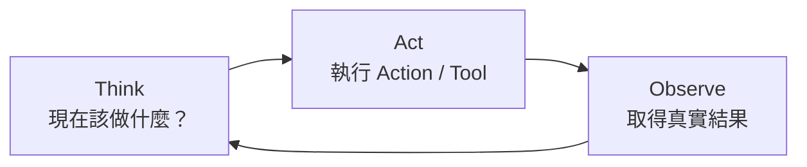
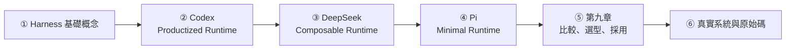
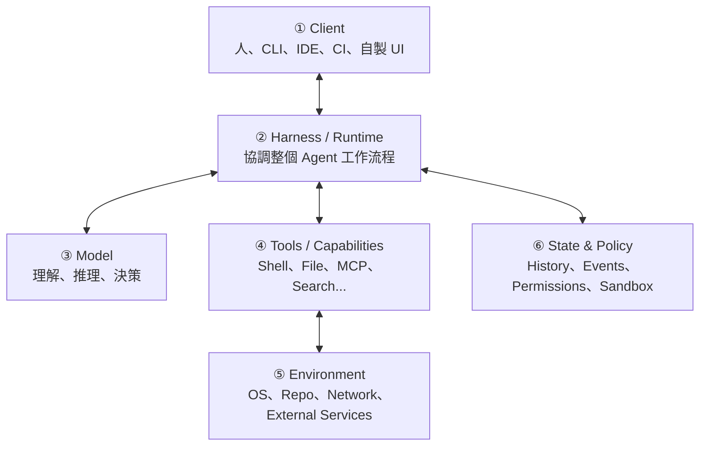

# 學習地圖：先建立全局觀

如果你第一次接觸 Agent Harness，不需要先懂 Rust、TypeScript、Responses API、MCP、JSON-RPC、Cordis 或 Pi Extensions。

先記住一件事：

> **Model 只是負責判斷的一部分；Harness 才把模型連到 Tools、Environment、Policy 與 State。**

這份教材用三套開源實作建立全局觀：

```text
Codex
→ 完整、opinionated 的 Coding Agent Runtime

DeepSeek Harness
→ Runtime responsibility 可重組的 Plugin / Capability Framework

Pi
→ Minimal、self-extensible 的 Coding Harness
```

三套不是互斥品牌，而是三種不同的架構答案。

## 最簡單的 Harness 模型



| 元件 | 直覺角色 | 主要工作 |
|---|---|---|
| Model | 大腦 | 理解、推理、選擇下一步 |
| Harness | 控制中心 | 組 Context、驅動 Loop、執行 Tool、保存狀態 |
| Tools | 手與感官 | Read、Search、Shell、Patch、MCP / API |
| Environment | 工作現場 | Repository、OS、Network、External Services |
| Policy / Sandbox | 門禁 | 決定 Action 能不能真正執行 |
| State | 工作筆記 | 保存已做過什麼、目前做到哪裡 |

## 所有 Agent 都在反覆三件事



後面的 Agent Loop、Context、Tool Runtime、Sandbox、Session、Thread / Turn / Item、SessionEvent、JSONL Tree，本質上都在回答：

> **如何把 Think → Act → Observe 做到 production-grade？**

## 教材主要閱讀路徑



## 第一階段：建立共同語言

先理解：

- Model vs Agent vs Harness；
- Agent Loop；
- Context；
- Tool Call；
- Policy / Sandbox；
- State / Persistence。

這些概念不屬於任何單一產品。

## 第二階段：用 Codex 看完整 Production Runtime

Codex 很適合用來學：

```text
codex-core
App Server
Thread / Turn / Item
Model Provider
Tool Execution
Sandbox / Approval
Skills / MCP / Hooks / Rules
```

它代表：

> **核心 Runtime 有明確中心，再提供高階 extension surfaces。**

## 第三階段：用 DeepSeek 看 Runtime Composition

DeepSeek Harness 很適合用來學：

```text
Cordis
Everything is a Plugin
Service / Provider / Consumer
SessionEvent
Capability Seam
Replaceable Agent Loop
Code Mode
Profiles / Bundles
```

它代表：

> **Runtime 本身就是可以重新組合的 Plugin Tree。**

## 第四階段：用 Pi 看 Minimal Harness

Pi 很適合用來學：

```text
pi-ai
pi-agent-core
AgentSession
SessionManager
JSONL Tree
ResourceLoader
TypeScript Extensions
RPC / SDK
Project Trust
External Sandbox
```

它代表：

> **不是所有常見 Agent feature 都必須內建在 core。**

## 第五階段：第九章不要直接做排行榜

第九章現在刻意拆成四步：

```text
比較框架
→ 架構維度逐項比較
→ 情境式選型
→ PoC、採用與混用策略
```

閱讀順序：

1. [第九章導讀：如何比較 Agent Harness](./comparison/overview.md)
2. [架構維度逐項比較：Codex、DeepSeek Harness、Pi](./comparison/architecture-comparison.md)
3. [情境式選型](./comparison/scenario-selection.md)
4. [PoC、採用與混用策略](./comparison/adoption-playbook.md)

這樣可以避免把「架構差異」「產品情境」「採用風險」混成同一張比較表。

## State Model 是最好的並讀入口

### Codex

```text
Thread
└─ Turn
   └─ Item
```

### DeepSeek

```text
Session
→ SessionEvents
→ Projection / Context / Replay
```

### Pi

```text
Session JSONL
→ Entry(id, parentId)
→ Tree / Branch
```

三種 abstraction 都合理，但服務的產品目標不同。

## Security Model 也完全不同

### Codex

```text
Sandbox / Approval / Policy
→ Runtime 核心產品能力
```

### DeepSeek

```text
Sandbox / Approval / Credentials
→ Formal capability seams
```

### Pi

```text
Project Trust
→ 控制 resource loading

OS / Container / Sandbox
→ 真正 execution isolation
```

Pi 官方明確提醒：**Project Trust 不是 sandbox。**

## 三種閱讀深度

### Level 1：第一次理解 Agent

建議：

1. [導論](./intro.md)
2. [什麼是 Harness？](./foundations/what-is-harness.md)
3. [Agent Loop](./foundations/agent-loop.md)
4. [第九章比較框架](./comparison/overview.md)

先懂圖與概念，不必讀原始碼。

### Level 2：工程師 / Agent 重度使用者

先完整讀 Codex，再讀：

- [DeepSeek Harness：先建立正確心智模型](./deepseek/overview.md)
- [Pi Agent Harness：先建立正確心智模型](./pi/overview.md)
- [架構維度逐項比較](./comparison/architecture-comparison.md)
- [情境式選型](./comparison/scenario-selection.md)

### Level 3：Agent / Platform 架構設計者

除了 App Server、State、Security，也重點讀：

- [`openai/codex` 原始碼導讀地圖](./reference/source-map.md)
- [`deepseek-ai/deepseek-harness` 原始碼導讀地圖](./reference/deepseek-source-map.md)
- [`earendil-works/pi` 原始碼導讀地圖](./reference/pi-source-map.md)
- [三套 Harness 原始碼導讀入口](./reference/source-reading.md)
- [PoC、採用與混用策略](./comparison/adoption-playbook.md)

這一層的目標不是「會使用三套工具」，而是能自己回答：

> **如果我要做新的 Agent Platform，哪些 abstraction 值得固定、哪些值得做 seam、哪些應該移出 core？**

## 後面所有名詞都可以放進六層模型



遇到陌生名詞時先問：

> **它是在做 Decision、Capability、Execution、Enforcement、State，還是 Integration？**

通常就不會迷路。

## 你現在只需要記住七句話

1. **Model 是推理元件，Harness 是完整控制與執行系統。**
2. **Agent 的核心是 Think → Act → Observe。**
3. **Tool Call 是行動提案，不等於行動已經成功。**
4. **Sandbox / Permission 是 capability boundary，不一定必須由同一層實作。**
5. **Codex 強調完整、opinionated 的 Coding Agent Runtime。**
6. **DeepSeek Harness 強調 Runtime 本身的 Plugin Composition。**
7. **Pi 強調 Minimal Core 與深度 Self-extension。**

帶著這七句話往下讀，就能把三套系統看成「同一問題的不同解法」，而不是三堆孤立 API。
