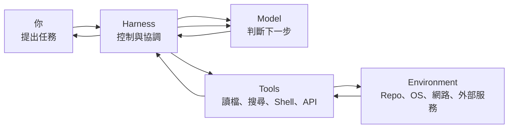
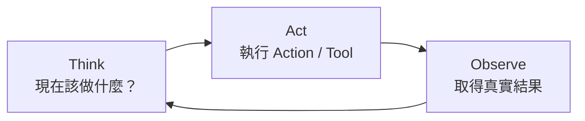
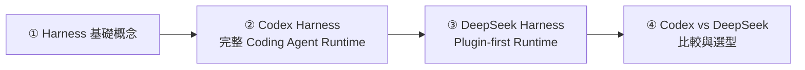
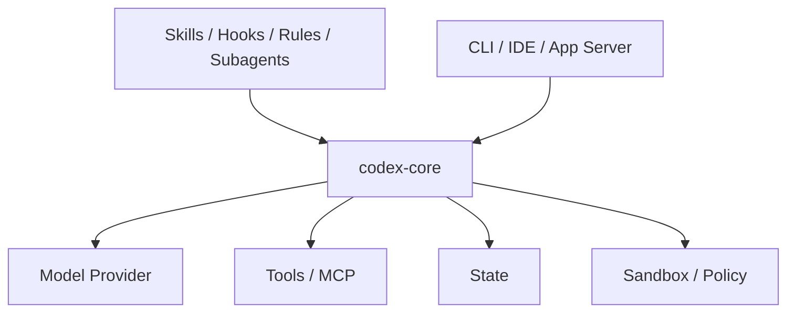
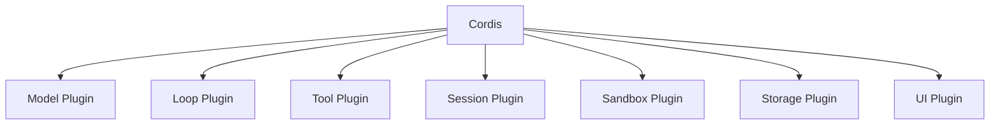
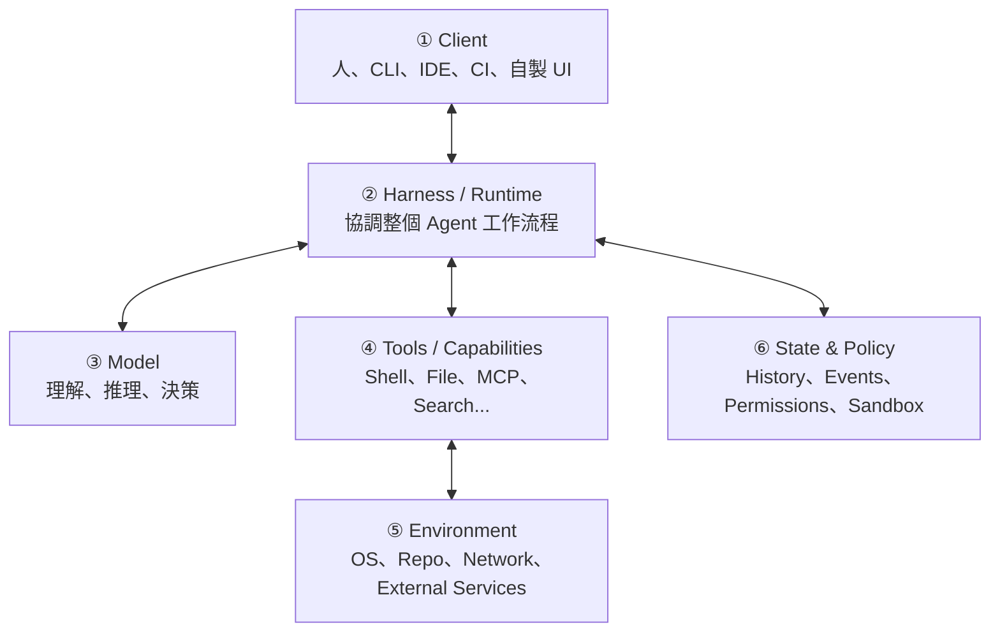

# 學習地圖：先建立全局觀

如果你第一次接觸 Agent Harness，不需要先懂 Rust、TypeScript、Responses API、MCP、JSON-RPC 或 Cordis。

先記住一件事：

> **Model 只是負責判斷的一部分；Harness 才把模型連到 Tools、Environment、Policy 與 State。**

這份教材會先用 **Codex** 建立完整 Coding Agent 心智模型，再用 **DeepSeek Harness** 展示另一種更 plugin-first 的 Runtime 設計，最後逐項比較。

## 最簡單的 Harness 模型

假設你對 Agent 說：

> 幫我找出登入失敗的原因，修好它，然後跑測試。

真正發生的事情比較像：



| 元件 | 直覺角色 | 主要工作 |
|---|---|---|
| Model | 大腦 | 理解、推理、選擇下一步 |
| Harness | 控制中心 | 組 Context、驅動 Loop、執行 Tool、保存狀態 |
| Tools | 手與感官 | Read、Search、Shell、Patch、MCP / API |
| Environment | 工作現場 | Repository、OS、Network、External Services |
| Policy / Sandbox | 門禁 | 決定 Action 能不能真正執行 |
| State | 工作筆記 | 保存已做過什麼、目前做到哪裡 |

## 所有 Agent 都在反覆三件事



後面的 Agent Loop、Context、Tool Runtime、Sandbox、Session、Thread / Turn / Item，本質上都在回答：

> **如何把 Think → Act → Observe 做到 production-grade？**

## 教材現在有三個主要區塊



### 第一階段：先建立共同語言

先理解：

- Model vs Agent vs Harness；
- Agent Loop；
- Context；
- Tool Call；
- Policy / Sandbox；
- State / Persistence。

這些概念不屬於任何單一品牌。

### 第二階段：用 Codex 看完整 Production Runtime

Codex 很適合用來學：

```text
codex-core
App Server
Thread / Turn / Item
Model Provider
Tool Execution
Sandbox / Approval
Skills / MCP / Hooks / Rules
```

它代表一種設計哲學：

> **核心 Runtime 有明確中心，再提供高階 extension surfaces。**

### 第三階段：用 DeepSeek 看另一種 Runtime Composition

DeepSeek Harness 很適合用來學：

```text
Cordis
Everything is a Plugin
Service / Provider / Consumer
SessionEvent
Capability Seam
Replaceable Agent Loop
Code Mode
Profiles / Bundles
```

它代表另一種哲學：

> **Runtime 本身就是可以重新組合的 Plugin Tree。**

### 第四階段：再做真正比較

不要只問「哪個比較強」，而比較：

```text
穩定中心是什麼？
Model 怎麼替換？
Loop 能不能替換？
State 怎麼建模？
Tool 如何 orchestrate？
Sandbox / Execution backend 怎麼抽象？
UI / Client 怎麼整合？
目前 production maturity 如何？
```

## Codex 與 DeepSeek 的第一張對照圖

### Codex：明確 Runtime Core



### DeepSeek：Plugin Composition



現在不需要判斷哪一張比較好，只要先看懂：

> **兩者把「固定」與「可替換」的邊界畫在不同地方。**

## 三種閱讀深度

### Level 1：第一次理解 Agent

建議：

1. [導論](./intro.md)
2. [什麼是 Harness？](./foundations/what-is-harness.md)
3. [Agent Loop](./foundations/agent-loop.md)
4. [Sandbox 與 Approvals](./security/sandbox-and-approvals.md)
5. [Codex vs DeepSeek Harness](./comparison/codex-vs-deepseek.md)

先懂圖與概念，不必讀原始碼。

### Level 2：工程師 / Agent 重度使用者

完整讀 Codex 一到六部分，再讀：

- [DeepSeek Harness：先建立正確心智模型](./deepseek/overview.md)
- [Cordis 與 Plugin 架構](./deepseek/architecture.md)
- [Session、Events 與可追溯狀態](./deepseek/session-and-events.md)
- [Code Mode、Capability 與 Runtime 組合](./deepseek/code-mode-and-plugins.md)

你會開始理解同一個 Harness 問題可以有不同 architectural answer。

### Level 3：Agent / Platform 架構設計者

除了 source map、App Server、State、Security，也重點讀：

- [Codex vs DeepSeek：架構逐項比較](./comparison/codex-vs-deepseek.md)
- [如何選擇 Codex 或 DeepSeek Harness？](./comparison/selection-guide.md)

這一層的目標不是「會使用兩套工具」，而是能自己回答：

> **如果我要做新的 Agent Platform，哪些 abstraction 值得採用？**

## 後面所有名詞都可以放進六層模型



遇到陌生名詞時先問：

> **它是在做 Decision、Capability、Execution、Enforcement、State，還是 Integration？**

通常就不會迷路。

## 你現在只需要記住六句話

1. **Model 是推理元件，Harness 是完整控制與執行系統。**
2. **Agent 的核心是 Think → Act → Observe。**
3. **Tool Call 是行動提案，不等於行動已經成功。**
4. **Sandbox / Permission 是真正的 capability boundary。**
5. **Codex 強調完整、opinionated 的 Coding Agent Runtime。**
6. **DeepSeek Harness 強調 Runtime 本身的 Plugin Composition。**

帶著這六句話往下讀，就能把兩套系統看成「同一問題的不同解法」，而不是兩堆孤立 API。
