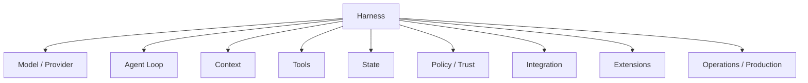

# 學習地圖：用同一組問題讀三套 Harness

如果第一次接觸 Agent Harness，不需要先懂 Rust、TypeScript、Responses API、Cordis、MCP 或 Pi Extensions。

先記住：

> **Model 負責判斷；Harness 負責把判斷連到 Tools、Execution、State、Policy 與 Client。**

## 三套不是主角與配角

```text
Codex
→ Productized / Opinionated Runtime

DeepSeek Harness
→ Composable Runtime Framework

Pi
→ Minimal / Self-extensible Harness
```

本教材現在刻意讓三套都回答同一組問題，而不是先把 Codex 學完，再用另外兩套做補充。

## 全書的共同問題



每讀一套，都問：

1. Runtime center 在哪？
2. Model 怎麼接？
3. Loop 怎麼驅動？
4. Context 怎麼組？
5. Tools 怎麼註冊與執行？
6. State 怎麼保存、resume、fork？
7. Security / Trust boundary 在哪？
8. Extension 怎麼加入？
9. Client / SDK / RPC 怎麼接？
10. Production correctness 誰負責？

## 第一章：共同基礎

這一章完全不把任何單一產品的資料模型當成標準答案。

建議順序：

1. [什麼是 Harness？](./foundations/what-is-harness.md)
2. [Agent Loop](./foundations/agent-loop.md)
3. [Context、Caching 與 Compaction](./foundations/context-and-caching.md)
4. [State Models 與 Lifecycle](./foundations/state-models-and-lifecycle.md)

第四篇會直接並讀：

```text
Codex     Thread / Turn / Item
DeepSeek  Session / Turn / Step / Event
Pi        JSONL Entry Tree
```

## 第二章：Codex 完整導讀

Codex 的價值在於看一個成熟、opinionated Coding Agent Runtime 如何把大量 product semantics 固定下來。

### 架構與 Runtime

- 系統架構
- `codex-core`
- Model Provider / Streaming
- Tool Execution
- State / Persistence
- App Server / Client Surfaces

### Security

- Sandbox / Approval
- Permissions / Rules / Network
- Trust Boundaries

### Customization

- Config
- AGENTS.md
- Skills / Plugins
- MCP
- Hooks
- Subagents / Worktrees

### Usage / Integration

- CLI
- Non-interactive / CI
- SDK
- App Server
- GitHub Actions

## 第三章：DeepSeek Harness 完整導讀

DeepSeek Harness 不是「Codex 的 plugin-heavy 版本」，而是一套能自足成立的 composable runtime architecture。

### 架構與 Runtime

- Cordis / Everything is a Plugin
- Model Adapter / Agent Loop
- Tool Pipeline
- Context / Compaction
- Session / Events
- Profiles / Bundles

### Extension / Orchestration

- Skills
- Subagent Providers
- Workflow / Jobs
- Code Mode
- Extensions / Hooks

### Security / Execution

- Approval / Sandbox
- Credentials
- Execution Worlds

### Usage / Integration / Production

- Web UI
- CLI / Headless
- SDK / JSON-RPC / ACP / Typert
- Invariants / Replay / Testing

## 第四章：Pi 完整導讀

Pi 的重點不是「小」，而是把很多責任從 core 移到 extension runtime 或外部 execution environment。

### 架構與 Runtime

- `pi-ai`
- `pi-agent-core`
- Agent Loop / Tools
- AgentSession
- SessionManager

### State / Context

- JSONL Session Tree
- Context reconstruction
- Compaction
- Branch Summarization

### Resources / Extensions

- ResourceLoader
- Skills / Prompts / Themes
- Pi Packages
- TypeScript Extensions
- Custom TUI

### Security / Usage / Integration

- Project Trust
- External isolation
- CLI / Interactive / Print / JSON
- RPC / SDK
- Production governance

## 第五章：三套 Labs

不要只讀概念，直接觀察三套最關鍵的 architecture behavior。

### Codex Labs

- Trace a Turn
- Guardrails
- Embed App Server

### DeepSeek Labs

- Trace Turn / Step / Events
- Build a Capability Plugin
- Replay / Invariant

### Pi Labs

- Trace AgentSession / JSONL Session
- Build an Extension
- Branch / Tree / Compaction

## 第六章：比較、選型與採用

```text
比較框架
→ 架構維度逐項比較
→ 情境式選型
→ PoC / Adoption / 混用
```

不要先問「誰最好」，而是問：

```text
我要的是完整 Product Runtime？
可重組 Agent Platform？
Minimal 可塑形 Harness？
```

## 第七章：真實系統與實務

這一章把三套重新抽象回 vendor-neutral engineering：

- Workflow Design
- Behavior Responsibility Placement
- Build Your Own Harness
- Production Checklist

## 第八章：參考資料與原始碼

三套都有自己的 Source Map，而且用對稱問題閱讀：

```text
Runtime center
→ Model / Loop
→ State
→ Tools
→ Extensions
→ Security
→ Integration
→ Production
```

## 三套 State Model 並讀

| 問題 | Codex | DeepSeek Harness | Pi |
|---|---|---|---|
| 長工作邊界 | Thread | Session | Session |
| 一次任務 | Turn | Turn | active branch + Agent lifecycle |
| 細粒度資料 | Item | SessionEvent / Step | Entry |
| Durable model | product objects / rollout | append-only event log | JSONL entry tree |
| Fork | Thread-level semantics | event/history lineage | native parentId branch |
| UI projection | Item events | Session + Agent events | AgentSession + tree view |

## 三套 Extension 並讀

| 需求 | Codex | DeepSeek Harness | Pi |
|---|---|---|---|
| Repo guidance | AGENTS.md | prompt/plugin contribution | project resources |
| Workflow knowledge | Skill | Skill | Skill |
| External capability | MCP / Tool | Tool Provider Plugin | Extension Tool |
| Lifecycle behavior | Hook | Typed Events / Plugin | Extension Events |
| Delegation | Subagent | Subagent Provider | SDK / Extension / external process |
| Runtime composition | limited high-level surfaces | Cordis composition | Extension + package + external environment |

## 三套 Security 並讀

```text
Codex
→ Productized Sandbox / Approval / Rules

DeepSeek
→ Formal Sandbox / Approval / Credential seams

Pi
→ Resource Trust + extension gates + external isolation
```

這裡最重要的不是哪一套「比較安全」，而是 security ownership 放在哪一層。

## 推薦閱讀路線

### 只想快速理解 Harness

```text
導論
→ 第一章
→ 三套 Overview
→ 第六章比較框架
```

### 想做 Coding Agent 整合

```text
第一章
→ Codex Usage / App Server
→ DeepSeek Integration
→ Pi SDK / RPC
→ 第六章情境選型
```

### 想做 Agent Platform

```text
第一章
→ 三套完整導讀
→ 三套 Labs
→ 第六章
→ 第七章 Build Your Own Harness
→ 三套 Source Map
```

## 最後只記住七句話

1. **Model 是推理元件；Harness 是控制與執行系統。**
2. **Agent Loop 是 Think → Act → Observe 的 production 版本。**
3. **State 不等於 Context。**
4. **Tool Call 不等於 side effect 已發生。**
5. **Extension surface 的形狀反映 Runtime philosophy。**
6. **Security ownership 放在哪一層，是 Harness 架構差異的核心。**
7. **Codex、DeepSeek、Pi 是同一組工程問題的三種不同答案。**
