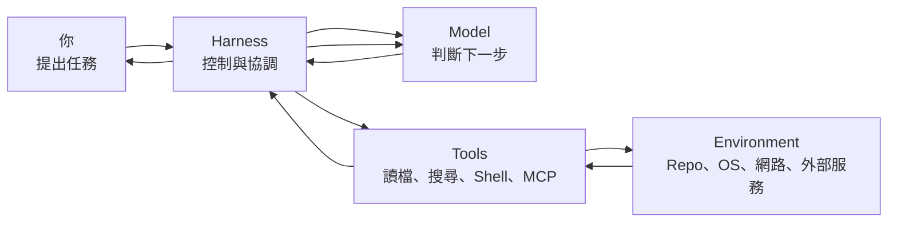
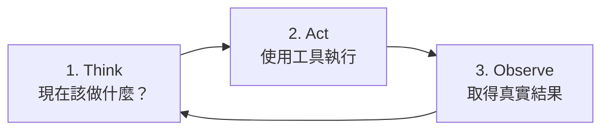
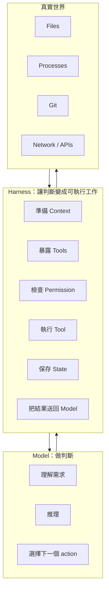

# 學習地圖：先建立全局觀

如果你第一次接觸 Codex harness，不需要先懂 Rust、Responses API、MCP 或 JSON-RPC。

先記住一件事：**Codex 不是只有一個會寫程式的模型，而是一套讓模型能安全地在真實電腦環境中工作的系統。**

這一頁先給你一張地圖，後面每個章節都只是把地圖中的某一塊放大。

## 先看最簡單的版本

假設你對 Codex 說：

> 幫我找出登入失敗的原因，修好它，然後跑測試。

真正發生的事情不是「模型直接把專案改好」，而比較像：



可以把各部分想成：

| 元件 | 直覺角色 | 主要工作 |
|---|---|---|
| Model | 大腦 | 理解問題、推理、決定下一步 |
| Harness | 控制中心 | 組 context、執行工具、維持流程、限制權限 |
| Tools | 手與感官 | 讀檔、搜尋、跑指令、修改檔案、呼叫外部 API |
| Environment | 工作現場 | Repository、作業系統、網路、資料庫、Git |
| Policy / Sandbox | 門禁 | 決定哪些行動真的能執行 |
| State | 工作筆記 | 記住這個任務做過什麼、目前做到哪裡 |

如果這張表能看懂，你已經掌握整份教材最重要的骨架。

## Codex 工作時，其實一直重複三件事

從高層來看，所有 coding agent 都在反覆進行：



例如：

```text
Think   → 我需要先看 auth.ts
Act     → 讀取 auth.ts
Observe → 發現 token 驗證邏輯

Think   → 懷疑 expiry 單位錯誤
Act     → 搜尋相關測試並執行
Observe → 測試證實問題

Think   → 修改程式
Act     → apply patch
Observe → 檔案已更新

Think   → 執行測試
Act     → npm test
Observe → 全部通過

Think   → 工作完成
Act     → 回覆使用者
```

這就是後面會深入講的 **agent loop**。

## 再加上一層：誰負責什麼？

最容易混淆的是「模型」和「Harness」的工作。



**模型會提出行動，但 Harness 才真正讓行動發生。**

這個分界是理解 Codex 安全、效能與架構的起點。

## 三種閱讀深度

這份教材刻意讓不同背景的人都能讀。

### Level 1：使用者 / 初學者

你只需要先回答：

- Codex 為什麼能讀檔、跑命令？
- Harness 跟模型有什麼不同？
- 為什麼有 sandbox 和 approval？
- AGENTS.md、Skill、MCP 各自是做什麼？

建議先讀：

1. [導論：把 Codex 看成一個 Harness](./intro.md)
2. [什麼是 Harness？](./foundations/what-is-harness.md)
3. [Agent Loop](./foundations/agent-loop.md)
4. [Sandbox 與 Approvals](./security/sandbox-and-approvals.md)
5. [行為到底該放哪裡？](./applications/where-should-behavior-live.md)

### Level 2：工程師 / Codex 重度使用者

再進一步理解：

- Context 怎麼組成？
- Tool call 為什麼可以一輪又一輪？
- Thread / Turn / Item 如何保存 agent 的工作？
- App Server 如何讓 IDE 或自製 UI 操控 Codex？
- Skills、MCP、Hooks 該怎麼分工？

建議完整閱讀第一到六部分。

### Level 3：Agent / Platform 架構設計者

你會關心：

- 如何自己做 harness？
- 如何設計 provider abstraction？
- 如何處理 persistence、retry、idempotency？
- 如何劃 trust boundary？
- 如何把 agent 放進 production？

這時再深入 source map、App Server protocol、state、security 與 Labs。

## 後面所有章節，都可以放進六層模型


後面遇到陌生名詞時，先問：

> **它屬於哪一層？它是在做決策、執行能力、限制能力，還是保存狀態？**

通常就不會迷路。

## 你現在只需要記住五句話

1. **Model 是大腦，Harness 是控制與執行系統。**
2. **Agent 的核心是 Think → Act → Observe 的循環。**
3. **Tool call 是模型提出的行動，不等於行動已經發生。**
4. **Sandbox / Permission 決定模型提出的行動能不能真的執行。**
5. **Thread / Turn / Item 讓一個長任務可以被記錄、恢復、觀察與分支。**

帶著這五句話往下讀，後面的 Rust crate、App Server、MCP、Hooks 就只是在補充細節，而不是一堆孤立名詞。
