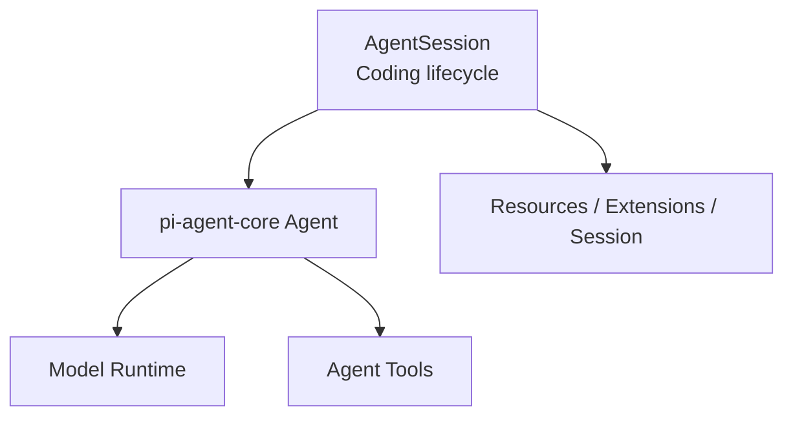
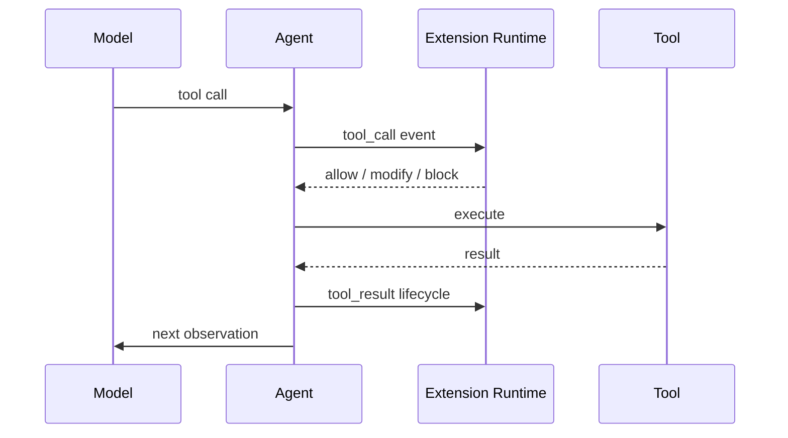
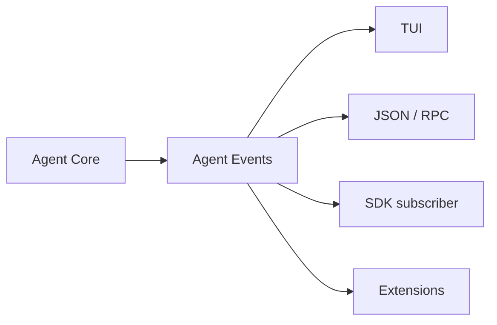

# Agent Loop 與 Tools：Minimal Core 怎麼工作

Pi 的 minimal philosophy 最容易從 `pi-agent-core` 與預設 Tools 看懂。

它不是沒有 Agent Loop，而是刻意把低階 loop 與高階 Coding Agent product behavior 分開。

## 兩層 Runtime



### `pi-agent-core`

負責：

```text
stateful agent
model call
streaming events
tool call execution
observation → next iteration
```

### `AgentSession`

負責：

```text
persistent session
resources
extensions
compaction
commands / TUI lifecycle
model selection
bash execution tracking
```

所以 Pi 不要求「一個 Agent class 擁有所有東西」。

## 預設 Tool Surface 很小

官方預設核心 coding tools：

```text
read
write
edit
bash
```

另外還有可選的 read-only utilities，例如 grep / find / ls。

這個設計提出一個很好的問題：

> **完成 coding loop 的最小 primitive 到底需要多少？**

Pi 的答案是先保持 surface 小，再讓 Extension / SDK 加能力。

## Tool Definition

Tool 至少包含：

```text
name
description
parameter schema
execute()
result / rendering semantics
```

可以由：

- built-in tool factory；
- SDK custom tool；
- Extension `registerTool()`

加入 runtime。

## Tool Call Lifecycle



Extension 可以在 execution 前攔截，因此 Pi 能自己做 permission gate、validation 或 audit。

但這種 gate 仍是 application policy，不等於 OS sandbox。

## `setTools()` 與 Tool Ownership

SDK / AgentSession 可以決定 active tool set。

這很適合：

```text
read-only reviewer
→ read / grep / find

coding agent
→ read / write / edit / bash

specialized agent
→ custom domain tools only
```

Tool surface 本身就是 Context / Security / Cost 的一部分；不是越多越好。

## Bash 為什麼特別重要？

Bash 是很強的 universal escape hatch：

```text
search
build
test
git
package manager
network client
scripts
```

這也是 Pi 能保持少量 built-in tools 的原因之一。

但代價是：如果沒有外部 isolation，Bash 會直接擁有啟動 Pi 的 OS user permissions。

因此 minimal tool surface **不等於** minimal risk surface。

## Tool Result 與 Context

Tool output 不應無限制塞回 Model。

實務需要處理：

```text
large logs
binary / non-text output
truncation
rendering
error status
metadata
```

Extension 也可以攔截 result / context，讓特定工具把 raw output 轉成更合適的 observation。

## Agent Events

Pi 的 Agent Core 會產生 streaming lifecycle events，讓外層能：

- 顯示 TUI；
- JSON mode 輸出；
- SDK subscriber 觀察；
- Extension 插入 behavior。

這是低階 engine 與 presentation 解耦的關鍵。



## 為什麼不內建更多高階 Tool？

Pi 官方刻意不把：

```text
MCP
subagent workflow
plan mode
todo system
background bash
permission popup
```

固定成 canonical core feature。

需要時可以透過 Extension / Package / 外部 process 建立。

這種哲學的優點是 core 小、迭代快；代價是團隊要自己決定 conventions 與 governance。

## 一個 Minimal Review Agent

如果只要做 code review，可以把 active tools 收窄：

```text
read
grep
find
ls
```

不用提供 write / bash。

這比「提供所有工具，再用 prompt 叫 Model 不要寫」更可靠。

即使 Pi 沒有內建 sandbox，**縮小 Tool Surface 仍然是一個有效 capability-reduction layer**。

## 本章重點

1. **Pi 把低階 Agent Loop 與高階 AgentSession 分層。**
2. **預設核心 coding tools 刻意保持小。**
3. **Extension / SDK 可以註冊與切換 Tool Surface。**
4. **Tool interception 可以做 policy，但不等於 OS-level sandbox。**
5. **Minimal built-in tools 不代表 minimal privilege；Bash 的 execution boundary 仍要治理。**

## 官方來源

- [`pi-agent-core`](https://github.com/earendil-works/pi/tree/main/packages/agent)
- [Pi SDK：Tools](https://pi.dev/docs/latest/sdk)
- [Pi Extensions](https://pi.dev/docs/latest/extensions)
