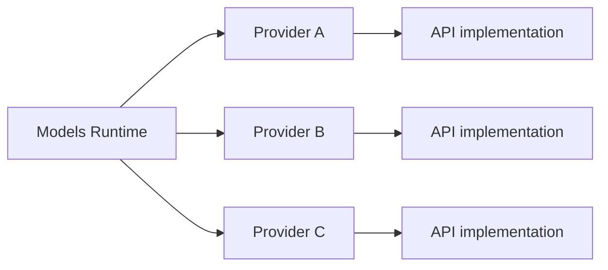
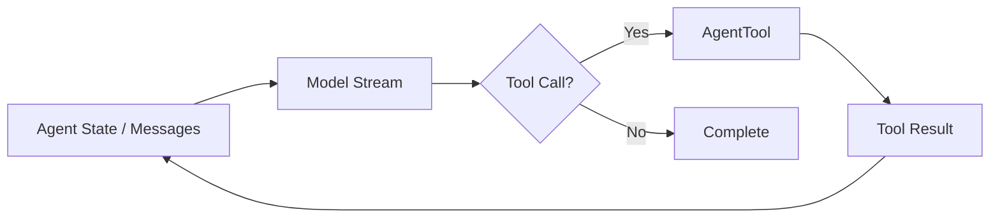
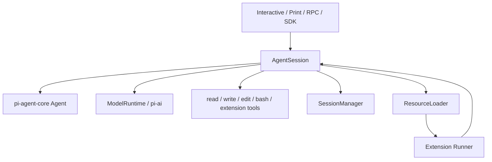
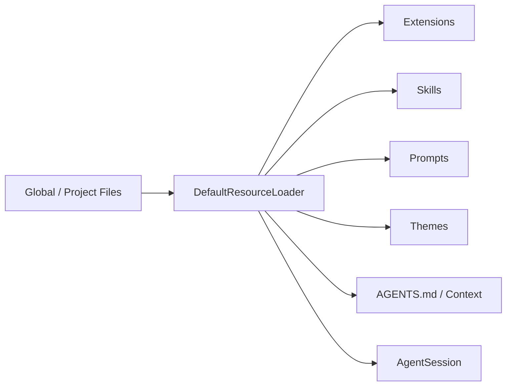
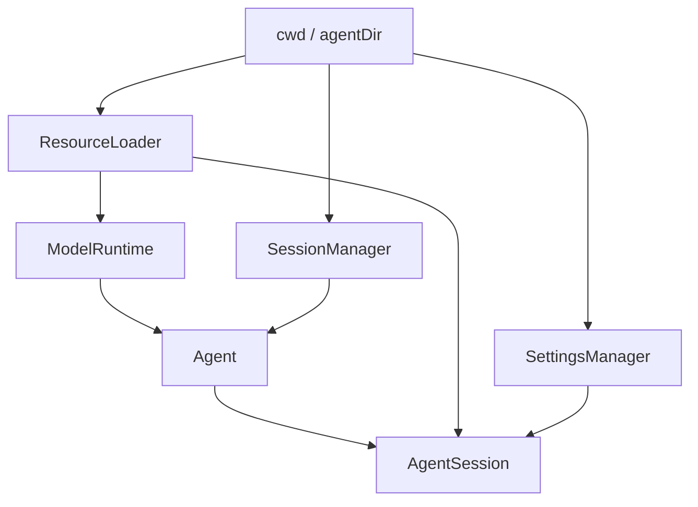

# Pi 架構：從 `pi-ai` 到 `AgentSession`

Pi 的架構最好分成三層讀，而不是把 `pi-coding-agent` 當成唯一核心：

```text
pi-ai
↓
pi-agent-core
↓
pi-coding-agent
```

每一層解不同問題。

## 1. `pi-ai`：Model / Provider Runtime

`@earendil-works/pi-ai` 處理：

```text
Provider
Model catalog
Credential / auth
Streaming
Usage
Tool-call message format
Cross-provider compatibility
```

目前核心型別把 **Provider** 定義成真正的 runtime unit：provider 擁有自己的 auth、models 與 streaming behavior。



這裡要分清楚兩件事：

```text
Provider
→ 具體 vendor / endpoint / auth / catalog

API implementation
→ reusable stream protocol implementation
```

例如多個 Provider 可以共用 OpenAI-compatible API behavior，但 Provider 本身仍擁有自己的 model catalog 與 credential semantics。

### 為什麼這個分離重要？

因為 multi-provider 不再只是：

```text
if provider === "openai" ...
else if provider === "anthropic" ...
```

而是明確形成：

```text
Models
→ resolve provider
→ resolve auth
→ merge request options
→ provider.stream()
```

這讓 `pi-agent-core` 不必理解每家 LLM API。

## 2. `pi-agent-core`：最小 Agent Runtime

`@earendil-works/pi-agent-core` 官方定位是：

> Stateful agent with tool execution and event streaming.

它建立在 `pi-ai` 之上，負責比較接近 Agent Loop 的事情：

```text
Agent state
Messages
Model invocation
Tool calls
Tool execution
Event stream
Abort / steering / follow-up
```

可以把它理解成：



這一層刻意不知道完整 Coding Agent 的 UI、project resources、session browser 或 terminal UX。

## 3. `pi-coding-agent`：把最小 Agent 變成 Coding Harness

真正的 Coding Agent product behavior 大量位於 `packages/coding-agent/`。

其中最重要的中心是：

```text
packages/coding-agent/src/core/agent-session.ts
```

`AgentSession` 的 source comment 已直接說明，它是所有 run mode 共用的 core abstraction，封裝：

```text
Agent state access
Event subscription + session persistence
Model / thinking-level management
Compaction
Bash execution
Session switching / branching
Extensions
```

因此比較準確的 runtime 圖是：



## 4. `AgentSession` 為什麼不是單純 Session DTO？

名稱很容易誤導。

Pi 的 `AgentSession` 不是只有「session data」。它其實是一個高階 runtime controller。

它同時掌握：

- active agent；
- model runtime；
- session manager；
- resource loader；
- tool registry；
- extension runner；
- compaction / retry / branch summarization；
- bash executions；
- active tools；
- project cwd。

因此更接近：

```text
AgentSession
≈ 一個可互動、可保存、可擴充的 Coding Agent runtime instance
```

這和 Codex 的 `Thread` 不是同一層 abstraction。

## 5. `SessionManager` 與 `AgentSession` 要分開

這也是讀 Pi source 時很重要的一刀。

```text
AgentSession
→ runtime lifecycle / model / tools / extensions

SessionManager
→ persisted entry tree / branch / context rebuild
```

兩者分開後，SDK 可以選：

```text
SessionManager.inMemory()
SessionManager.create()
SessionManager.continueRecent()
SessionManager.open()
```

因此 persistence strategy 不會和 Agent loop 綁死。

## 6. `ResourceLoader` 是 Pi extension philosophy 的關鍵

Pi 不把所有可客製化內容塞進一個 config object。

`DefaultResourceLoader` 負責發現：

```text
Extensions
Skills
Prompt Templates
Themes
Context Files / AGENTS.md
Project resources
Global resources
```

SDK 建立 `AgentSession` 時，如果沒有自行提供 loader，就使用預設 resource discovery。



所以在 Pi 裡，很多「產品功能」其實是由 **resource discovery + extension runtime** 組成，而不是 Agent core 直接內建。

## 7. ModelRuntime 是 Coding Agent 的 provider facade

`pi-coding-agent` 還有 `ModelRuntime`，把 `pi-ai` 的 Models / credential / catalog 能力整理成 Coding Agent 可直接使用的 runtime。

典型路徑是：

```text
AgentSession
→ ModelRuntime
→ pi-ai Models
→ Provider
→ stream()
```

Extension 也可以註冊 provider，因此 provider customization 和 extension system 可以接起來。

## 8. Built-in Tools 與 Tool Registry

Pi coding agent 預設工具很小：

```text
read
write
edit
bash
```

SDK 也提供 read-only / coding tool factory，以及 grep / find / ls 等可組合工具。

`AgentSession` 會維護 tool definitions / registry，Extension 可以再：

```text
registerTool()
setTools()
intercept tool_call
```

因此 Pi 的工具哲學是：

> **核心提供足夠完成 coding loop 的 primitive，再讓 extension / SDK 決定工具表面要長成什麼樣。**

## 9. `createAgentSession()` 是最重要的 SDK factory

如果你想快速理解整個 runtime 怎麼被 wiring 起來，可以直接讀：

```text
packages/coding-agent/src/core/sdk.ts
```

`createAgentSession()` 大致做：



它會：

1. resolve cwd / agentDir；
2. 建立或接受 `ModelRuntime`；
3. 建立 Settings / Session manager；
4. 載入 resources；
5. restore session state；
6. resolve model / thinking level；
7. 建立低階 `Agent`；
8. 建立 `AgentSession`。

這是 Pi source reading 最值得先 trace 的 call path 之一。

## 10. Runtime Services 與 cwd switching

Pi 最近的 source 還把 cwd-bound services 額外整理成：

```text
createAgentSessionServices()
createAgentSessionFromServices()
createAgentSessionRuntime()
```

目的之一是：當 session / cwd 被替換時，可以重建和目錄綁定的：

```text
SettingsManager
ResourceLoader
ModelRuntime integration
SessionManager
```

這代表 Pi 雖然主張 minimal，但並不是只有單檔 loop；它已經形成相當清楚的 embedding/runtime lifecycle boundary。

## 和另外兩套對照

### Codex

```text
codex-core
→ 大型、產品化 runtime center
```

### DeepSeek

```text
Cordis
→ service composition center
```

### Pi

```text
pi-agent-core
→ minimal agent engine

AgentSession
→ coding-agent lifecycle center

ResourceLoader / Extensions
→ 大量 product behavior 的外掛面
```

因此 Pi 的「中心」其實是**分層的**，不能只看 `pi-agent-core` 或只看 CLI。

## 建議 source reading 順序

```text
README.md
→ packages/coding-agent/README.md
→ packages/agent/README.md
→ packages/ai/src/models.ts
→ packages/coding-agent/src/core/sdk.ts
→ packages/coding-agent/src/core/agent-session.ts
→ packages/coding-agent/src/core/session-manager.ts
→ resource-loader.ts
→ extensions/
→ tools/
→ modes/rpc/
```

下一章再專門看 Pi 最有辨識度的兩件事：**Session Tree** 與 **Extension Runtime**。

## 官方來源

- [`pi-agent-core` README](https://github.com/earendil-works/pi/blob/main/packages/agent/README.md)
- [`AgentSession`](https://github.com/earendil-works/pi/blob/main/packages/coding-agent/src/core/agent-session.ts)
- [`sdk.ts`](https://github.com/earendil-works/pi/blob/main/packages/coding-agent/src/core/sdk.ts)
- [`pi-ai` Models](https://github.com/earendil-works/pi/blob/main/packages/ai/src/models.ts)
- [SDK Documentation](https://pi.dev/docs/latest/sdk)
