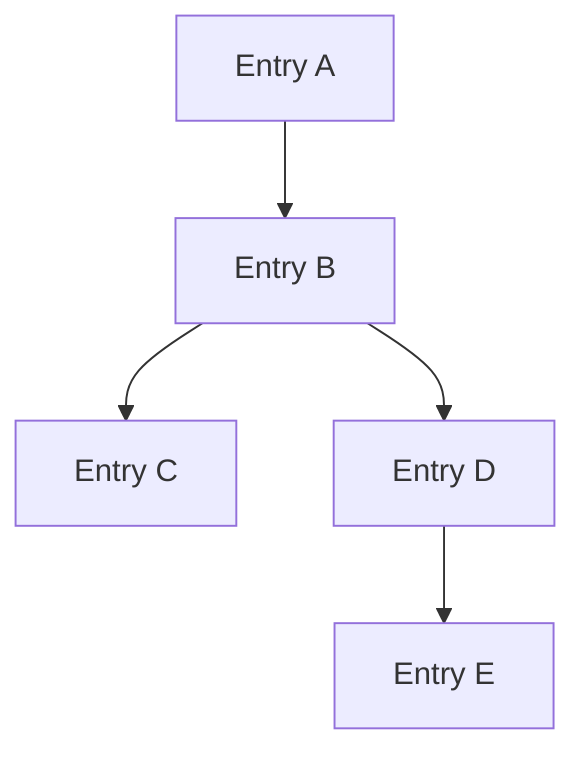
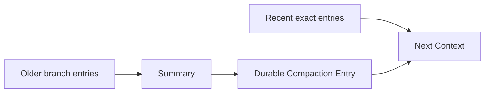
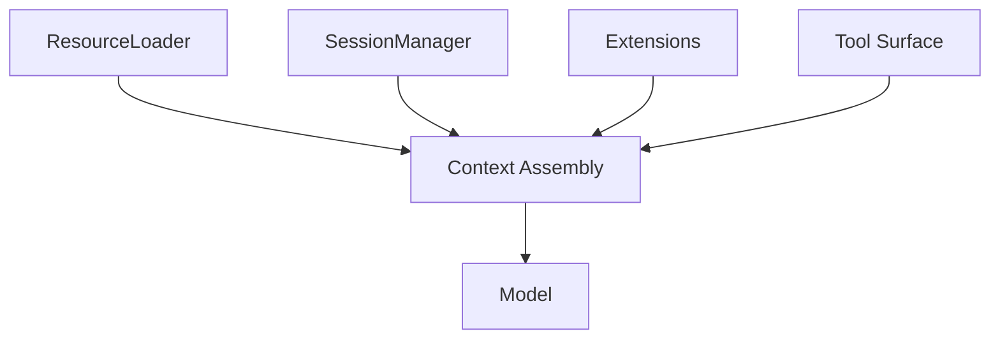

# Context、Compaction 與 Branching

Pi 的 Context 設計必須和它的 Tree Session 一起看。

因為目前 Model 看到的不是「session file 全部內容」，而是：

```text
active branch
+ context files / resources
+ selected tool surface
+ compaction / branch summary
+ runtime / extension contribution
```

## Active Branch 才是主要 History

Session Entry 使用 `id / parentId` 形成 tree。



如果目前 active leaf 是 E，Model history 會沿：

```text
A → B → D → E
```

重建，而不是把 C 也塞進 context。

這讓 branch navigation 天然也是 context selection。

## `SessionManager` 與 Context Rebuild

`SessionManager` 不只是 append JSONL。

它要能：

```text
parse / migrate session
identify active branch
walk parent lineage
interpret compaction entries
restore model / thinking metadata
build model-visible session context
```

所以 persisted format 與 context projection 雖然緊密相關，仍然是兩個責任。

## Compaction：處理 Context Window 壓力

當 context 接近 window 時，Pi 可以自動或手動 compact。

```text
/compact
```

概念上：



重點是 compaction 結果本身會成為 durable entry，因此 resume 後仍知道舊內容如何被壓縮。

## Branch Summarization：目的不同

這是 Pi 最值得學的 distinction。

```text
Compaction
→ 因為 context window 壓力而壓縮歷史

Branch Summarization
→ 離開一條探索 branch 時，保留那條路徑的 knowledge
```

假設：

```text
B → C → D 研究方案 A
```

你回到 B 改走：

```text
B → E → F 方案 B
```

方案 A 的重要發現可以被 summary 帶到新 branch，而不需要把完整 C/D raw history 也放進 context。

## 為什麼這比單純 Fork Copy 有趣？

線性 conversation 常用：

```text
clone entire history
→ new conversation
```

Pi 的 tree 可以保留：

```text
共同 prefix
+ multiple branches
+ branch-local knowledge
```

因此 storage duplication、branch identity、UI navigation 都更自然。

## Context Files 與 Session History 不同

Pi 會發現 project / global context files，例如 AGENTS.md 類 guidance。

```text
Context Files
→ repository / project knowledge

Session Entries
→ 這次 agent trajectory
```

兩者不應混成同一份 chat history。

`ResourceLoader` 負責前者；`SessionManager` 主要負責後者。

## Extension 可以攔截 Context / Compaction

Pi Extension 可以：

```text
inject context
modify lifecycle
listen session_before_compact
cancel default compaction
provide custom summary
append custom durable entry
```

這讓不同 workflow 可以自己決定：

- 哪些 knowledge 必須長期保留；
- 哪些 tool result 可以丟；
- branch summary 要採什麼格式。

但 custom compaction 是 correctness-sensitive extension：摘要漏掉 constraint，可能直接改變後續 Agent 行為。

## Prompt Caching 與 Tree History

Tree data model 不妨礙 prompt caching。

只要 active branch 的 request projection 維持 deterministic：

```text
stable system / resources
+ stable earlier branch entries
+ append recent observation
```

仍可能保留 reusable prefix。

切 branch、切 model、改 system prompt、執行 compaction 都可能讓 cache boundary 改變；這是正常 trade-off。

## 一個實用的 Context 分層



遇到 context 問題時，可以先判斷：

```text
resource 發現錯？
branch 選錯？
compaction 壞？
extension 注入過多？
tool schemas 太大？
```

不要全部歸因到 prompt 文案。

## 本章重點

1. **Pi 的 Model history 主要由 active session branch 投影。**
2. **Compaction 與 Branch Summarization 是兩種不同知識保存機制。**
3. **Context files 與 Session trajectory 分別由不同 responsibility 管理。**
4. **Extension 可以自訂 context / compaction，但這是 correctness-sensitive capability。**
5. **Tree persistence 與 prompt caching 並不衝突；真正關鍵是 request projection 是否穩定。**

## 官方來源

- [Sessions](https://pi.dev/docs/latest/sessions)
- [Session File Format](https://pi.dev/docs/latest/session-format)
- [Compaction & Branch Summarization](https://pi.dev/docs/latest/compaction)
- [`SessionManager`](https://github.com/earendil-works/pi/blob/main/packages/coding-agent/src/core/session-manager.ts)
