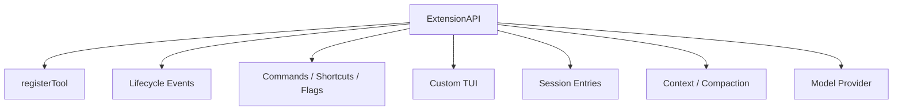
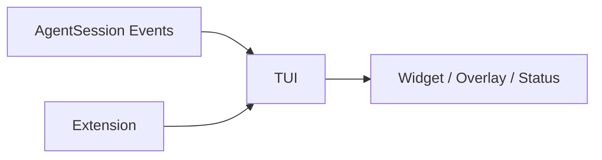
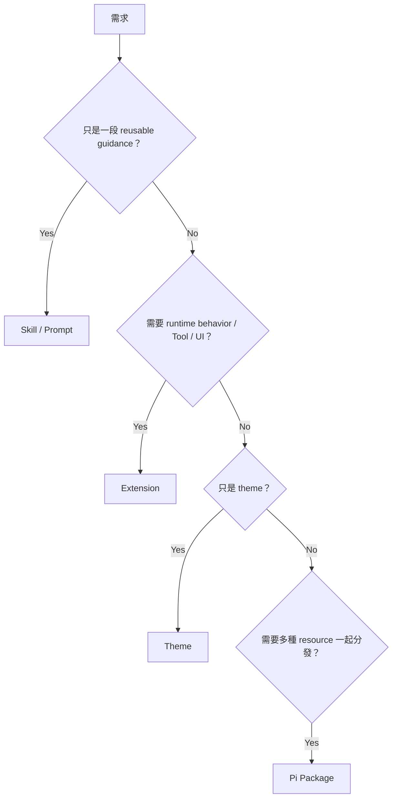

# Extensions 與自訂 TUI

Pi 的 TypeScript Extension 是它最寬的一個 customization surface。

它不是「多一個 Tool」而已；Extension 可以直接參與 AgentSession lifecycle、Context、Compaction、Commands、UI、Session State 與 Model Provider。

## Extension 能碰哪些層？



這就是 Pi 能把 core 保持小的關鍵：非必要的產品行為可以先存在 Extension，而不用立刻變成 canonical built-in feature。

## Event-driven Extension

Extension 可以監聽多種 lifecycle：

```text
resource events
session events
agent events
model events
tool events
```

因此能做：

```text
before tool → validation / approval UI
after tool  → logging / transformation
before compact → custom summarization
session lifecycle → checkpoint / metadata
model lifecycle → route / observe
```

## 自訂 Tool

```text
pi.registerTool(...)
```

讓 Extension 可以直接提供 Model-callable capability。

真正要設計的是：

- schema 是否清楚；
- tool 是否有 side effect；
- output 是否 bounded；
- 是否應進 active tool set；
- 是否需要 project trust / external sandbox。

不要因為 register 很簡單就忽略 capability design。

## 自訂 Commands

Extension 可以加入 slash commands、shortcuts、flags。

這對 product workflow 很有用：

```text
/deploy-check
/checkpoint
/review-state
```

Command 不一定需要 Model inference；很多 deterministic operation 可以直接由 UI / Extension 執行。

## Custom TUI

Pi 的 TUI 不是封閉殼。

Extension 可以加入：

```text
widgets
overlays
status line
footer
custom editor / input behavior
custom rendering
```

因此 presentation layer 可以隨 workflow 改變。



這對需要 domain-specific human-in-the-loop UI 的工具特別有吸引力。

## Durable Extension State

Extension 可以把 JSON-serializable state 寫進 Session Entry。

例如：

```text
workflow checkpoint
review cursor
external issue id
git checkpoint metadata
custom todo state
```

這樣 resume 後不必只靠 memory 或另一個 sidecar file 猜 Extension 上次做到哪裡。

但一旦 custom entry 成為 durable contract，就要考慮 schema migration。

## `/reload`：很短的開發迴圈

Project / global extension 修改後可以：

```text
/reload
```

重新載入。

典型開發流程：

```text
寫 TypeScript
→ /reload
→ 直接在 AgentSession 驗證
→ 看 events / UI / tool behavior
```

這也是 Pi 很適合 Harness experimentation 的原因之一。

## Extension 不是 Sandbox

Extension 本身以 Pi process 權限執行，可以執行任意程式碼。

因此：

```text
install extension
≈
install trusted runtime code
```

即使 Extension 做了一個 permission popup，也只是 application-level gate；真正 filesystem/process/network confinement 仍需外部 enforcement。

## Extension Governance

團隊採用 Pi 時至少要定義：

```text
approved extension sources
version pinning
code review
secret access policy
custom session-entry schema ownership
compatibility tests
package removal / migration strategy
```

Minimal core 把自由度交給團隊，也把部分治理責任一起交出來。

## 什麼需求值得做 Extension？



先用較小 abstraction 解決，避免 Extension 無限制變成新 core。

## 本章重點

1. **Pi Extension 可以深入 AgentSession lifecycle，不只是 Tool plugin。**
2. **Custom TUI / Commands 讓 domain workflow 不必改 core。**
3. **Durable custom entries 讓 Extension state 可隨 Session resume。**
4. **`/reload` 提供很短的 runtime experimentation loop。**
5. **Extension 是高權限 runtime code，必須有 governance；它不是 sandbox。**

## 官方來源

- [Pi Extensions](https://pi.dev/docs/latest/extensions)
- [Pi TUI](https://github.com/earendil-works/pi/tree/main/packages/tui)
- [Pi Session File Format](https://pi.dev/docs/latest/session-format)
