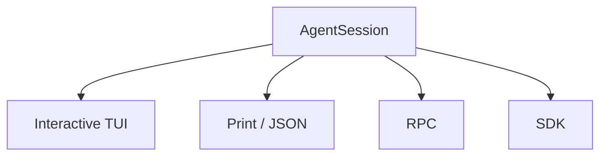
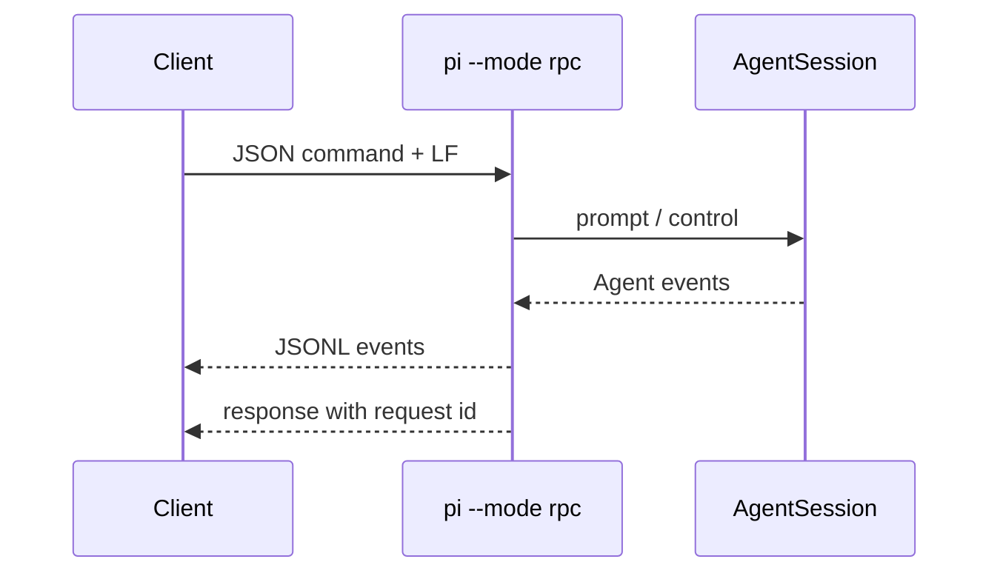

# Pi Integration、Project Trust 與 Security

Pi 的 integration surface 很完整，但 security philosophy 和 Codex / DeepSeek 明顯不同。

這章要把兩件容易混在一起的事分開：

```text
怎麼嵌入 Pi？
≠
Pi 怎麼限制 execution？
```

## 1. 四種 Run Mode 共用同一個 AgentSession

Pi coding agent 官方支援：

```text
Interactive
Print / JSON
RPC
SDK
```



這意味著你可以先用 TUI 驗證 workflow，再用 SDK 或 RPC 把同一套 agent runtime 嵌進產品。

## 2. SDK：同 process 的 TypeScript integration

Node.js / TypeScript 應用最直接的方式是：

```ts
import {
  createAgentSession,
  ModelRuntime,
  SessionManager,
} from "@earendil-works/pi-coding-agent";

const modelRuntime = await ModelRuntime.create();
const {session} = await createAgentSession({
  sessionManager: SessionManager.inMemory(),
  modelRuntime,
});

session.subscribe((event) => {
  // render / log / observe agent events
});

await session.prompt("Inspect this repository");
```

SDK 適合：

```text
custom web / desktop / mobile UI
internal automation
agent evaluation
custom orchestration
programmatic tools
child sessions
```

## 3. SDK 不只是 thin CLI wrapper

SDK 直接暴露 runtime building blocks：

```text
createAgentSession()
createAgentSessionRuntime()
SessionManager
ModelRuntime
DefaultResourceLoader
Tool factories
Extension types
SettingsManager
```

因此你可以選擇：

```text
高階：createAgentSession() + defaults

中階：替換 tools / resource loader / session manager

低階：自己建立 services / runtime / AgentSession
```

這和 Codex App Server 的哲學不同。

Codex 比較像：

```text
Custom Client
↕
Product Protocol Boundary
↕
Codex Runtime
```

Pi SDK 則更像：

```text
Your Node App
↕
Runtime Objects
↕
AgentSession / Agent / Models
```

## 4. RPC：跨 process / 跨語言

如果 client 不在 Node.js process 內，可以用：

```bash
pi --mode rpc
```

RPC 使用 stdin / stdout JSONL。



適合：

- Python / Go / Rust client；
- IDE plugin；
- process isolation；
- language-agnostic integration。

官方也特別說明 RPC framing 是嚴格 LF-delimited JSONL，不應使用會把 Unicode line separator 當換行的 generic line reader。

## 5. Print / JSON：Automation 最輕入口

如果只是 CI 或 shell pipeline，不一定要上 SDK/RPC。

```text
pi -p ...
pi --mode json ...
```

可以把 coding harness 當一次性 command 或 structured event producer。

因此 integration 成本可以分層：

```text
CLI
→ Print / JSON
→ RPC
→ SDK
→ Low-level runtime composition
```

## 6. ResourceLoader 讓嵌入模式仍可使用完整 customization

SDK 並沒有犧牲 Pi 的 extension system。

`DefaultResourceLoader` 仍可載入：

```text
extensions
skills
prompts
themes
AGENTS.md / context files
```

也可以自己傳入：

```text
additionalExtensionPaths
inline extensionFactories
custom context files
resource overrides
```

所以 Pi 的 custom client 不需要另造一套 extension model。

## 7. Security 的第一條：Pi 預設沒有 Built-in Permission System

Pi repository README 目前明確寫：

> Pi does not include a built-in permission system for restricting filesystem, process, network, or credential access.

預設：

```text
Pi process
→ 使用啟動它的 OS user permissions
→ filesystem / process / network / credentials
```

也就是：如果你的 user account 做得到，Pi 的 `bash` / file tools 通常也在同一 trust boundary 內。

這和 Codex 內建 sandbox / approval 模型有根本差異。

## 8. Project Trust 解的是「載入本地程式碼」

Pi 有 Project Trust，但它不是 execution sandbox。

當 project 出現這類 resources：

```text
.pi/settings.json
.pi/extensions/
.pi/skills/
.pi/prompts/
.pi/themes/
.pi/SYSTEM.md
.pi/APPEND_SYSTEM.md
.agents/skills
```

Pi 會根據 trust decision 決定要不要載入它們。

這是在防：

```text
clone 一個 repo
→ repo 偷塞 extension / settings
→ Pi 啟動就執行未信任 local code
```

所以 Project Trust 的 security boundary 是：

> **Resource loading trust。**

不是：

> **Tool execution confinement。**

## 9. 非互動模式的 Trust 行為

Print / JSON / RPC 不會跳互動式 trust prompt。

它們會依：

```text
defaultProjectTrust
```

以及：

```text
--approve
--no-approve
```

決定是否載入 project-local resources。

這對 CI 很重要，因為「不顯示 prompt」不等於「自動 trust」。

## 10. Extension 本身是高權限程式碼

Pi extension 文件也直接提醒：

> Extensions run with your full system permissions and can execute arbitrary code.

因此 extension security model 很接近 Node.js plugin：

```text
install extension
≈
install code with your process privileges
```

所以 team / enterprise 使用時，要建立自己的：

```text
source review
package pinning
trusted package list
extension compatibility tests
supply-chain controls
```

## 11. Permission Gate 可以用 Extension 做，但不是 Sandbox

Extension 可以攔截 `tool_call`：

```text
bash command
→ extension inspect
→ confirm / block / allow
```

例如阻擋：

```text
rm -rf
sudo
production command
write .env
```

這可以做出 approval UX，但本質仍是 application policy。

如果 extension 本身、另一個 tool、或 process boundary 被繞過，它不等於 OS-level confinement。

所以要分清楚：

```text
Extension Gate
→ authorization / workflow policy

Container / Sandbox
→ enforcement boundary
```

## 12. 官方建議的 Isolation 路線

Pi 官方目前列出幾種 containerization / isolation pattern。

### Gondolin

概念上：

```text
Pi + provider auth on host
↓
built-in tools / ! commands
↓
local Linux microVM
```

### Docker

把整個 Pi process 放進 container。

### OpenShell

把整個 process 放到 policy-controlled sandbox。

所以 Pi 的 isolation philosophy 比較接近：

> **Harness 不一定要自己成為 sandbox；execution world 可以在 Harness 外面包一層。**

## 13. 三種 Security Philosophy

### Codex

```text
Runtime
→ Sandbox / Approval / Policy 深度產品化
→ Client UX 直接呈現 permission flow
```

### DeepSeek Harness

```text
Runtime Composition
→ Sandbox Service
→ Approval Service
→ Provider / Backend 可替換
```

### Pi

```text
Minimal Harness
→ Project Trust 管 resource loading
→ Extension 可做 gate
→ OS / Container / Sandbox 負責真正 isolation
```

沒有哪一種必然正確，差別在**哪一層承擔 enforcement responsibility**。

## 14. 自製 Client 時怎麼選 SDK 或 RPC？

| 情境 | 建議 |
|---|---|
| Node.js / TS 同 process | SDK |
| 需要直接 access runtime state | SDK |
| 想替換 ResourceLoader / Tools | SDK |
| Python / Go / Rust client | RPC |
| 想 process isolation | RPC |
| CLI pipeline / CI | Print / JSON |
| Human coding workflow | Interactive TUI |

## 15. Pi 適不適合企業 Agent Platform？

答案取決於你要的是什麼。

### 很適合

如果你重視：

```text
small core
multi-provider
full TypeScript control
custom client
custom tools
fast extension iteration
external sandbox architecture
```

### 要自行補強

如果你需要：

```text
統一 enterprise approval protocol
built-in filesystem / network sandbox
centralized policy engine
first-party multi-agent orchestration
固定 plan / task model
long-term extension governance
```

Pi 會把較多責任交給你的 platform layer。

## 16. 最重要的架構問題

Pi 逼你直接面對一個很好的 Harness 設計問題：

> **Security、Workflow、Subagent、Plan 等能力，哪些真的必須進 Agent Runtime core？**

這正是它和 Codex / DeepSeek 並讀的最大價值。

## 延伸

- [三種 Harness：Codex、DeepSeek、Pi](../comparison/three-harnesses.md)
- [三種 Harness 選型指南](../comparison/three-way-selection-guide.md)
- [`earendil-works/pi` 原始碼導讀地圖](../reference/pi-source-map.md)

## 官方來源

- [Security](https://pi.dev/docs/latest/security)
- [SDK](https://pi.dev/docs/latest/sdk)
- [RPC Mode](https://pi.dev/docs/latest/rpc)
- [Using Pi](https://pi.dev/docs/latest/usage)
- [`earendil-works/pi` README](https://github.com/earendil-works/pi)
