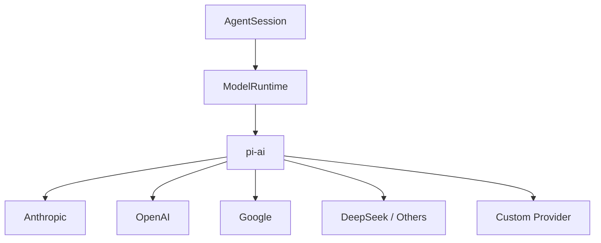

# Model Providers：pi-ai 與多模型 Runtime

Pi 從底層就把 Model Provider 做成獨立 package：`pi-ai`。

因此 Pi 不應被理解成「某一家模型的 terminal agent」，而是：

```text
Coding Harness
→ ModelRuntime
→ pi-ai
→ Provider
→ Model API / Local Gateway
```

## Package Boundary



`pi-ai` 負責統一：

```text
model catalog
provider identity
streaming
usage / finish normalization
thinking / reasoning capability
auth / API key wiring
custom provider registration
```

而 `pi-coding-agent` 的 `ModelRuntime` 再把這些能力整理成 Coding Agent 可直接使用的 facade。

## CLI 中選 Model

Pi 支援直接指定：

```bash
pi --provider <provider> --model <model>
```

互動模式也可以用：

```text
/model
```

切換目前 model。

這意味著 model choice 是 session/runtime 的 first-class state，而不是寫死在 binary 裡。

## Provider Auth

不同 provider 的 auth 方式可以不同：

```text
API key
OAuth / subscription login
custom gateway credential
local endpoint without cloud credential
```

Pi 將 provider / model catalog 與 auth 組合，而不是要求所有 backend 都假裝成同一個 base URL。

## Custom Models / Local Gateways

使用者可以在 models config 中加入自訂 model/provider，例如：

```text
Ollama
vLLM
LM Studio
OpenAI-compatible gateway
company internal proxy
```

真正要驗證的不只是 endpoint 能不能回字，而是：

```text
stream protocol
tool calling compatibility
reasoning fields
context window
max output tokens
usage reporting
model capability metadata
```

## Model Capability 會影響 Harness 行為

例如不同模型可能：

- 支援或不支援 reasoning effort；
- context window 不同；
- tool-call semantics 不同；
- streaming chunks 不同；
- input image / modalities 不同。

所以 Model Provider abstraction 的價值是讓 Harness 能讀 capability，而不是只換 URL。

## Session 中切 Model

Pi session 可以保存 model / thinking-level change entry。

這很重要，因為 resume 時如果只重播 message，卻忘記當時已切換 model，後續 trajectory 可能和原本不一致。


State Model 因此也包含 runtime configuration history。

## Extension 也可以註冊 Provider

Pi Extension 不只加 Tool，也可以延伸 provider surface。

這代表 custom model integration 可以被包成 Pi Package，和 Skills / Extensions 一起分發。

但同時也帶來 governance 問題：

```text
provider code provenance
credential handling
model catalog correctness
upgrade compatibility
```

Production team 需要把 provider extension 當真正 runtime code review，而不是普通 config。

## Multi-provider 的實際價值

### 個人使用

快速在不同模型間切換，依任務選成本 / 品質。

### Agent Research

保持 Harness / Tool / Session 不變，只換 Model 做 controlled comparison。

### Internal Platform

讓 company gateway、local model、cloud provider 都能共用同一套 AgentSession / Extension 生態。

## 本章重點

1. **Pi 的 multi-provider 不是外掛補丁，而是 `pi-ai` 的核心責任。**
2. **ModelRuntime 將 provider/model/auth 能力帶進 Coding Agent。**
3. **Model change 可以成為 durable session state。**
4. **Custom provider 要驗證 capability semantics，不只是 base URL。**
5. **Extension provider 讓模型整合可分發，但也增加 supply-chain / credential governance。**

## 官方來源

- [Pi Models / Providers](https://pi.dev/docs/latest/models)
- [Pi Usage](https://pi.dev/docs/latest/usage)
- [`packages/ai`](https://github.com/earendil-works/pi/tree/main/packages/ai)
