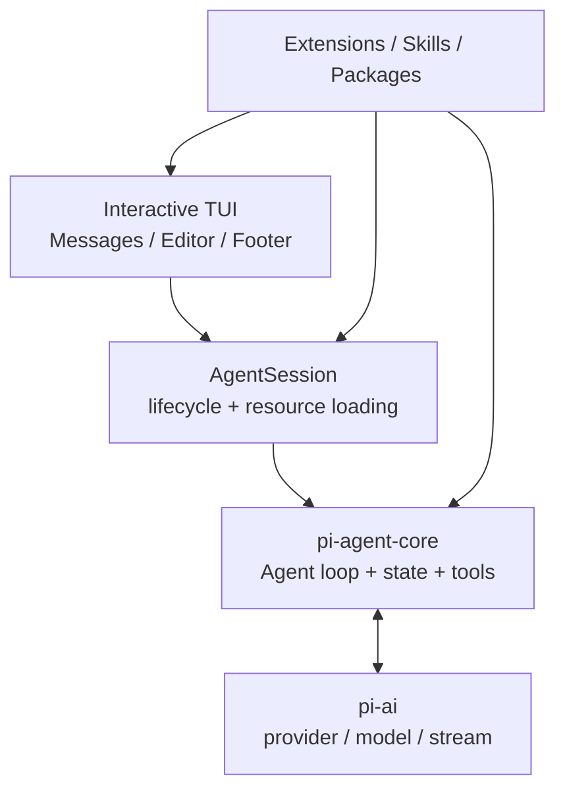
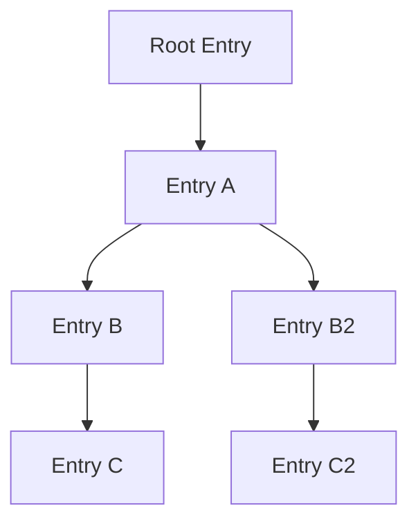

# 官方視角：Pi TUI 與 Session Tree

Pi 很適合直接看官方截圖，因為它的產品哲學和架構哲學高度一致：**介面保持輕量，功能透過 Extensions / Skills / Packages 擴充；Session 則直接把 branch 做進資料模型。**

本頁使用的兩張圖都來自 `earendil-works/pi` 官方 repo，固定到 revision `a470b12…`。該 repo 採 [MIT License](https://github.com/earendil-works/pi/blob/a470b121bf683b4c2b9fc0b3a7c807de7e0cfe9c/LICENSE)。

## 官方 Interactive Mode


*官方原始素材：[`packages/coding-agent/docs/images/interactive-mode.png`](https://github.com/earendil-works/pi/blob/a470b121bf683b4c2b9fc0b3a7c807de7e0cfe9c/packages/coding-agent/docs/images/interactive-mode.png)，並由官方 [`packages/coding-agent/README.md`](https://github.com/earendil-works/pi/blob/a470b121bf683b4c2b9fc0b3a7c807de7e0cfe9c/packages/coding-agent/README.md#interactive-mode) 使用。*

官方 README 對這個畫面的拆法很直接：

```text
Startup header
Messages
Editor
Footer
```

但真正值得注意的是：這些 UI 都不是不可替換的「核心」。官方同一段文件也說 Extensions 可以：

- 暫時替換 editor；
- 在上方或下方加 widget；
- 加 status line / custom footer；
- 加 overlay；
- 註冊自訂 command。

這正好說明 Pi 的設計方向：

> **TUI 是預設 presentation，不是固定 product boundary。**

## 從官方介面反推 Pi 的 Harness 分層



*這張圖是教材依 Pi 官方 package boundaries 與 Coding Agent README 重繪，不是 Pi 官方原圖。*

這也是為什麼 Pi 和 Codex 的「Client Surface」概念不能完全等同：Codex 更強調一個成熟 runtime 對外暴露 App Server；Pi 則允許 Extension 直接深入同一個 AgentSession / UI lifecycle。

## 官方 `/tree` Session View


*官方原始素材：[`packages/coding-agent/docs/images/tree-view.png`](https://github.com/earendil-works/pi/blob/a470b121bf683b4c2b9fc0b3a7c807de7e0cfe9c/packages/coding-agent/docs/images/tree-view.png)，由官方 README 的 [Sessions → Branching](https://github.com/earendil-works/pi/blob/a470b121bf683b4c2b9fc0b3a7c807de7e0cfe9c/packages/coding-agent/README.md#branching) 使用。*

這張圖和 Pi 的資料模型是直接對應的。官方文件明確說 Session 儲存為 JSONL，而且每個 entry 有：

```text
id
parentId
```

因此 branch 不是 UI 自己幻想出來的 view，而是 session storage 本身就是 tree。

教材可以把它抽象成：



你在 `/tree` 看到的，就是這個 parent-linked structure 的可視化。

## `/tree`、`/fork`、`/clone` 不一樣

官方 README 把三者分得很清楚：

| 操作 | 作用 |
|---|---|
| `/tree` | 在同一個 session JSONL 裡切換 branch，歷史全部保留 |
| `/fork` | 從既有 user message 建立新的 session file |
| `/clone` | 把目前 active branch 複製成新的 session file |

這個差異很重要，因為 Pi 的「branch」不是只有 Git-like fork；它也可以在**同一個 session file 內**保留多條路徑。

## 官方畫面也透露 Multi-model 是一級 UX

Interactive Mode footer 會顯示 current model；官方 README 也把 `/model`、Ctrl+L、Ctrl+P model cycling 當成一級操作。

所以 Pi 的 multi-provider 不是只有底層 library feature，而是直接進到日常 UX：

```text
pi-ai provider abstraction
→ AgentSession model state
→ /model selector
→ current model shown in footer
```

這和 Pi 的 minimal philosophy 並不矛盾：它把「換模型」視為核心能力，但把 subagents、plan mode 等更高階 workflow 行為留給 extension ecosystem。

## Security：不要從漂亮 TUI 推論出 sandbox

官方 [Project Trust](https://github.com/earendil-works/pi/blob/a470b121bf683b4c2b9fc0b3a7c807de7e0cfe9c/packages/coding-agent/README.md#project-trust) 主要控制的是：

- 是否載入 project-local settings；
- 是否載入 project extensions / skills / packages；
- 是否執行專案 extension code。

但它**不是 process sandbox**。Pi 預設仍以啟動它的 OS user 權限工作；真正 isolation 要放在 container、microVM 或其他外層 execution environment。

所以看這些官方 UI 圖時，請同時記住：

> **可操作性 UI ≠ capability confinement。**

## 官方來源

- [Pi Coding Agent README](https://github.com/earendil-works/pi/blob/a470b121bf683b4c2b9fc0b3a7c807de7e0cfe9c/packages/coding-agent/README.md)
- [Interactive Mode 官方截圖](https://github.com/earendil-works/pi/blob/a470b121bf683b4c2b9fc0b3a7c807de7e0cfe9c/packages/coding-agent/docs/images/interactive-mode.png)
- [Tree View 官方截圖](https://github.com/earendil-works/pi/blob/a470b121bf683b4c2b9fc0b3a7c807de7e0cfe9c/packages/coding-agent/docs/images/tree-view.png)
- [Pi repository](https://github.com/earendil-works/pi)
- [MIT License](https://github.com/earendil-works/pi/blob/a470b121bf683b4c2b9fc0b3a7c807de7e0cfe9c/LICENSE)

讀完後可回到 [Pi：先建立正確心智模型](./overview.md)，或繼續讀 [Session Tree、Compaction 與 Extensions](./session-and-extensions.md)。
