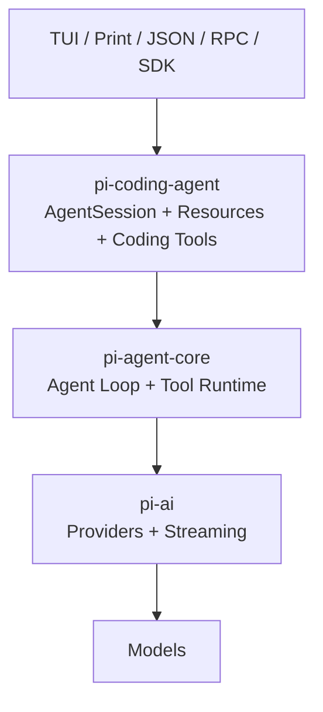
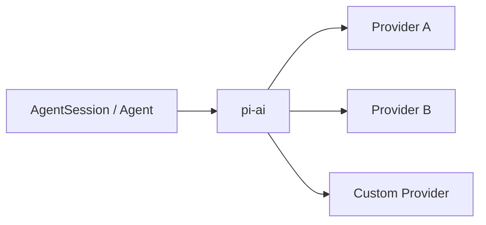
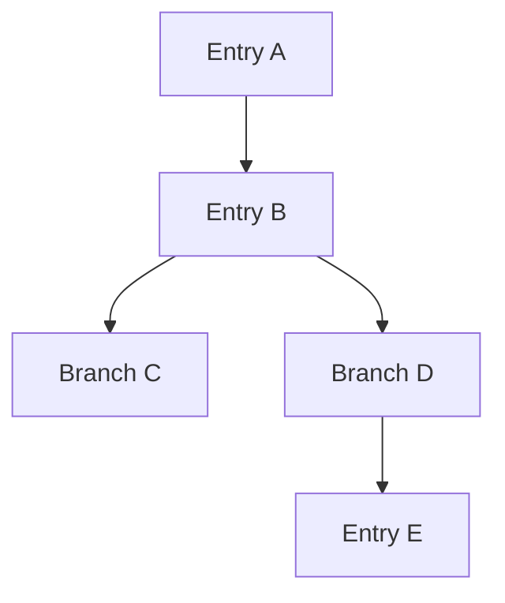
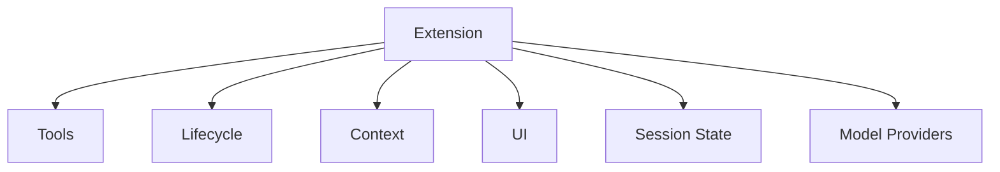
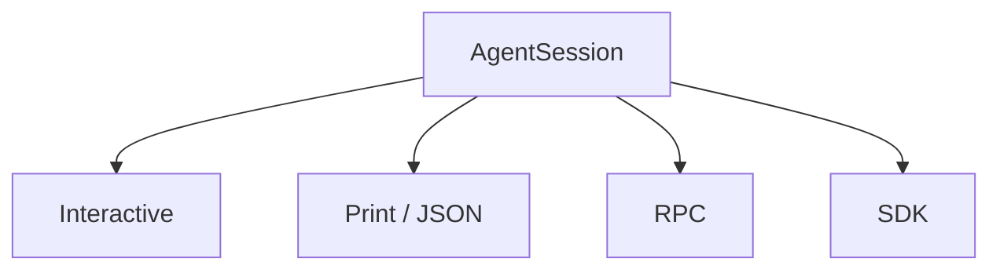

# Pi Agent Harness：Minimal Runtime 完整導讀

> 最後核對：2026-08-24。Pi 官方直接把自己稱為 **Agent Harness**；目前主要 repository 是 [`earendil-works/pi`](https://github.com/earendil-works/pi)。

Pi 最值得學的地方不是「又一套 Coding Agent」，而是它對 core boundary 做了非常鮮明的選擇：

> **核心保持 minimal，把大量 workflow、UI、policy UX 與產品行為留給 extensions、resources、packages 與外部 execution environment。**

## 先看官方 Interactive Mode


*官方原始素材：[`packages/coding-agent/docs/images/interactive-mode.png`](https://github.com/earendil-works/pi/blob/a470b121bf683b4c2b9fc0b3a7c807de7e0cfe9c/packages/coding-agent/docs/images/interactive-mode.png)，由官方 Coding Agent README 使用；來源 repo 採 MIT License。*

這張圖很能代表 Pi：預設 TUI 已足夠完整，但 presentation / commands / widgets 仍可被 Extension 深度改造。

## Package Map

```text
@earendil-works/pi-ai
→ multi-provider model abstraction

@earendil-works/pi-agent-core
→ minimal stateful Agent runtime、tools、events

@earendil-works/pi-coding-agent
→ AgentSession、sessions、resources、extensions、TUI、RPC、SDK

@earendil-works/pi-tui
→ terminal UI primitives
```



## Minimal 不等於功能少

Pi 的 minimal philosophy 是：**不要把所有常見 Agent workflow 固定成 canonical core feature。**

很多高階能力可以放到：

```text
TypeScript Extension
Skill
Prompt Template
Pi Package
SDK / external orchestrator
container / microVM / shell environment
```

所以讀 Pi 時不要只問「有沒有某個 feature」，而要問：

> **這個 responsibility 被放在 core、extension、resource，還是 execution environment？**

## Model：pi-ai 是 first-class multi-provider layer

`pi-ai` 把 provider、model catalog、authentication、request / streaming vocabulary 抽離 Coding Agent。



因此 Pi 的多模型不是附加 feature，而是 package boundary 本身的一部分。

## Agent Loop：pi-agent-core 保持小

`pi-agent-core` 提供的是低階 stateful Agent primitives：

```text
messages / state
model streaming
tool calls
Tool execution
Agent events
continue / abort lifecycle
```

而 `pi-coding-agent` 的 `AgentSession` 再把 coding tools、session persistence、resources、extensions、TUI / RPC 等產品責任組起來。

這個分層是 Pi 最值得學的地方之一：

```text
Low-level Agent Runtime
≠
Full Coding Agent Product Session
```

## Tools：預設小，Extension 可深度增加

Pi 預設 coding tools 很精簡：

```text
read
write
edit
bash
```

其他 capability 可以由 Extension 註冊。這使 Tool surface 更像「每個 Pi installation / workflow 自己塑形」，而不是 core 內建越多越好。

## State：JSONL Session Tree

Pi Session 存成 JSONL，但 entry 透過：

```text
id
parentId
```

形成 durable tree。



所以 branch / fork / resume 不是 UI 特效，而是 persisted lineage 的直接結果。

## Context / Compaction / Branch Summarization

Pi 把三件事分得很清楚：

```text
Session Tree
→ 保存完整 durable lineage

Context reconstruction
→ 選 current branch 需要的內容

Compaction / Branch Summary
→ 控制 context window、保留離開路徑的知識
```

這也是「State 不等於 Context」最直觀的實作之一。

## ResourceLoader

Pi 的 resources 包含：

```text
Skills
Prompt Templates
Themes
Extensions
Pi Packages
```

ResourceLoader 負責 global / project discovery 與載入；Project Trust 則會影響 project-local resources 是否應被信任與啟用。

## Extensions：Pi 的核心產品哲學

TypeScript Extension 可以深入很多 lifecycle boundary：

```text
register tools
intercept tool call
listen lifecycle events
inject context
customize compaction
register commands / shortcuts / flags
custom TUI
append durable session entries
register provider
```



Pi 能保持 core minimal，很大一部分就是因為 ExtensionAPI 足夠深。

## Project Trust 與 Isolation 必須分開

Project Trust 主要控制：

```text
project settings
.pi/extensions
project skills / prompts / themes
project packages
```

但官方明確提醒：

> **Project Trust 不是 Sandbox。**

Pi 預設仍以啟動它的 OS user permissions 執行。若要更強 isolation，需要 container、microVM、其他 sandbox 或 Extension / execution wrapper。

## 四種主要使用模式

```text
Interactive TUI
Print / JSON
RPC
SDK
```

重要的是它們共用 `AgentSession`，不是四套不同 Agent。



## Production / Governance

Minimal core 把更多 responsibility 留給採用者，因此 production Pi 要特別關注：

- Extension provenance；
- project resource trust；
- container / sandbox policy；
- Session format compatibility；
- custom provider compatibility；
- RPC / SDK contract；
- team-level distribution / pinning；
- custom workflow regression tests。

這些不是 Pi 缺陷，而是 minimal architecture 的 ownership trade-off。

## 完整閱讀順序

### A. 架構與 Runtime

1. [官方視角：Pi TUI 與 Session Tree](./official-visuals.md)
2. [Pi 架構：從 pi-ai 到 AgentSession](./architecture.md)
3. [Model Providers：pi-ai](./model-providers.md)
4. [Agent Loop 與 Tools](./agent-loop-and-tools.md)
5. [Context、Compaction 與 Branching](./context-compaction-and-branching.md)
6. [Session、Compaction 與 Extensions](./session-and-extensions.md)

### B. Resources / Extensions

7. [Resources、Skills、Prompts 與 Pi Packages](./resources-skills-and-packages.md)
8. [Extensions 與自訂 TUI](./extensions-and-ui.md)

### C. Security / Usage / Integration

9. [Project Trust 與 Isolation](./project-trust-and-isolation.md)
10. [CLI 與日常使用](./cli-and-usage.md)
11. [SDK 與 RPC](./sdk-and-rpc.md)
12. [Production 與 Governance](./production-and-governance.md)

### D. Labs / Source

13. Pi Labs：Session Tree / Extension / Branch & Compaction
14. [`earendil-works/pi` Source Map](../reference/pi-source-map.md)

## Pi 最值得學的七件事

1. **Minimal 是 boundary choice，不是功能數量。**
2. **Low-level Agent Runtime 與產品 AgentSession 可以明確分層。**
3. **Multi-provider 可以從最底層就成為一級 abstraction。**
4. **Session Tree 讓 branch / fork 成為 durable data model。**
5. **ResourceLoader + ExtensionAPI 讓產品行為在 core 外快速塑形。**
6. **Project Trust 與 execution isolation 是不同安全問題。**
7. **Core 少做決定，代表 adoption team 要承擔更多 governance responsibility。**

## 官方來源

- [Pi](https://pi.dev/)
- [Pi Documentation](https://pi.dev/docs/latest)
- [`earendil-works/pi`](https://github.com/earendil-works/pi)
- [Coding Agent README](https://github.com/earendil-works/pi/tree/main/packages/coding-agent)
- [Extensions](https://pi.dev/docs/latest/extensions)
- [Sessions](https://pi.dev/docs/latest/sessions)
- [Security](https://pi.dev/docs/latest/security)
