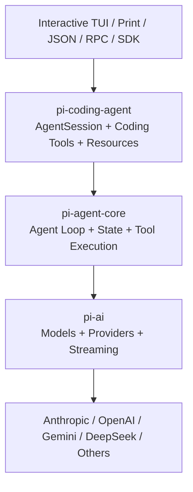
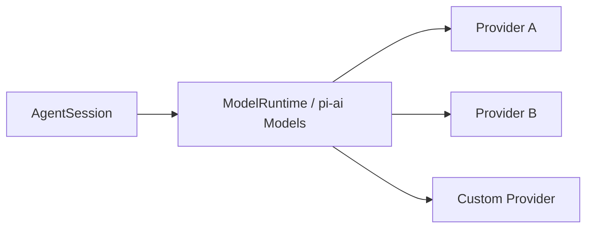
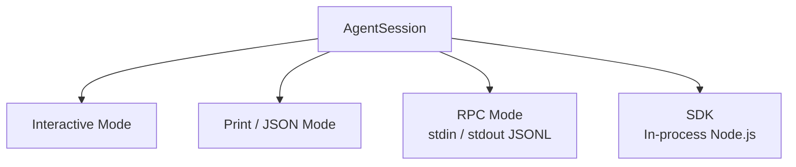
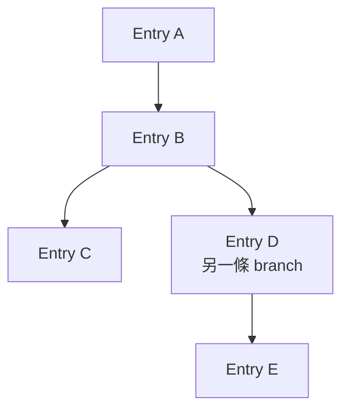
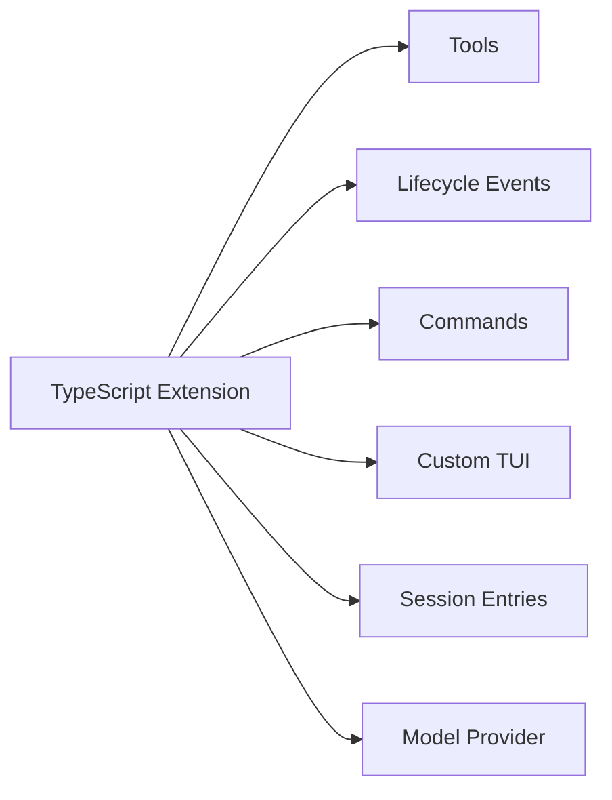

# Pi Agent Harness：先建立正確心智模型

> 最後核對：2026-08-24。Pi 官方直接把自己稱為 **Agent Harness**，目前主 repository 為 [`earendil-works/pi`](https://github.com/earendil-works/pi)。

Pi 最值得學的地方，不是它又做了一套 Coding Agent，而是它刻意選擇了與 Codex、DeepSeek Harness 都不同的穩定中心：

> **核心保持 minimal，把大量 workflow 與 product behavior 留給 extensions、skills、packages 與外部環境。**

如果只記一句話：

```text
Codex    → Productized / Opinionated Runtime
DeepSeek → Composable Runtime Framework
Pi       → Minimal / Self-extensible Harness
```

三者都能成為完整 Coding Agent，但「哪些東西應該內建」的答案非常不同。

## 先看 Pi 官方 Interactive Mode


*官方原始素材：[`packages/coding-agent/docs/images/interactive-mode.png`](https://github.com/earendil-works/pi/blob/a470b121bf683b4c2b9fc0b3a7c807de7e0cfe9c/packages/coding-agent/docs/images/interactive-mode.png)，由 Pi 官方 [`packages/coding-agent/README.md`](https://github.com/earendil-works/pi/blob/a470b121bf683b4c2b9fc0b3a7c807de7e0cfe9c/packages/coding-agent/README.md#interactive-mode) 使用；來源 repo 採 MIT License。*

這張圖很能代表 Pi 的哲學：預設 UI 很完整，但仍是一個相對薄的 presentation layer。官方 README 明確說 Extension 可以替換 editor、加入 widget、status line、footer 或 overlay，所以畫面不是一個封閉產品殼，而是可延伸的 AgentSession UI。

## Pi 的 package map

Pi monorepo 目前最重要的 package 是：

```text
@earendil-works/pi-ai
→ multi-provider LLM abstraction

@earendil-works/pi-agent-core
→ stateful agent runtime、tool execution、event streaming

@earendil-works/pi-coding-agent
→ terminal coding harness、sessions、tools、extensions、SDK / RPC

@earendil-works/pi-tui
→ terminal UI primitives
```

可以先把它想成：



這個分層比「一個大型 coding-agent binary」更容易拆解。

## Minimal 不代表功能少

Pi 的 minimal philosophy 不是功能殘缺，而是**刻意不把所有高階 workflow 固化成 core feature**。

官方目前明確列出的設計取向包括：

```text
No built-in MCP
No built-in sub-agents
No permission popups
No plan mode
No built-in to-dos
No background bash
```

這些能力不是「不能做」，而是被推到：

```text
TypeScript Extension
Skill
Prompt Template
Pi Package
外部工具 / tmux / container
```

因此 Pi 的問題不是：

> 這個 feature 有沒有？

而比較像：

> **這個 behavior 應該進 core，還是應該留在 extension / environment？**

## 預設 Coding Agent 很小

Pi 預設提供的核心 coding tools 是：

```text
read
write
edit
bash
```

其他能力可以再透過 resource loader、extensions 或 SDK 注入。

這和 Codex 的產品哲學差異非常大：Codex 會把較多 repository workflow、安全 UX、client protocol 與 agent features 做成 first-party runtime capability；Pi 則努力讓 core 不因每種 workflow 都膨脹。

## Multi-provider 是第一級能力

Pi 的 `pi-ai` 不是單一 vendor wrapper。

Model runtime 將 provider、model catalog、authentication 與 streaming 拆開，Coding Agent 可以在多家 provider / model 之間切換。官方目前支援的來源包含 Anthropic、OpenAI、Google、Amazon Bedrock、DeepSeek、Mistral、Groq、Cerebras、xAI、OpenRouter 等，也允許自訂 provider / model。

心智模型是：



所以不要把 Pi 理解成「某一家 Model 的 CLI」。

## 四種主要使用模式

Pi 官方把 coding agent 的執行方式分成四類：

```text
Interactive TUI
Print / JSON
RPC
SDK
```



重要的是：**這些 mode 不是四套不同 agent。**

`AgentSession` 是共用中心，interactive / print / RPC 都在上面加自己的 I/O layer；Node.js integration 則可直接透過 SDK 建立 `AgentSession`。

## Pi 的 State Model：JSONL Tree

Pi 的 Session 非常值得單獨研究。

Session 儲存成 JSONL，但不是單純線性 log：

```text
entry
├─ id
└─ parentId
```

所以同一個 session file 可以天然形成 tree：



這讓 Pi 可以：

- resume；
- fork；
- 在 `/tree` 中切 branch；
- 對離開的 branch 做 summarization；
- 在同一個 JSONL 裡保留不同探索路徑。

這和另外兩套 state abstraction 很不同：

```text
Codex
→ Thread / Turn / Item

DeepSeek
→ Session / Turn / Step / SessionEvent

Pi
→ Session JSONL / Entry Tree / id-parentId
```

## Extensions 是 Pi 的核心產品哲學

TypeScript Extension 可以做的不只是補 prompt。

它可以：

```text
registerTool()
on(event)
registerCommand()
registerShortcut()
registerFlag()
appendEntry()
custom UI
intercept tool call
modify context
customize compaction
register provider
```

而且 project / global extension 可以用 `/reload` hot reload。

因此 Pi 的 extension boundary 非常寬：



這也是為什麼 Pi 可以維持 core minimal，卻仍然讓使用者做很深的客製化。

## Security：Project Trust 不是 Sandbox

Pi 在安全哲學上與 Codex、DeepSeek 差異最大。

官方非常明確：Pi 是 local coding agent，預設以**啟動它的使用者帳號權限**執行。

Project Trust 的用途是：

```text
是否載入 project-local settings
是否載入 .pi/extensions
是否載入 project skills / prompts / themes
是否安裝 project packages
```

但：

> **Project Trust 不是 Sandbox。**

它不會限制模型在啟動後透過 tools 可以要求 OS 做什麼。

需要更強 isolation 時，官方建議把 execution boundary 放到外層，例如：

```text
Gondolin microVM extension
Docker
OpenShell
其他 container / sandbox
```

所以三者的 security philosophy 可以先記成：

```text
Codex
→ Security 是 productized runtime 核心能力

DeepSeek
→ Security 是 formal / replaceable capability seam

Pi
→ Core 預設信任本機 user boundary；強隔離交給外部環境或 extension
```

## Pi 最適合拿來學什麼？

Pi 很適合回答這些問題：

1. Coding Agent 最小核心到底需要什麼？
2. AgentSession 與低階 Agent Runtime 應該怎麼分層？
3. Multi-provider 怎麼做成 first-class runtime abstraction？
4. Session 若直接建成 tree，branch / fork / compact 會變得多自然？
5. Extension API 要開放到多深，才可以讓 core 不膨脹？
6. 哪些安全責任一定要在 Harness 內，哪些可以交給 execution environment？

## 三套 Harness 的第一張總覽

| 面向 | Codex | DeepSeek Harness | Pi |
|---|---|---|---|
| 核心定位 | 完整 Coding Agent Runtime | 可重組 Runtime Framework | Minimal Coding Harness |
| Runtime center | `codex-core` | Cordis + service contracts | `Agent` + `AgentSession` |
| Model | Provider registry | LLM capability seam | `pi-ai` multi-provider |
| State | Thread / Turn / Item | Event-sourced Session | JSONL tree entries |
| Extension | Skills / MCP / Hooks / Rules 等 | Plugin / Provider / Consumer | TS Extensions / Skills / Packages |
| Security | built-in、產品化 | formal、可替換 | 預設 user permission；外部 isolation |
| Client | App Server / SDK / CLI | SDK / JSON-RPC / ACP / Host | TUI / Print / JSON / RPC / SDK |

## 建議閱讀順序

1. 本章：先建立 Pi 心智模型。
2. [Pi 架構：從 pi-ai 到 AgentSession](./architecture.md)
3. [Pi Session、Compaction 與 Extensions](./session-and-extensions.md)
4. [Pi Integration、Project Trust 與 Security](./integration-and-security.md)
5. [三種 Harness：Codex、DeepSeek、Pi](../comparison/three-harnesses.md)
6. [`earendil-works/pi` 原始碼導讀地圖](../reference/pi-source-map.md)

## 官方來源

- [Pi 官方網站](https://pi.dev/)
- [Pi Documentation](https://pi.dev/docs/latest)
- [`earendil-works/pi`](https://github.com/earendil-works/pi)
- [Coding Agent README 與 Interactive Mode 官方截圖](https://github.com/earendil-works/pi/blob/a470b121bf683b4c2b9fc0b3a7c807de7e0cfe9c/packages/coding-agent/README.md)
- [Security](https://pi.dev/docs/latest/security)
