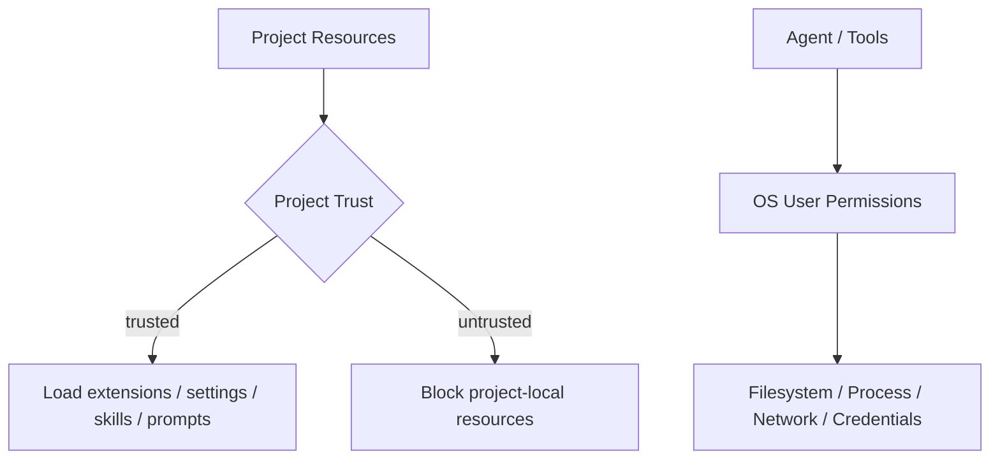
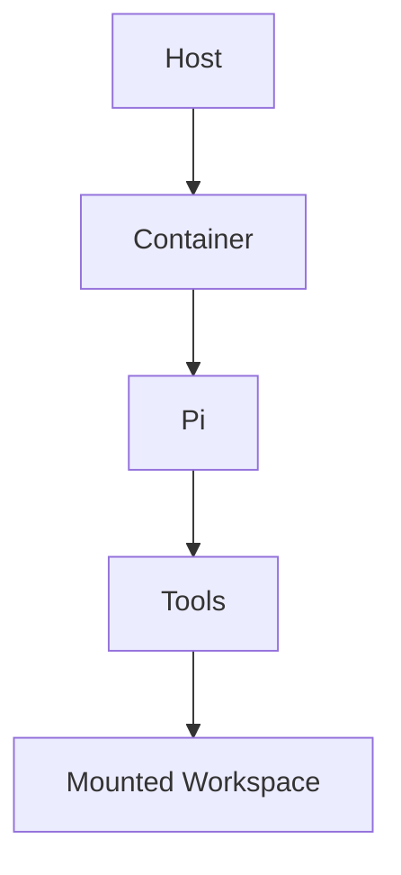

# Project Trust 與 Containerization

Pi 的安全模型必須先記住一句官方原則：

> **Project Trust 不是 Sandbox。**

Pi 預設以啟動它的 OS user permissions 執行。Project Trust 解的是「要不要載入 project-local executable / configurable resources」，不是「Tool 執行後能不能寫某個檔案或連某個網路」。

## 先畫出兩個不同 boundary



兩條線回答完全不同的問題。

## Project Trust 在保護什麼？

當你 clone 一個陌生 repo，裡面可能包含：

```text
.pi/settings.json
.pi/extensions/
.pi/skills/
.pi/prompts/
.pi/themes/
.pi/SYSTEM.md
.pi/APPEND_SYSTEM.md
```

其中 Extension 尤其是 executable code。

Project Trust 的目的是避免：

```text
clone repo
→ 啟動 pi
→ 未經確認就載入 repo 偷塞的高權限 extension
```

這是 resource-loading trust boundary。

## 為什麼它不是 Sandbox？

即使你完全不載入 project extension，Pi 的 built-in `bash` 仍然可能以你的 user permissions 執行：

```text
rm
curl
git
package manager
process
network
```

所以真正 execution isolation 仍要靠：

```text
OS permissions
container
microVM
policy-controlled sandbox
remote worker
```

## 非互動模式也要處理 Trust

Print / JSON / RPC 不應假設「因為沒有 prompt，所以自動 trust」。

Automation 要明確設定 project trust behavior，避免 CI 在無人互動時偷偷載入未知 project resources，或反過來因等待確認而卡住。

## External Isolation 的三種常見模式

### 1. 把 Pi 整個放進 Container



優點：process / filesystem boundary 清楚。

需要設計：

```text
mount scope
network
credentials
git identity
cache
container lifecycle
```

### 2. MicroVM / Stronger Isolation

例如 Gondolin 類模式：讓 Tool / command 真正在隔離的 Linux environment 執行。

適合需要比一般 container 更強 boundary 的情境。

### 3. Policy-controlled External Sandbox

像 OpenShell 類型：把整個 process 放到既有 sandbox / policy system 下。

如果公司本來就有 execution platform，Pi 不會要求它必須改用 Pi 自己的 sandbox abstraction。

## Extension Gate 可以做 Approval UX

Extension 可以攔截 tool call：

```text
command
→ extension inspect
→ allow / block / ask
```

例如：

```text
sudo
rm -rf
git push --force
production deploy
```

但請明確區分：

```text
Extension Gate
→ authorization / workflow policy

Container / Sandbox
→ technical enforcement
```

兩者可以一起使用，但不能互相假裝。

## Credential Boundary

因為 Pi process 預設就是你的 user process，環境變數、credential files、CLI login state 都需要小心。

Containerization 時應明確決定：

```text
哪些 provider credential 進 container？
是 host 代送 model request，還是 worker 自己持有 key？
repo credential 是否只 read？
SSH agent 是否 mount？
cloud credential 是否 short-lived？
```

不要把「workspace 隔離」誤認成「secret 也自動隔離」。

## Minimal Harness 的安全責任轉移

Pi 的設計不是 security 不重要，而是把 ownership 放在不同層：

```text
Resource Loading
→ Project Trust

Application Policy
→ Extensions / Tool Surface

Strong Execution Isolation
→ OS / Container / MicroVM / External Sandbox

Organization Governance
→ package / extension / credential policy
```

這對已有成熟 execution platform 的團隊可能是優勢；對希望「裝完就有完整 sandbox UX」的使用者則代表更多責任。

## Production Checklist

```text
[ ] project trust policy 明確
[ ] approved extension / package sources
[ ] active tools 最小化
[ ] external sandbox / container strategy
[ ] network policy
[ ] credential injection policy
[ ] workspace mount scope
[ ] audit / command logging
[ ] session storage policy
[ ] extension compatibility tests
```

## 本章重點

1. **Project Trust 只管 project-local resource loading。**
2. **Pi 預設沿用 OS user permissions，沒有 built-in execution sandbox。**
3. **Extension Gate 是 authorization，不是 confinement。**
4. **Container / microVM / external sandbox 是 Pi 官方哲學中重要的 isolation 路線。**
5. **Minimal Harness 不是沒有 security responsibility，而是把 enforcement ownership 移到外層。**

## 官方來源

- [Pi Security](https://pi.dev/docs/latest/security)
- [Pi Extensions](https://pi.dev/docs/latest/extensions)
- [Pi Usage](https://pi.dev/docs/latest/usage)
