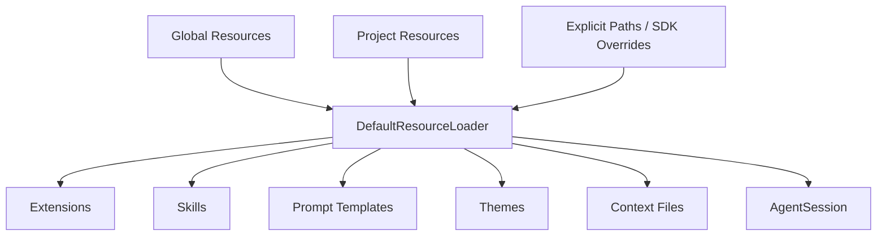
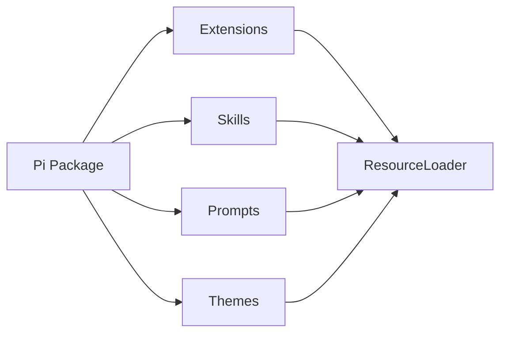

# Resources、Skills、Prompts 與 Pi Packages

Pi 維持 minimal core 的關鍵，不只是 Extension API，而是一整套 **Resource discovery + distribution** 模型。

很多「Agent 應該知道什麼」不需要進 core code，而是由 `ResourceLoader` 發現。

## ResourceLoader 在哪一層？



這讓 CLI 與 SDK 可以共用同一套 customization discovery，而不是嵌入模式又重做一次設定系統。

## Context Files

Context files 適合放 project / directory level guidance，例如：

```text
coding conventions
repo architecture notes
commands / validation rules
project-specific instructions
```

它們屬於「Model 應知道什麼」，不是「OS 能不能執行」。

因此不要用 context file 假裝做 sandbox policy。

## Skills

Skill 適合有明確 trigger 的專門 workflow / knowledge。

概念上：

```text
inventory
→ name / description
→ relevant skill selected
→ load complete instructions
```

這可以避免所有 SOP 永久塞進 system/context files。

## Prompt Templates

Prompt Template 適合 reusable task starter：

```text
/review
/release-check
/migration-plan
```

它和 Skill 的差異可以先簡化成：

```text
Prompt Template
→ 使用者主動啟動的一段可重用 prompt

Skill
→ Agent 可以發現、按需載入的 workflow knowledge
```

## Themes

Pi 把 terminal presentation 也做成 resource。

這和核心 agent behavior 分離後：

- 同一個 AgentSession 可以換 theme；
- package 可以帶自己的 UI presentation；
- theme 不需要修改 runtime core。

## Pi Packages：Distribution Unit

Pi Package 可以一起分發：

```text
Extensions
Skills
Prompt Templates
Themes
```

因此它不是單純「npm package 裡有一段 plugin code」，而是 Agent customization bundle。



## Global 與 Project Scope

常見需求可以分成：

### Global

```text
個人通用 skill
個人 theme
個人 extension
```

### Project

```text
repo-specific extension
team skill
project prompt
project context files
```

Project-local executable resources 會牽涉 Project Trust；這一點和單純讀 Markdown guidance 的風險不同。

## SDK 可以自行注入 Resources

Embedding 時不一定要完全依賴 filesystem discovery。

可以提供：

```text
additionalExtensionPaths
inline extension factories
custom context files
resource overrides
```

這對測試與產品 embedding 很重要：

```text
production app
→ 明確注入 approved resources
→ 不必掃描任意 local project resource
```

## Resource Discovery 也是 Supply-chain Boundary

「可以被自動發現」帶來便利，也帶來風險。

需要治理：

```text
哪些 project path 可被掃描？
哪些 package source 可安裝？
resource version 是否 pin？
extension 是否 code-reviewed？
Skill / prompt 是否有 owner？
```

Pi 的 Project Trust 就是在處理其中「是否載入 project-local resources」這一層。

## 怎麼選 Resource 類型？

| 需求 | 優先考慮 |
|---|---|
| repo 長期規則 | Context file |
| 按需 SOP | Skill |
| 常用 task starter | Prompt Template |
| runtime behavior / tool | Extension |
| terminal appearance | Theme |
| 一起分發多種能力 | Pi Package |

這個分類讓很多需求不需要修改 `AgentSession` 或 `pi-agent-core`。

## 本章重點

1. **ResourceLoader 是 Pi minimal core 能成立的重要配套。**
2. **Context、Skill、Prompt、Extension 解的是不同問題。**
3. **Pi Package 是多種 customization resource 的 distribution unit。**
4. **SDK 可以使用明確 resources，而不必完全依賴 local discovery。**
5. **Resource discovery 同時也是 trust / supply-chain boundary。**

## 官方來源

- [Pi Skills](https://pi.dev/docs/latest/skills)
- [Pi Prompt Templates](https://pi.dev/docs/latest/prompt-templates)
- [Pi Packages](https://pi.dev/docs/latest/packages)
- [Pi SDK](https://pi.dev/docs/latest/sdk)
