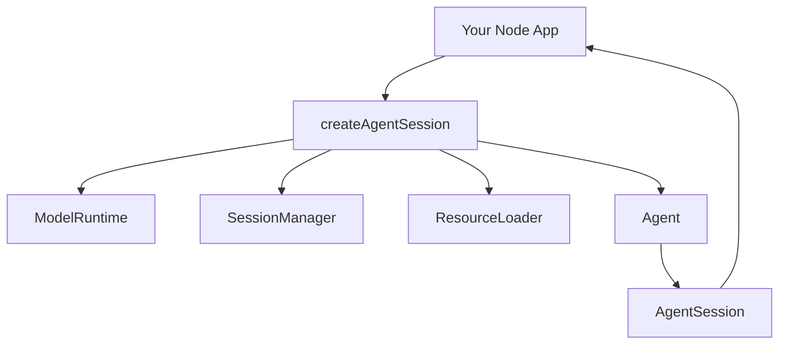
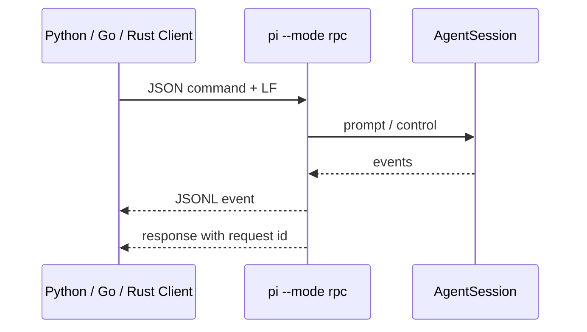

# SDK 與 RPC：把 Pi 嵌入自己的產品

Pi 不只是一個 TUI。官方提供兩條很不一樣的 embedding 路線：

```text
SDK
→ 同一個 Node.js / TypeScript process 直接操作 runtime objects

RPC
→ 把 pi 當獨立 process，以 stdin/stdout JSONL 控制
```

## SDK：直接取得 AgentSession

高階入口是 `createAgentSession()`。

概念上：



SDK 不是只包一層 CLI command；你可以直接替換 / 注入：

```text
SessionManager
ModelRuntime
ResourceLoader
Tools
Settings
Extension factories
```

## 高階與低階 Embedding

### 高階

```text
createAgentSession()
+ defaults
```

適合快速建立 custom app。

### 中階

替換：

```text
session manager
tool set
resource loader
model runtime
```

適合 internal platform。

### 低階

自行建立 runtime services / AgentSession wiring。

適合研究或高度客製化 embedding。

## Subscribe Events

SDK 可以訂閱 AgentSession / Agent events，用於：

```text
render UI
progress indicator
telemetry
audit
eval
workflow coordinator
```

這讓 presentation 不必依賴 TUI implementation。

## RPC：跨 Process / 跨語言

RPC mode 使用 stdin / stdout JSONL。



適合：

- 非 Node.js client；
- IDE / desktop process boundary；
- 想隔離 crash / dependency；
- 想由其他語言管理 lifecycle。

## RPC Framing 要嚴格

官方特別提醒 RPC 是 LF-delimited JSONL。

Client 不應使用會把其他 Unicode line separator 也當換行的 generic reader，避免 framing 被錯切。

這是一個小細節，但正是 production protocol 會踩的坑。

## SDK vs RPC 怎麼選？

| 情境 | 建議 |
|---|---|
| TypeScript 同 process | SDK |
| 需要直接操作 runtime object | SDK |
| 要替換 ResourceLoader / Tools | SDK |
| Python / Go / Rust client | RPC |
| 希望 process isolation | RPC |
| 只跑一次 | Print / JSON |
| Human terminal workflow | TUI |

## SDK 的 Security 含義

同 process SDK 代表：

```text
Your App
與
Pi Extensions / Tools
```

在同一個 Node process trust boundary。

所以如果 App 需要更強隔離，不應只因 SDK 好用就忽略 process boundary；可以考慮 RPC + external sandbox。

## RPC 的 Security 含義

RPC 只隔離 process address space，不會自動建立 sandbox。

如果 `pi --mode rpc` process 仍以高權限 user 執行，它的 tools 仍然有那些 OS permissions。

真正 enforcement 仍要由 container / sandbox / worker architecture 決定。

## Session Ownership

Embedding 時要明確定義：

```text
誰建立 Session？
誰決定 persistence directory？
誰負責 resume / fork？
App 關閉時 Agent 如何 cancel？
Extension resources 來自哪裡？
誰管理 Model credentials？
```

這些都比「能不能呼叫 prompt()」更接近 production integration 問題。

## 本章重點

1. **SDK 直接暴露 Pi runtime objects，不只是 CLI wrapper。**
2. **RPC 提供 language-neutral JSONL process boundary。**
3. **SDK 適合同 process 深度客製；RPC 適合跨語言或 process separation。**
4. **RPC / SDK 都不會自動帶來 sandbox。**
5. **Embedding 真正要設計的是 Session、Resource、Credential、Cancellation ownership。**

## 官方來源

- [Pi SDK](https://pi.dev/docs/latest/sdk)
- [Pi RPC](https://pi.dev/docs/latest/rpc)
- [`sdk.ts`](https://github.com/earendil-works/pi/blob/main/packages/coding-agent/src/core/sdk.ts)
