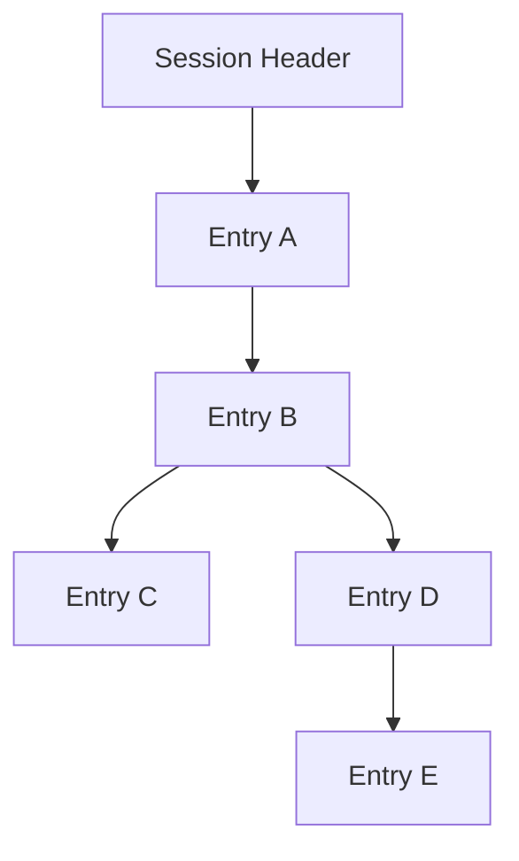
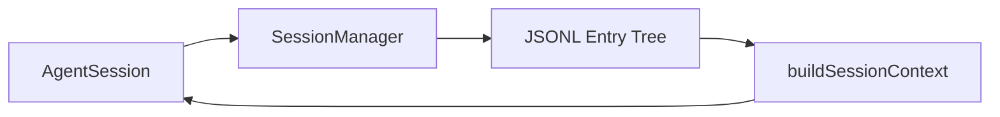
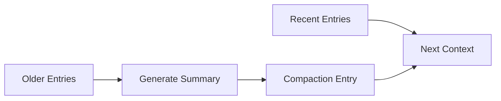
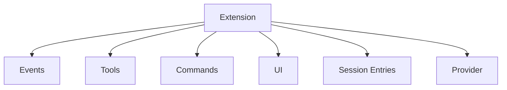
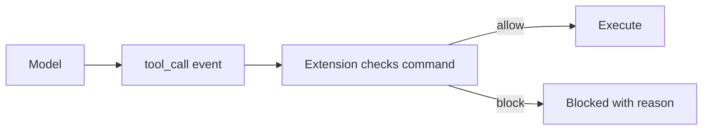

# Pi Session、Compaction 與 Extensions

Pi 最有辨識度的兩個 architectural choice 是：

1. **Session 本身是 Tree。**
2. **大量產品行為由 Extension Runtime 注入。**

這兩件事其實互相呼應：既然 runtime 保持 minimal，就必須讓 state 與 extension 足夠強，才能在不改 core 的情況下長出複雜 workflow。

## 1. Session 是 JSONL，但不是線性 Log

Pi session 預設保存在：

```text
~/.pi/agent/sessions/
```

每個 session 是 JSONL file。

但 Version 2 之後，entry 使用：

```text
id
parentId
```

建立 tree structure。



這不是 UI 上模擬 branch，而是 persisted format 本身就保留 lineage。

## 2. 為什麼 Tree Session 很重要？

假設 Agent 做錯方向：

```text
A → B → C → D
```

你回到 B，走另一條路：

```text
A → B → E → F
```

線性 history 常見作法是：

- 建新 conversation；
- clone / fork 整份資料；
- 或把舊 branch 隱藏。

Pi 的資料模型直接允許：

```text
        C → D
       /
A → B
       \
        E → F
```

因此：

```text
branch
fork
resume
context rebuild
```

都可以直接建立在 entry lineage 上。

## 3. `SessionManager` 的責任

讀 Pi 時要把 `SessionManager` 和 `AgentSession` 分開。

`SessionManager` 負責的是 persisted history：

```text
append entry
read branch
build context
migrate session version
resume / open
session metadata
branch lineage
```

`AgentSession` 則是正在運行的 agent controller。

所以：



## 4. Session Entry 不只是聊天訊息

Pi session format 可以保存不同類型的 durable runtime facts，例如：

```text
message
model change
thinking-level change
compaction
branch summary
custom extension entry
```

因此 session 不只是 transcript，而是**可以重建 runtime context 的 durable entry tree**。

這點和 DeepSeek event sourcing 有相似之處，但 abstraction 不同：

```text
DeepSeek
→ SessionEvent 是整套 state architecture 的核心

Pi
→ SessionEntry tree 直接服務 branch / context / resume
```

## 5. Compaction

LLM context window 有上限，所以 Pi 也需要 compact。

預設概念是：

```text
contextTokens > contextWindow - reserveTokens
→ trigger auto compaction
```

Compaction 不會粗暴刪掉前半段訊息，而是建立 durable `compaction` entry，保存 summary 與 cut point。



Pi 還會追蹤 summary 中的重要 file operations，例如 read / modified files。

## 6. Branch Summarization

Pi 還把另一種 summary 和 compaction 分開：

```text
Compaction
→ 為了 context window

Branch Summarization
→ 為了離開一條探索路徑時保留其知識
```

當使用者透過 `/tree` 切到另一 branch 時，可以把原 branch 的重要結果摘要帶到新的路徑。

這是 Tree Session 才特別自然的能力。

## 7. Extensions 可以改寫 Compaction 行為

Pi extension 可以訂閱：

```text
session_before_compact
```

並且：

- 取消預設 compaction；
- 提供自訂 summary；
- 改變 summarization strategy。

因此 compaction 不是完全鎖死在 core 的演算法。

這很符合 Pi 一貫設計：

> **提供 default，但保留 extension seam。**

## 8. Extension Runtime 能做到什麼？

Pi TypeScript Extension 是非常高權限的 extension surface。

官方列出的能力包含：

```text
Custom tools
Lifecycle events
Tool interception
Context injection
Custom compaction
Commands
Shortcuts
Flags
Custom TUI
Session persistence
Custom rendering
Provider registration
```

簡化成：



## 9. Extension Event Lifecycle

Extension 可以觀察的不是只有「tool 前後」。

文件目前把 events 分成幾類：

```text
Resource Events
Session Events
Agent Events
Model Events
Tool Events
```

因此你可以在不同 lifecycle boundary 插入行為。

例如 permission gate：



這也是 Pi 為什麼可以「沒有 built-in permission popup」，卻仍能自己做 approval UX。

## 10. Extension 可以保存 Durable State

Extension 不必把 state 只放在 memory。

透過：

```text
pi.appendEntry()
```

可以把 JSON-serializable custom state 寫進 session。

因此 Extension 可以做：

```text
TODO state
workflow checkpoint
git checkpoint metadata
external integration cursor
custom audit facts
```

而且 state 可以隨 session resume。

## 11. `/reload` 與開發體驗

自動發現位置包括：

```text
~/.pi/agent/extensions/
.pi/extensions/
```

這些 extensions 可以用：

```text
/reload
```

hot reload。

這代表 Pi 的 extension 開發迴圈非常短：

```text
寫 TypeScript
→ /reload
→ 直接在同一個 agent workflow 測試
```

## 12. Skills、Prompts、Themes、Pi Packages

Extension 不是唯一 customization surface。

Pi 還有：

```text
Skills
Prompt Templates
Themes
Pi Packages
```

### Skills

用 Markdown / instructions 提供可發現的 workflow knowledge。

### Prompt Templates

把常用 prompt 做成 slash-command style reusable prompt。

### Themes

自訂 terminal presentation。

### Pi Packages

把 extensions / skills / prompts / themes 一起打包，透過 npm 或 git 分享。

所以 Pi 的 customization hierarchy 可以想成：

```text
Prompt / Skill
→ 改模型知道什麼、怎麼做

Extension
→ 改 runtime behavior / tools / lifecycle / UI

Pi Package
→ Distribution unit
```

## 13. 和 Codex / DeepSeek 的 Extension 哲學比較

### Codex

```text
AGENTS.md
Skill
MCP
Hook
Rule
Subagent
App Server
```

優點：語意分類清楚。

### DeepSeek

```text
Plugin
Service Definition
Provider
Consumer
Typed Events
```

優點：底層 composition mechanism 一致。

### Pi

```text
ExtensionAPI
ResourceLoader
Skills
Prompt Templates
Pi Packages
```

優點：**core 很小，但 extension 可以深入 runtime lifecycle。**

## 14. Pi 沒有 built-in Subagent，這是設計選擇

官方明確不把 sub-agent 固定成唯一抽象。

你可以：

```text
spawn another pi
用 tmux 管理多 instance
extension 裡建立自訂 delegation
SDK 裡建立 child AgentSession
安裝第三方 package
```

所以「No sub-agents」應理解成：

> **No canonical built-in subagent workflow.**

而不是「不能做 multi-agent」。

## 15. 這套 state/extension 組合適合什麼？

很適合：

- 個人化 coding workflow；
- 研究新的 agent behavior；
- 快速做 custom tools / gates；
- 想保留完整 branch history；
- 希望避免 fork core；
- 希望讓 agent 幫自己寫 extension。

但代價是：

- extension 有很高權限；
- team governance 要自己建立；
- 沒有 built-in approval system 可直接當企業 policy；
- extension compatibility 需要測試。

## 下一步

下一章看這些能力怎麼暴露到外部應用，以及 Pi 把 security boundary 放在哪裡：

[Pi Integration、Project Trust 與 Security](./integration-and-security.md)

## 官方來源

- [Sessions](https://pi.dev/docs/latest/sessions)
- [Session File Format](https://pi.dev/docs/latest/session-format)
- [Compaction & Branch Summarization](https://pi.dev/docs/latest/compaction)
- [Extensions](https://pi.dev/docs/latest/extensions)
- [`SessionManager` source](https://github.com/earendil-works/pi/blob/main/packages/coding-agent/src/core/session-manager.ts)
