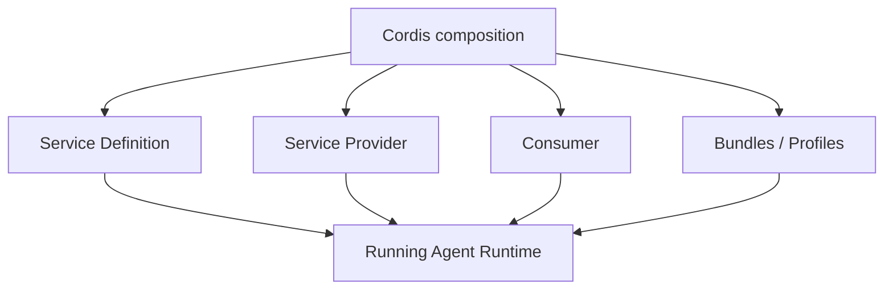
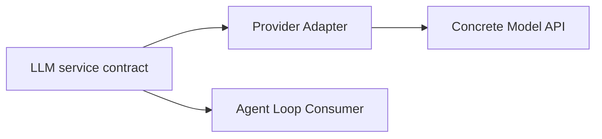
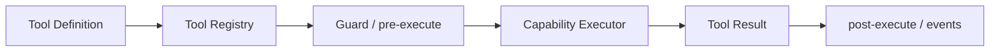
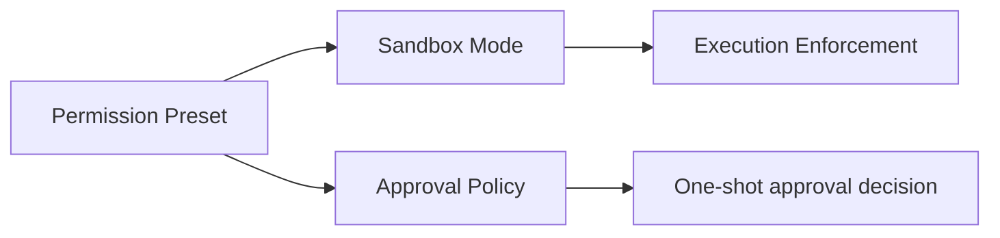
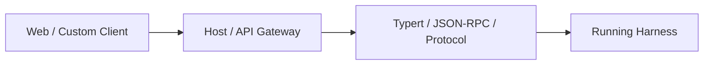

# `deepseek-ai/deepseek-harness` 原始碼導讀地圖

本頁和 [`openai/codex` 原始碼導讀地圖](./source-map.md)採取相同原則：**不是列出所有 package，而是從「我想理解什麼」反推該從哪裡讀。**

> 最後核對：2026-08-23。DeepSeek Harness 整體仍是 developer preview，package tree 變動速度快；請把本頁當責任地圖，而不是永久固定的檔案清單。

## 先看最重要的差異

讀 Codex source 時，通常先找 `codex-core` 這個 runtime center。

讀 DeepSeek Harness 時，第一步反而是先理解：



你要找的不是單一 privileged core，而是：

1. 這個 capability 的 **service contract** 在哪裡；
2. 目前有哪些 **provider**；
3. 哪些 **consumer / model-facing tools** 使用它；
4. 哪個 **bundle / profile** 把它們組起來。

這四個問題會貫穿整個 source tree。

## 1. 我想先看整體 package 地圖

先讀：

- [`packages/README.md`](https://github.com/deepseek-ai/deepseek-harness/blob/master/packages/README.md)
- [`docs/module-graph.md`](https://github.com/deepseek-ai/deepseek-harness/blob/master/docs/module-graph.md)
- [`docs/subsystems/README.md`](https://github.com/deepseek-ai/deepseek-harness/blob/master/docs/subsystems/README.md)

`packages/README.md` 是最重要的 package hierarchy map。它把 packages 分成：

```text
core / api / llm / shell / terminal / sandbox / fs
skill / compaction / subagent / workflow / jobs
session / settings / credentials / storage
sdk / acp / interaction / host / client
bundle / extensions / hooks / examples ...
```

而 `docs/subsystems/README.md` 則從 domain vocabulary 角度整理每個 subsystem。

**建議：先看 package group，再看 subsystem；不要一開始搜尋某個 function 名稱。**

## 2. 我想理解 Cordis 與 composition

先讀：

- [`docs/architecture.md`](https://github.com/deepseek-ai/deepseek-harness/blob/master/docs/architecture.md)
- [`docs/capability-seams.md`](https://github.com/deepseek-ai/deepseek-harness/blob/master/docs/capability-seams.md)
- `packages/boot/`
- `packages/bundle/`

重點概念：

```text
Plugin
Service
Provider
Consumer
ctx.effect()
ctx.on()
ctx.waterfall()
Profile
Bundle
cordis.patch.yml
```

如果這一層還沒看懂，就不要急著鑽 Agent Loop，否則會一直困惑「為什麼同一種能力散落在不同 package」。

## 3. 我想理解 Agent Loop

從：

- [`docs/subsystems/core.md`](https://github.com/deepseek-ai/deepseek-harness/blob/master/docs/subsystems/core.md)
- `packages/core/`

開始。

Package map 中可以看到：

```text
agent
agent-loop
session
system-prompt
tools
scope
invariants
```

這裡要特別注意 DeepSeek 的抽象方式：

```text
dsh-agent-loop = concrete loop plugin
Agent / Session / Tools / LLM = loop 依賴的 services
```

所以「Loop 可替換」不是代表整套 runtime 沒有共同 contract，而是 loop 本身也透過 service seam 參與 composition。

## 4. 我想知道模型怎麼接

先讀：

- [`docs/subsystems/llm-streaming.md`](https://github.com/deepseek-ai/deepseek-harness/blob/master/docs/subsystems/llm-streaming.md)
- `packages/llm/`

重點找：

```text
Message / ContentBlock
assembled model request
StreamChunk
BlockAssembler
LlmAdapter
model adapter registration
```

DeepSeek Harness 的 Model 不是硬寫死在 Agent Loop 裡，而是 capability family。

讀 source 時分三層：



## 5. 我想理解 Session / Turn / Step / Event

先讀：

- [`docs/subsystems/session.md`](https://github.com/deepseek-ai/deepseek-harness/blob/master/docs/subsystems/session.md)
- [`docs/subsystems/persistence.md`](https://github.com/deepseek-ai/deepseek-harness/blob/master/docs/subsystems/persistence.md)
- `packages/session/`
- `packages/core/session*` 相關程式

重點不是找 `messages[]`，而是理解：

```text
SessionHeader
SessionEventMap
turn/start
step/start
user/message
tool/call
tool/result
turn/end
```

再追：

```text
JSONL backend
SQLite backend
projection
session query
replay / fork
```

這是 DeepSeek 和 Codex 最值得並讀的地方之一。

## 6. 我想知道 Prompt / Context 怎麼組

先看：

- [`docs/subsystems/system-prompt.md`](https://github.com/deepseek-ai/deepseek-harness/blob/master/docs/subsystems/system-prompt.md)
- `packages/context/`
- `packages/core/system-prompt*`

讀的時候分清楚：

```text
Context contribution
System prompt section
Tool schemas
Runtime context snapshot
Session-derived messages
```

DeepSeek 很多 runtime state 會先記錄成 event，再由 projection / assembly 在 model call 前重建。

## 7. 我想知道 Tools 怎麼註冊與執行

先讀：

- [`docs/subsystems/tools.md`](https://github.com/deepseek-ai/deepseek-harness/blob/master/docs/subsystems/tools.md)
- `packages/core/tools*`
- 各種 `tool-*` consumer package

典型結構可以想成：



接著再去看具體 family：

```text
shell/
fs/
terminal/
lsp/
web/
workflow/
jobs/
```

## 8. 我想知道 Code Mode

先讀：

- [`docs/subsystems/code-runtime.md`](https://github.com/deepseek-ai/deepseek-harness/blob/master/docs/subsystems/code-runtime.md)
- `packages/code-runtime/`

要分三件事：

```text
Code Runtime service definition
Worker-thread provider
Code Mode consumer / tool bindings
```

重點不是「執行 TypeScript」本身，而是 model-written program 如何只能透過 host 提供的 bindings 編排 capability。

## 9. 我想知道 Sandbox / Approval / Permission

這區建議一起讀：

- [`docs/subsystems/sandbox.md`](https://github.com/deepseek-ai/deepseek-harness/blob/master/docs/subsystems/sandbox.md)
- [`docs/subsystems/approval.md`](https://github.com/deepseek-ai/deepseek-harness/blob/master/docs/subsystems/approval.md)
- [`docs/subsystems/permission-presets.md`](https://github.com/deepseek-ai/deepseek-harness/blob/master/docs/subsystems/permission-presets.md)
- `packages/sandbox/`
- `packages/interaction/`

先畫清楚：



不要把 Permission Preset 當成 enforcement 本身；它只是把兩個獨立 knob 組成產品層選項。

## 10. 我想知道 Filesystem / Shell / Terminal

分別看：

- [`docs/subsystems/filesystem.md`](https://github.com/deepseek-ai/deepseek-harness/blob/master/docs/subsystems/filesystem.md)
- [`docs/subsystems/shell.md`](https://github.com/deepseek-ai/deepseek-harness/blob/master/docs/subsystems/shell.md)
- [`docs/subsystems/terminal.md`](https://github.com/deepseek-ai/deepseek-harness/blob/master/docs/subsystems/terminal.md)
- `packages/fs/`
- `packages/shell/`
- `packages/terminal/`
- `packages/subprocess/`

這裡非常適合觀察 capability seam：

```text
Service Definition
→ local / sandbox / remote provider
→ model-facing tool consumer
```

例如 filesystem 不必假設永遠是本機 filesystem。

## 11. 我想知道 Skills / Subagents / Workflows

先看：

- [`docs/subsystems/skills.md`](https://github.com/deepseek-ai/deepseek-harness/blob/master/docs/subsystems/skills.md)
- [`docs/subsystems/subagent.md`](https://github.com/deepseek-ai/deepseek-harness/blob/master/docs/subsystems/subagent.md)
- [`docs/subsystems/workflow.md`](https://github.com/deepseek-ai/deepseek-harness/blob/master/docs/subsystems/workflow.md)
- `packages/skill/`
- `packages/subagent/`
- `packages/workflow/`

DeepSeek 的 subagent 特別值得注意：provider registry 可以把 delegation 接到不同 execution strategy，甚至外部 agent runtime。

這裡很適合和 Codex 的 Skills / Subagents / Worktrees 章節對照閱讀。

## 12. 我想知道 Extensions / Hooks / Runtime 自我修改

看：

- [`docs/subsystems/extensions.md`](https://github.com/deepseek-ai/deepseek-harness/blob/master/docs/subsystems/extensions.md)
- [`docs/cookbook/extension-cookbook.md`](https://github.com/deepseek-ai/deepseek-harness/blob/master/docs/cookbook/extension-cookbook.md)
- `packages/extensions/`
- `packages/hooks/`

這是 DeepSeek plugin-first 哲學真正落地的地方：

```text
inspect services
mount plugin
unmount plugin
hot reload
lifecycle teardown
```

讀這裡時要同時注意 approval 與 trust boundary，因為「runtime 可以改自己」也代表安全面積更大。

## 13. 我想知道 Web / Client / Remote API

看：

```text
packages/host/
packages/client/
packages/api/
packages/sdk/
packages/acp/
```

以及：

- `docs/subsystems/typert.md`
- `docs/subsystems/web-server.md`
- `docs/subsystems/client-modules.md`

可以把整體想成：



若要找「DeepSeek 對應 Codex App Server 的整合面」，不要只找一個同名 server；要一起看 SDK、API、Host/Client 與 ACP。

## 14. 我想知道 Profiles / Bundles 到底怎麼把東西組起來

看：

- [`docs/architecture.md`](https://github.com/deepseek-ai/deepseek-harness/blob/master/docs/architecture.md)
- `packages/bundle/base/`
- `packages/boot/`
- profiles / bundles 的 `cordis.patch.yml`

官方提供一個非常實用的入口：

```bash
dsh --profile web --dump-config
```

它會顯示**這台機器實際要 boot 的 plugin tree**。

對 DeepSeek source reading 而言，這甚至比只看 package tree 更重要：package tree 告訴你「有哪些零件」，dump-config 告訴你「這次到底裝了哪些零件」。

## 15. 我想看測試、Invariant 與 Replay

看：

```text
packages/test-support/
packages/guard/
docs/subsystems/invariants.md
```

DeepSeek 將許多 runtime invariant 做成可驗證 contract，也有 replay / loader smoke 等測試支援。

如果你在研究 Harness correctness，而不只是 feature，這區值得單獨讀。

## 建議閱讀順序


### DeepSeek source reading 的一句原則

> **先找 Service Definition → Provider → Consumer → Composition，再追 function call。**

這和 Codex 的「先找 responsibility boundary，再追 call graph」其實是同一個精神，只是 DeepSeek 的 responsibility boundary 更常沿著 capability seam 分散在多個 package。
