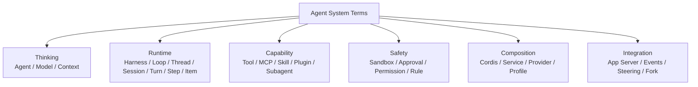

# Glossary：名詞速查

遇到陌生名詞時，不需要先背正式定義。先用這張分類圖判斷它大概在哪一層。



## Agent

**一句話：** 會根據目標反覆「想 → 做 → 看結果 → 再想」的系統。

Model 只是 Agent 的一部分；Agent 還需要 Harness、Tools、Environment、Policy、State。

## Agent Loop

**一句話：** Agent 的主循環。

```text
Model → Action / Tool → Observation → Model → ... → 完成
```

不要和「一次 Model API Call」混淆；一個 Turn 可以跑很多輪 Agent Loop。

## Harness

**一句話：** 把 Model 的判斷連到真實世界的控制與協調 Runtime。

通常負責：

```text
Context + Tools + Execution + Policy + State + Events
```

## Model

**一句話：** Agent 裡負責理解、推理與選擇下一步的部分。

Model 可以提出 Tool Call，但 Tool 是否真的執行，由 Harness / Policy / Environment 決定。

## Model Provider

**一句話：** Harness 連到某個模型服務時使用的 adapter / endpoint 設定層。

Codex 有 `model_providers` abstraction；DeepSeek Harness 則把 LLM adapter 放在 `ctx.llm` capability seam。

「Harness 品牌」不等於「只能使用同品牌 Model」。

## Context

**一句話：** Model 這一次 inference 真正看得到的「工作桌」。

可能包含 instructions、tool metadata、history、environment 與 current user input。

## Context Window

**一句話：** Model 一次最多能處理多少 token 的容量上限。

Context Window 有限，所以 Harness 必須做 selection、truncation、compaction。

## Compaction

**一句話：** Context 太長時，把舊歷史壓縮成「未來還需要的狀態」。

它不是單純把聊天寫成漂亮摘要，而是 durable state compression。

## Prompt Caching

**一句話：** 後續 request 的前綴相同時，Provider 有機會重用先前計算。

Stable prefix、deterministic ordering、append-only growth 都有助於提高命中機會。

## Tool

**一句話：** Model 可以要求 Harness 執行的一種能力。

例如 shell、read file、apply patch、search、MCP tool。

Tool Call 是「行動提案」，不代表行動已經成功。

## Tool Schema

**一句話：** 告訴 Model「這個 Tool 怎麼用」的 machine-readable contract。

通常描述：

```text
name + purpose + arguments + result shape
```

## MCP

**全名：** Model Context Protocol。

**一句話：** 讓 Agent Host 以標準方式連接外部 Tool / Resource / Server。

## Skill

**一句話：** 特定情境才載入的專門 SOP / 知識包。

Codex 中核心概念是 progressive disclosure：先暴露 name + description，需要時才載入完整內容。

## Plugin

**一句話：** 可以掛入 Runtime、提供一組能力或行為的擴充單位；不同 Harness 對 Plugin 的定義範圍不同。

### 在 Codex

Plugin / extension system 與 Skill、MCP、Hook、Rule 等高階 abstraction 並存，通常各自有明確用途。

### 在 DeepSeek Harness

Plugin 是更基礎的 composition 單位；Model Adapter、Tool Registry、Session、Agent Loop、Sandbox、Storage、UI 都可以由 Plugin 提供。

所以看到「Plugin」時，一定要先確認是在談哪套 Harness。

## Hook

**一句話：** 在特定 lifecycle event 發生時，自動執行 deterministic handler。

例如 Tool 執行後自動跑 validator。

## AGENTS.md

**一句話：** Repository / directory scope 的 Agent 長期工作規則。

它主要是 instruction，不是強制安全邊界。

## Sandbox

**一句話：** 限制 Agent 在 execution layer 技術上碰得到什麼。

可以限制 filesystem、process、network 等 capability。

## Approval

**一句話：** 某個特定 Action 是否要由 User / Reviewer 放行。

```text
Sandbox  → 能不能做
Approval → 這次要不要批准
```

## Permission Profile

**一句話：** 一組命名好的 capability / policy 組合。

在不同產品中具體資料模型會不同，不要和 DeepSeek Harness 的 Runtime Profile 混淆。

## Rule

**一句話：** 針對特定 Action / Command Pattern 做 deterministic policy。

例如：

```text
git status       → allow
git push         → prompt
git push --force → forbidden
```

# Codex 常見 Runtime 名詞

## Thread

**一句話：** Codex 中一整段可以延續的 Agent 工作對話 / session boundary。

比喻：一本工作筆記。

## Turn

**一句話：** 一次 User Request 到 Agent 完成 / 失敗 / 中斷的工作單位。

Codex 與 DeepSeek 都有 Turn 概念，但內部 lifecycle 不完全相同。

## Item

**一句話：** Codex Turn 裡的一個細粒度、可觀察內容 / 事件單位。

例如 message、reasoning、shell command、file edit、tool result。

## App Server

**一句話：** 讓 IDE、自製 App 等 Client 可以驅動完整 Codex Harness 的 integration surface。

它提供 Thread / Turn / Item、Config、Auth、Approval、Events 等雙向 protocol 能力。

## JSON-RPC-like Protocol

**一句話：** App Server 使用的 request / response / notification 溝通模式。

語意接近 JSON-RPC，但實際 wire contract 以當前 App Server protocol 為準。

## JSONL

**一句話：** 一行一個 JSON Object 的串流格式。

常用於 stdio streaming 與 `codex exec --json` 類輸出。

## Steering

**一句話：** Turn 還在執行時，User 再補充新的要求或限制。

## Ephemeral Thread

**一句話：** 不保存成 durable history 的暫時 Thread。

## Worktree

**一句話：** Git 讓同一 Repository 同時存在多個獨立 working directory 的功能。

## Subagent

**一句話：** Root Agent 派生出的專門子 Agent。

適合相對獨立、可以並行的 work packet。

# DeepSeek Harness 常見名詞

## Cordis

**一句話：** DeepSeek Harness 底下負責 Plugin lifecycle、dependency、services、typed events 與 reversible effects 的 composition framework。

可以粗略想成：

```text
Cordis = Runtime composition kernel
```

而 Agent 能力主要存在 Plugins 裡。

## Service

**一句話：** Plugin 之間透過共享 Context 使用的一個 capability contract。

例如 `ctx.llm`、`ctx.tools`、`ctx.sessions`。

## Provider

**一句話：** 實際提供某個 Service / Capability Seam 的 implementation。

例如同一個 filesystem seam 可以有 Local Provider 或 Remote Sandbox Provider。

## Consumer

**一句話：** 使用某個 Service 的 Plugin / subsystem。

理想情況下 Consumer 依賴 seam，不依賴 concrete Provider。

## Capability Seam

**一句話：** 把「我要這種能力」與「能力實際怎麼做」分開的 abstraction boundary。

```text
Consumer → Capability Seam ← Provider
```

這是 DeepSeek Harness 可替換 Model / FS / Sandbox / Code Runtime 等 backend 的重要基礎。

## Session

**一句話：** DeepSeek Harness 中 durable Agent trajectory 的主要邊界。

Session 由 append-only `SessionEvent` stream 表達，而不只是 `messages[]`。

## SessionEvent

**一句話：** 被追加到 Session log 的 durable fact。

例如 user message、turn lifecycle、assistant message、tool call / result 等。

## Event Sourcing

**一句話：** 不只保存目前狀態，而是保存造成目前狀態的一連串 Events，再從 Events derive state。

DeepSeek Harness 用這個思維支援 Resume、Fork、Replay、Trajectory 與 Context reconstruction。

## Step

**一句話：** DeepSeek Harness 中一次 model request，以及該 request 產生的 Tool Calls 所形成的執行粒度。

可以先理解為：

```text
Session
└─ Turn
   ├─ Step 1
   └─ Step 2
```

## Code Mode

**一句話：** DeepSeek Harness 的一種 Tool presentation mode，讓 Model 產生受控 TypeScript program，透過 generated SDK 組合多個 Tool operations。

適合 map / filter / batching / aggregation 類多步操作，但不是所有任務都應取代 iterative model loop。

## Code Runtime

**一句話：** 執行 Code Mode program 的獨立 capability seam。

它接收 program + async bindings，回傳 value / logs / error，而不需要知道 Tool 的業務語意。

## Profile

**一句話：** DeepSeek Harness 中一個具名的 Runtime composition。

它可以決定要疊哪些 Bundles、User Plugins 與 Patch，因此不只是「幾個 config value」。

## Bundle

**一句話：** 可以被 Profile 組合的一組 Plugins / Runtime capability composition。

## Reversible Effect

**一句話：** Plugin mount 時註冊的 service / handler / capability，在 Plugin unload 時可以一起撤銷的 lifecycle effect。

這使動態 Runtime composition 更容易維持一致性。

# 通用架構名詞

## Fork

**一句話：** 從既有歷史 / state boundary 建立一條新的 Agent 分支。

Codex 與 DeepSeek 都有 Fork 類能力，但底層 state model 不同。

## Backpressure

**一句話：** Producer 產生事件太快、Consumer 吃不完時，系統如何避免無限制堆積。

常見手段包括 bounded queue、reject、retry、flow control。

## Idempotency

**一句話：** 同一個 operation 因 retry 被執行多次時，不會造成重複副作用。

例如建立付款若 retry 兩次卻真的扣款兩次，就是缺乏正確 idempotency design。

## 最容易混淆的九組名詞

| 不要混淆 | 差異 |
|---|---|
| Model vs Agent | Model 是推理元件；Agent 是完整工作系統 |
| Model vs Harness | Model 決策；Harness 協調與執行 |
| Harness vs Model Provider | Harness 是 Runtime；Provider 只是模型連線 / adapter 層 |
| Thread vs Turn | Codex Thread 是整段工作；Turn 是一次任務 |
| Turn vs Step | DeepSeek Turn 可包含多個 model Step |
| Item vs SessionEvent | Codex 對外主要用 Item；DeepSeek 更強調 durable event log |
| Sandbox vs Approval | Sandbox 是能力邊界；Approval 是本次放行決策 |
| Skill vs MCP | Skill 教「怎麼做」；MCP 增加「能做什麼」 |
| Codex Plugin vs DeepSeek Plugin | Codex 有多個語意化 extension surface；DeepSeek Plugin 是更基礎的 Runtime composition 單位 |
