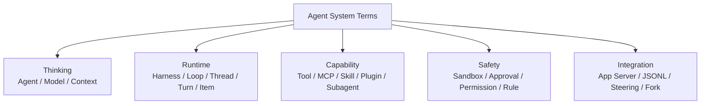

# Glossary：名詞速查

遇到陌生名詞時，不需要先背正式定義。先用這張分類圖判斷它大概在哪一層。



## Agent

**一句話：** 會根據目標反覆「想 → 做 → 看結果 → 再想」的系統。

Model 只是 Agent 的一部分；Agent 還需要 Harness、Tools、Environment、Policy、State。

## Agent Loop

**一句話：** Agent 的主循環。

```text
Model → Action / Tool → Observation → Model → ... → 完成
```

不要和「一次 Model API Call」混淆；一個 Turn 可以跑很多輪 Agent Loop。

## Harness

**一句話：** 把 Model 的判斷連到真實世界的控制中心。

負責協調：

```text
Context + Tools + Execution + Policy + State + Events
```

## Model

**一句話：** Agent 裡負責理解、推理與選擇下一步的部分。

Model 可以提出 Tool Call，但 Tool 是否真的執行，由 Harness / Policy / Environment 決定。

## Context

**一句話：** Model 這一次 inference 真正看得到的「工作桌」。

可能包含：

- instructions；
- tool metadata；
- history；
- environment；
- current user input。

## Context Window

**一句話：** Model 一次最多能處理多少 token 的容量上限。

Context Window 有限，所以 Harness 必須做 selection、truncation、compaction。

## Compaction

**一句話：** Context 太長時，把舊歷史壓縮成「未來還需要的狀態」。

它不是單純把聊天寫成漂亮摘要，而是 durable state compression。

## Prompt Caching

**一句話：** 後續 request 的前綴相同時，Provider 有機會重用先前計算。

Harness 透過：

- stable prefix；
- deterministic ordering；
- append-only growth

提高命中機會。

## Tool

**一句話：** Model 可以要求 Harness 執行的一種能力。

例如：

- shell；
- read file；
- apply patch；
- search；
- MCP tool。

Tool Call 是「行動提案」，不代表行動已經成功。

## Tool Schema

**一句話：** 告訴 Model「這個 Tool 怎麼用」的 machine-readable contract。

通常描述：

```text
name + purpose + arguments + result shape
```

## MCP

**全名：** Model Context Protocol。

**一句話：** 讓 Agent Host 以標準方式連接外部 Tool / Resource / Server。

例如把 GitHub、Slack、Database、Observability 服務變成 Agent 能使用的 capability。

## Skill

**一句話：** 只有特定情境才載入的專門 SOP / 知識包。

核心概念是 **progressive disclosure**：先暴露 name + description，需要時才載入完整內容。

## Plugin

**一句話：** 可以分發的一組 Codex capability bundle。

可包含多種能力；具體格式依 Codex 版本演進。

## Hook

**一句話：** 在特定 lifecycle event 發生時，自動執行 deterministic handler。

例如 Tool 執行後自動跑 validator。

## AGENTS.md

**一句話：** Repository / directory scope 的 Agent 長期工作規則。

適合放「只要在這個 code scope 工作就應該知道」的 invariant。

不要和 Permission 混淆：AGENTS.md 主要是 instruction，不是強制安全邊界。

## Sandbox

**一句話：** 限制 Agent 在 execution layer 技術上碰得到什麼。

可以想成「圍牆」。

可能限制：

- filesystem；
- process；
- network。

## Approval

**一句話：** 某個特定 Action 是否要由 User / Reviewer 放行。

可以想成「門禁決策」。

不要和 Sandbox 混淆：

```text
Sandbox  → 能不能做
Approval → 這次要不要批准
```

## Permission Profile

**一句話：** 一組命名好的 capability / policy 組合。

用來選擇某個 Thread / Turn 應使用哪一套權限設定。

## Rule

**一句話：** 針對特定 Action / Command Pattern 做 deterministic policy。

例如：

```text
git status       → allow
git push         → prompt
git push --force → forbidden
```

## Thread

**一句話：** 一整段可以延續的 Agent 工作對話。

比喻：一本工作筆記。

## Turn

**一句話：** 一次 User Request 到 Agent 完成 / 失敗 / 中斷的工作單位。

比喻：工作筆記中的一次任務。

## Item

**一句話：** Turn 裡的一個細粒度事件。

例如：

- message；
- reasoning；
- shell command；
- file edit；
- tool result。

比喻：一次任務中的每一筆紀錄。

## App Server

**一句話：** 讓 IDE、自製 App 等 Client 可以驅動完整 Codex Harness 的 integration surface。

它提供 Thread / Turn / Item、Config、Auth、Approval、Events 等雙向 protocol 能力。

## JSON-RPC-like Protocol

**一句話：** App Server 使用的 request / response / notification 溝通模式。

語意接近 JSON-RPC 2.0，但實際 wire contract 以當前 Codex App Server 文件為準。

## JSONL

**一句話：** 一行一個 JSON Object 的串流格式。

常用於 stdio streaming 與 `codex exec --json` 類輸出。

## Steering

**一句話：** Turn 還在執行時，User 再補充新的要求或限制。

例如 Agent 工作到一半，你說：

```text
先不要改 DB schema。
```

## Fork

**一句話：** 從既有 Thread 的某個歷史邊界分出新的 Thread。

概念接近 Git branch：保留共同歷史，之後走不同路線。

## Ephemeral Thread

**一句話：** 不保存成 durable history 的暫時 Thread。

適合一次性 task、CI、subtask 或某些敏感場景。

## Worktree

**一句話：** Git 讓同一 Repository 同時存在多個獨立 working directory 的功能。

對多 Agent 平行修改很有用，因為不同 Agent 不一定要搶同一個工作目錄。

## Subagent

**一句話：** Root Agent 派生出的專門子 Agent。

適合相對獨立、可以並行的 work packet。

## Backpressure

**一句話：** Producer 產生事件太快、Consumer 吃不完時，系統如何避免無限制堆積。

常見手段：

- bounded queue；
- reject；
- retry；
- flow control。

## Idempotency

**一句話：** 同一個 operation 因 retry 被執行多次時，不會造成重複副作用。

例如「建立一筆付款」如果 retry 兩次卻真的扣款兩次，就是缺乏正確 idempotency design。

## 最容易混淆的五組名詞

| 不要混淆 | 差異 |
|---|---|
| Model vs Agent | Model 是推理元件；Agent 是完整工作系統 |
| Model vs Harness | Model 決策；Harness 協調與執行 |
| Thread vs Turn | Thread 是整段工作；Turn 是一次任務 |
| Sandbox vs Approval | Sandbox 是能力邊界；Approval 是本次放行決策 |
| Skill vs MCP | Skill 教「怎麼做」；MCP 增加「能做什麼」 |
