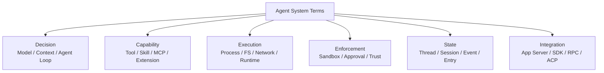

# Glossary：Agent Harness 三方名詞速查

這份 Glossary 先放**通用概念**，再分 Codex、DeepSeek Harness、Pi。目的不是把三套名詞硬翻成同一套，而是知道它們各自在回答哪一種 responsibility。



# 通用名詞

## Agent

**一句話：** 會根據目標反覆「判斷 → 行動 → 觀察 → 再判斷」的工作系統。

Model 只是 Agent 的推理元件；完整 Agent 還需要 Harness、Tools、Environment、Policy、State。

## Agent Harness

**一句話：** 把 Model 的判斷連到真實世界，並管理 Context、Tools、Execution、Policy、State、Events 的 runtime / control system。

## Agent Loop

**一句話：** Agent 的主控制循環。

```text
Model → Action / Tool → Observation → Model → ... → Complete
```

## Model

**一句話：** 負責理解、推理、產生下一步提案的元件。

## Model Provider / Adapter

**一句話：** Harness 連到某個模型服務時使用的 transport / request / streaming abstraction。

Harness 品牌不等於只能使用同品牌模型。

## Context

**一句話：** Model 這一次 inference 真正看得到的工作資料集合。

## Context Projection

**一句話：** 從 durable state、instructions、tools、resources 中投影出本輪 Model Request 的過程。

## Compaction

**一句話：** Context 太長時，把較舊歷史轉成未來仍可繼續工作的壓縮狀態。

## Prompt Caching

**一句話：** 後續 request 前綴穩定時，Provider 可能重用既有計算；Harness 的 ordering / context stability 會影響命中率。

## Tool

**一句話：** Model 可以提出呼叫、由 Harness 真正執行的一種 capability。

Tool Call 是行動提案，不代表 side effect 已經發生。

## Tool Registry

**一句話：** 管理可提供給 Model 的 tool definitions、schemas、execution handlers 的 runtime registry。

## Skill

**一句話：** 按需載入的 workflow / domain knowledge / SOP。不同 Harness 的載入與 distribution 方式不同。

## Plugin / Extension

**一句話：** 掛入 runtime、增加 capability 或 lifecycle behavior 的擴充單位；三套對這個詞的 abstraction depth 不同。

## Sandbox

**一句話：** 在 execution layer 技術上限制 Agent 可以造成的 effect。

## Approval

**一句話：** 針對某個具體 action 的一次性授權決策。

```text
Sandbox  → 技術上能不能造成某種 effect
Approval → 這一次是否放行
```

## Trust Boundary

**一句話：** 系統在哪一層把輸入、程式碼、extension、credential 或 process 視為不可信，並建立控制界線。

## Execution World

**一句話：** Agent 真正工作的 filesystem、process、network、terminal、credentials 等環境集合；可能是 local OS、container、microVM 或 remote workspace。

## Resume

**一句話：** 從 durable state 重建先前工作並繼續執行。

## Fork / Branch

**一句話：** 從某個既有 state boundary 建立另一條工作路徑。

## Replay

**一句話：** 從 durable events / entries 重新重建或驗證 trajectory。

## Idempotency

**一句話：** 同一 operation 因 retry 執行多次時，不造成重複 side effect。

## Backpressure

**一句話：** Producer 產生資料太快時，Consumer 如何限制 queue / memory / latency 成長。

# Codex 名詞

## codex-core

**一句話：** Codex Rust runtime 的核心區域，承擔 Agent Loop、context/state/tool/security 等主要控制責任。

## Thread

**一句話：** Codex 中一整段可延續的 Agent 工作容器。

## Turn

**一句話：** Codex 中從一次 user input 開始，到完成、失敗或中斷的工作單位。

## Item

**一句話：** Codex Turn 裡的細粒度活動物件，例如 message、reasoning、command、file change、tool result。

## App Server

**一句話：** 讓 IDE、自製 App 等 Rich Client 驅動完整 Codex runtime 的主要 integration boundary。

## AGENTS.md

**一句話：** Repository / directory scope 的長期 guidance / instructions。

它是 instruction surface，不等同 enforcement。

## MCP

**全名：** Model Context Protocol。

**一句話：** Codex 可透過 MCP 連接外部 tools / resources / services。

## Rule / Permission

**一句話：** Codex 裡用來限制或要求批准特定 action 的 deterministic policy surface。

## Hook

**一句話：** 在 lifecycle checkpoint 執行 deterministic integration behavior 的 extension surface。

## Subagent

**一句話：** Root Agent 可委派相對獨立工作給另一個 Agent execution unit。

## Worktree

**一句話：** Git 提供的獨立 working directory，適合隔離並行修改。

# DeepSeek Harness 名詞

## Cordis

**一句話：** DeepSeek Harness 底下管理 Plugin lifecycle、services、typed events、dependency 與 reversible effects 的 composition framework。

## Service Definition

**一句話：** 一種 capability contract；Consumer 依賴它，而不是依賴 concrete backend。

## Provider

**一句話：** 實際提供某個 Service / Capability 的 implementation。

## Consumer

**一句話：** 使用某個 Service 的 Plugin / subsystem。

## Capability Seam

**一句話：** 把「我要這種能力」與「它實際怎麼做」分開的 abstraction boundary。

```text
Consumer → Service Definition ← Provider
```

## Profile

**一句話：** 一個具名 Runtime composition，決定要 boot 哪些 bundles / plugins / patches。

## Bundle

**一句話：** 可重用的一組 Plugin composition / config rows。

## Session

**一句話：** DeepSeek Harness durable Agent trajectory 的主要 boundary。

## SessionEvent

**一句話：** 被 append 到 Session log 的 durable fact。

## Event Sourcing

**一句話：** 保存造成目前狀態的一連串 events，再從 events derive projection，而不是只保存最後 snapshot。

## Turn

**一句話：** 從一批 input 被 claim 到沒有待完成 work 的 lifecycle boundary。

## Step

**一句話：** 一次 model request，加上該 request 產生的 tool execution phase。

## Agent Event

**一句話：** 描述 live in-flight Agent lifecycle、steering、step、status 等非單純 durable transcript 的 event domain。

## Guard

**一句話：** 在 capability / tool boundary 做 deterministic policy / runtime hygiene 的機制。

## Permission Preset

**一句話：** 把 Sandbox Mode + Approval Policy 組成產品層可理解的權限模式。

## Code Mode

**一句話：** 讓 Model 產生受控 TypeScript program，透過 generated bindings 組合多個 tool operations 的 presentation / execution mode。

## Code Runtime

**一句話：** 執行 Code Mode program 的獨立 capability seam。

## Subagent Provider

**一句話：** 把 delegation 抽象成 provider，可委派給 in-process Agent、ACP、其他 runtime 等不同 backend。

## Workflow / Jobs

**一句話：** 把固定流程與長生命週期背景工作從單一 Agent Loop 拆出的 formal capability families。

## Invariant

**一句話：** 對 runtime / session / request reconstruction 做 correctness 驗證的結構性契約。

## Reversible Effect

**一句話：** Plugin mount 時註冊的 effect 在 unload 時可以一起撤銷，維持 composition lifecycle 一致性。

# Pi 名詞

## pi-ai

**一句話：** Pi 的 multi-provider model abstraction layer，負責不同模型 Provider、streaming、tool-call vocabulary 等能力。

## pi-agent-core

**一句話：** Pi 的 minimal stateful Agent runtime，負責 Agent Loop、messages、tools、events 等核心 primitive。

## pi-coding-agent

**一句話：** 建立在 `pi-ai` 與 `pi-agent-core` 上的完整 terminal coding harness，包含 AgentSession、Session、Resources、Extensions、TUI、RPC、SDK。

## AgentSession

**一句話：** Pi Coding Agent 的主要 runtime controller；interactive、print、RPC 等 mode 共用這個 session lifecycle 中心。

## SessionManager

**一句話：** Pi durable JSONL Session Tree 的管理元件，負責 append、resume、branch lineage、context reconstruction 等。

## Session Entry

**一句話：** Pi session file 裡的一筆 durable entry；透過 `id / parentId` 形成 tree，而不是只有線性 message array。

## Session Tree

**一句話：** Pi 用 entry lineage 表示完整 branch history 的 durable state model。

## Branch Summary

**一句話：** 離開某條 Session branch 時，把該探索路徑的重要資訊帶到另一條路徑的 summary 機制。

## ResourceLoader

**一句話：** Pi 發現與載入 Skills、Prompt Templates、Extensions、Themes 等 resources 的 subsystem。

## ExtensionAPI

**一句話：** Pi TypeScript Extension 用來註冊 tools、events、commands、UI、providers、durable state 等 runtime behavior 的主要 surface。

## Pi Package

**一句話：** 可一起分發 Extensions、Skills、Prompts、Themes 等 resources 的 package unit。

## Project Trust

**一句話：** Pi 用來控制是否載入專案內 `.pi/` resources 的信任機制。

**重要：Project Trust 不是 sandbox。**

## Interactive Mode

**一句話：** Pi 的完整 TUI 使用模式。

## Print / JSON Mode

**一句話：** 適合 shell pipeline / automation 的非互動輸出模式。

## RPC Mode

**一句話：** 透過 stdin/stdout machine-readable protocol 驅動 Pi AgentSession 的 integration mode。

## Pi SDK

**一句話：** 在 Node/TypeScript process 內直接建立、控制 Pi AgentSession 的 integration surface。

# 最容易混淆的名詞

| 不要混淆 | 正確理解 |
|---|---|
| Model vs Agent | Model 是推理元件；Agent 是完整工作系統 |
| Agent vs Harness | Agent 是行為主體；Harness 是驅動與限制它的 runtime/control layer |
| Tool Call vs Side Effect | Tool Call 是提案；Executor 真正執行才產生 effect |
| State vs Context | State 保存 durable facts；Context 是本輪 Model 的 projection |
| Sandbox vs Approval | Sandbox 是 execution boundary；Approval 是一次 action decision |
| Trust vs Isolation | 信任某個 resource 能不能載入，不等於 OS effect 已隔離 |
| Codex Item vs DeepSeek SessionEvent vs Pi Entry | 都可描述活動/狀態，但 data model、durability、UI semantics 不同 |
| Codex Thread vs DeepSeek Session vs Pi Session | 都是長生命週期工作邊界，但不是同一資料模型 |
| Codex Skill vs DeepSeek Skill vs Pi Skill | 都偏 workflow knowledge，但 discovery / provider / resource mechanism 不同 |
| Plugin vs Extension | DeepSeek Plugin 是 runtime composition primitive；Pi Extension 是深度 runtime extension；Codex 則有多個語意化 extension surfaces |
| App Server vs JSON-RPC SDK vs Pi RPC | 都可做 client integration，但 protocol scope、state model、產品責任不同 |

## 最後的閱讀原則

遇到陌生名詞先不要問「它對應另一套的哪個同名功能」，先問：

> **它是在處理 Decision、Context、Capability、Execution、Enforcement、State，還是 Integration？**

先找到 responsibility，再做跨 Harness 對照，通常比較不會誤解。
