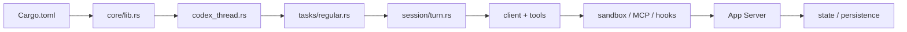

# `openai/codex` 原始碼導讀地圖

本頁不是完整 crate catalog，而是用「你想理解什麼」來決定去哪裡看。

> Source tree 變動很快；以下以 2026-08-23 核對的 `main` 架構為導讀基準。實際檔案請以 repository 當前狀態為準。

## 1. 我想看整體 workspace

[`codex-rs/Cargo.toml`](https://github.com/openai/codex/blob/main/codex-rs/Cargo.toml)

先看 `[workspace].members`。目前可看到數十個 crates，涵蓋 core、app-server、protocol、exec、sandbox、MCP、skills、hooks、thread store、model provider 等。

**目的：** 建立模組邊界，不要一開始鑽函式。

## 2. 我想知道 Core 有什麼

[`codex-rs/core/src/lib.rs`](https://github.com/openai/codex/blob/main/codex-rs/core/src/lib.rs)

這是最好的 core map。重點模組：

```text
session
codex_thread
thread_manager
client
context / context_manager
agent
exec / unified_exec / exec_policy
mcp
skills / plugins / agents_md
hook_runtime
guardian / safety / sandboxing
rollout / state / tasks
tools
compact*
```

## 3. 我想理解 Thread

[`core/src/codex_thread.rs`](https://github.com/openai/codex/blob/main/codex-rs/core/src/codex_thread.rs)

看：

- `ThreadConfigSnapshot`；
- `CodexThread`；
- session/io relation；
- submit/event lifecycle。

## 4. 我想理解 Turn / Agent Loop

[`core/src/tasks/regular.rs`](https://github.com/openai/codex/blob/main/codex-rs/core/src/tasks/regular.rs)

先從較小的 RegularTask 進入，再追：

[`core/src/session/turn.rs`](https://github.com/openai/codex/blob/main/codex-rs/core/src/session/turn.rs)

不要反過來，否則容易陷在細節。

## 5. 我想知道 Model Call

```text
core/src/client.rs
core/src/client_common.rs
codex-client/
model-provider/
models-manager/
responses-api-proxy/
```

對照官方 [agent loop article](https://openai.com/index/unrolling-the-codex-agent-loop/) 理解 request / stream / retry。

## 6. 我想知道 Tools 怎麼執行

```text
core/src/tools/
core/src/unified_exec.rs
exec/
exec-server/
apply-patch/
shell-command/
```

建議從 tool registry/handler 追到 executor，再看 OS/sandbox integration。

## 7. 我想知道 Sandbox / Security

```text
sandboxing/
linux-sandbox/
network-proxy/
execpolicy/
core/src/safety.rs
core/src/guardian.rs
core/src/exec_policy.rs
```

閱讀時區分：

- instruction/guidance；
- deterministic policy；
- OS enforcement；
- reviewer/approval。

## 8. 我想知道 MCP

```text
codex-mcp/
mcp-server/
rmcp-client/
core/src/mcp/
core/src/mcp_tool_call.rs
core/src/mcp_tool_exposure.rs
```

看 MCP discovery/exposure/call 與 Codex internal tool pipeline 如何接合。

## 9. 我想知道 Skills / Plugins / Hooks

```text
skills/
plugin/
core/src/skills.rs
core/src/plugins/
hooks/
core/src/hook_runtime.rs
```

這一區最容易因版本快速演進，先讀官方 docs 再讀 source。

## 10. 我想知道 App Server

[`codex-rs/app-server/README.md`](https://github.com/openai/codex/blob/main/codex-rs/app-server/README.md)

再看：

```text
app-server/
app-server-client/
app-server-transport/
app-server-protocol/
app-server-daemon/
```

README 本身已詳細描述 protocol、primitives、lifecycle、API。

## 11. 我想知道 Protocol Types

[`codex-rs/protocol/README.md`](https://github.com/openai/codex/blob/main/codex-rs/protocol/README.md)

這個 crate 的設計原則是保持 minimal dependencies，定義 core↔TUI 與 App Server 用的 types，避免 material business logic。

這是很好的 layering 範例。

## 12. 我想知道 Persistence

```text
thread-store/
rollout/
history/
state/
core/src/rollout/
core/src/state.rs
```

搭配 App Server 的 thread/list/read/resume/fork API 看，會比只讀 DB/storage code 更容易理解。

## 建議閱讀順序



### 原則

**先找 responsibility boundary，再追 call graph。**

大型 agent runtime 最容易讀錯的方式，就是從某個 2000 行函式逐行讀，最後記得很多細節卻不知道系統為什麼這樣切。
