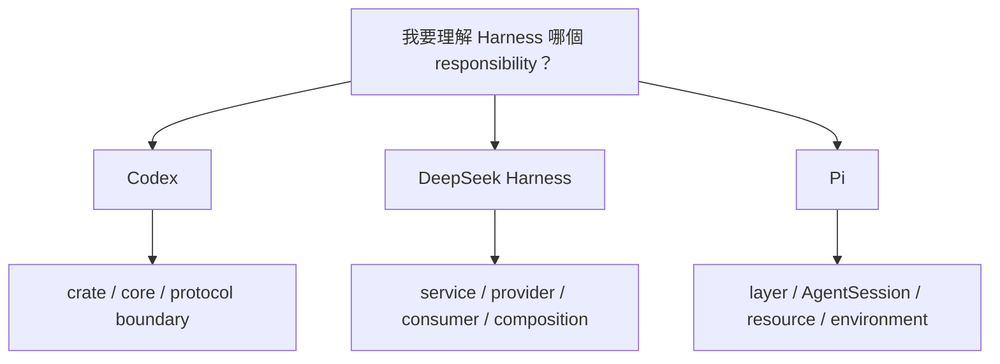

# 三套 Harness 原始碼導讀入口

本教材現在把 Codex、DeepSeek Harness 與 Pi 當成三套完整 architecture case study，因此 source reading 也用同一組 responsibility 來並讀。

不要先問 repo 大小，而是先問：

> **我想理解的是 Model、Loop、Tools、State、Security、Extension，還是 Client integration？**



## Codex：先找 responsibility boundary

[閱讀 `openai/codex` 原始碼導讀地圖](./source-map.md)

推薦入口：

```text
codex-rs/Cargo.toml
→ codex-core
→ Thread / Turn / task
→ model client + tools
→ sandbox / MCP / hooks
→ App Server
→ state / persistence
```

Codex 最適合先問：

> **這個責任屬於哪個 crate / core module / protocol boundary？**

再沿 call graph 往下追。

## DeepSeek：先找 capability seam

[閱讀 `deepseek-ai/deepseek-harness` 原始碼導讀地圖](./deepseek-source-map.md)

推薦入口：

```text
architecture.md
→ packages/README.md
→ core / agent-loop
→ session / events
→ llm / prompt
→ tools / capability seams
→ sandbox / approval
→ skills / subagent / workflow
→ sdk / host / client
→ profiles / bundles
```

DeepSeek 最適合先問：

> **Service Definition 在哪？誰是 Provider？誰是 Consumer？哪個 Composition 把它們 mount 起來？**

再追 function call。

## Pi：先判斷 behavior 位於哪一層

[閱讀 `earendil-works/pi` 原始碼導讀地圖](./pi-source-map.md)

推薦入口：

```text
README.md
→ packages/coding-agent/README.md
→ packages/ai/src/models.ts
→ packages/agent/
→ packages/coding-agent/src/core/sdk.ts
→ agent-session.ts
→ session-manager.ts
→ resource-loader.ts
→ extensions/
→ tools/
→ modes/rpc/
→ security / containerization docs
```

Pi 最適合先問：

> **這個 behavior 應該在 pi-ai、pi-agent-core、AgentSession、Extension / Resource，還是 external environment？**

這個問題本身就是 Pi 的 architectural boundary。

## 同一個問題，三邊去哪裡看？

| 我想理解 | Codex | DeepSeek Harness | Pi |
|---|---|---|---|
| 整體模組 | `codex-rs/Cargo.toml` | `packages/README.md`, module graph | repo README + package READMEs |
| Agent Loop | `codex-core` tasks / turn | agent-loop service | `pi-agent-core` |
| Coding Runtime Center | `codex-core` | Cordis composition | `AgentSession` |
| Model Provider | model-provider crates / core client | LLM adapter seam | `packages/ai/src/models.ts`, `ModelRuntime` |
| Context / Prompt | core context / instructions | system-prompt + projection | system-prompt + ResourceLoader |
| State | Thread / Rollout / Thread Store | SessionEvent + projection | SessionManager + JSONL tree |
| Tools | core tools / exec / MCP | tool registry / capability providers | tools/ + AgentTool + Extension tools |
| Sandbox | sandbox / exec policy | sandbox service / platform providers | external container / OS boundary |
| Approval | core / App Server flow | approval service | optional Extension gate |
| Skills | skills / core integration | skill provider | ResourceLoader / skills |
| Subagents | first-party agent collaboration | subagent provider | no canonical built-in abstraction |
| Extension lifecycle | Hooks / Skills / MCP / Rules | Typed events / Plugins | `ExtensionAPI`, `pi.on()` |
| Client integration | App Server / SDK | SDK / JSON-RPC / ACP / Host | SDK / JSONL RPC / Print / TUI |
| Runtime composition | config + high-level surfaces | Profile / Bundle / Cordis tree | SDK factories + ResourceLoader + Extensions |

## 練習 1：一次 Tool Call

### Codex

```text
Model response
→ tool routing
→ policy / approval
→ executor
→ output item
→ next model request
```

### DeepSeek

```text
assistant tool call
→ tools/pre-execute
→ tools/execute
→ capability provider
→ tools/post-execute
→ tool/result SessionEvent
→ next Step
```

### Pi

```text
AgentSession
→ pi-agent-core Agent
→ model emits tool call
→ extension tool_call interception
→ AgentTool.execute
→ result appended to Agent state
→ SessionManager persistence
→ next model request
```

## 練習 2：一次 Resume

### Codex

追：

```text
Thread Store
→ rollout / history
→ context rebuild
→ continue Turn
```

### DeepSeek

追：

```text
SessionEvent persistence
→ derive projection / messages
→ resume Session
```

### Pi

追：

```text
SessionManager.open / continueRecent
→ parse JSONL
→ choose branch
→ buildSessionContext
→ restore model / thinking metadata
→ AgentSession
```

## 練習 3：一次 Branch / Fork

這是 Pi 最值得加入後的新並讀題目。

### Codex

看 Thread / fork / rollout semantics。

### DeepSeek

看 Session lineage / event projection。

### Pi

看：

```text
id / parentId entry tree
→ active branch
→ branch summary
→ rebuild context
```

## 練習 4：危險 Bash

### Codex

```text
policy
→ approval
→ sandbox
→ exec
```

### DeepSeek

```text
approval service
→ sandbox provider
→ execution capability
```

### Pi

```text
optional extension gate
→ bash tool
→ OS user permissions / external sandbox
```

這個練習能直接看出三種 security philosophy。

## 練習 5：換 Model Provider

### Codex

追 model provider registry、config 與 product surface model discovery。

### DeepSeek

追 LLM Service Definition → Adapter Provider → composition。

### Pi

追：

```text
ModelRuntime
→ pi-ai Models
→ Provider
→ auth
→ provider.stream()
```

以及 extension provider registration。

## 三種 source-reading 心法

### Codex

```text
先定位 crate / core subsystem / protocol boundary
→ 再追 call graph
```

### DeepSeek

```text
先找 Service Definition
→ Provider
→ Consumer
→ Composition
→ 再追 function call
```

### Pi

```text
先判斷 responsibility layer
→ pi-ai / agent-core / AgentSession / Resource / Extension / Environment
→ 再追 runtime object wiring
```

## 為什麼三套一起讀更有價值？

因為同一個 feature 在三套系統裡可能根本不位於同一層。

例如「permission」：

```text
Codex
→ first-party Runtime capability

DeepSeek
→ formal service seam

Pi
→ optional extension policy + external enforcement
```

如果只讀一套，很容易把該套的 design choice 誤認成「Agent 必然如此」。

## 讀 source 的共同原則

不論哪一套，最有效的順序仍然是：

> **先知道 responsibility boundary，再看 implementation detail。**

三套 boundary 的形狀不同：

```text
Codex
→ crate / core subsystem / protocol

DeepSeek
→ service / provider / consumer / composition

Pi
→ runtime layer / AgentSession / resource / extension / external environment
```

這正是三套 Harness 並讀的核心學習價值。
