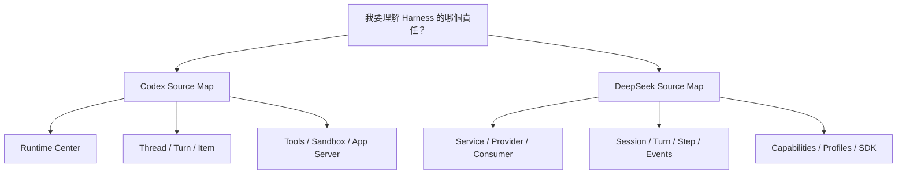

# 雙 Harness 原始碼導讀入口

本教材現在同時把 Codex 與 DeepSeek Harness 當成完整架構案例，因此原始碼導讀也採對稱安排。

不是先問「哪個 repo 比較大」，而是用同一組問題讀兩邊：



## Codex：從 responsibility boundary 進入

[閱讀 `openai/codex` 原始碼導讀地圖](./source-map.md)

推薦入口：

```text
codex-rs/Cargo.toml
→ codex-core
→ CodexThread / regular task / turn
→ model client + tools
→ sandbox / MCP / hooks
→ App Server
→ state / persistence
```

Codex 最適合先問：

> **這個責任屬於哪個 crate / core module？**

再沿 call graph 往下追。

## DeepSeek：從 capability seam 與 composition 進入

[閱讀 `deepseek-ai/deepseek-harness` 原始碼導讀地圖](./deepseek-source-map.md)

推薦入口：

```text
architecture.md
→ packages/README.md
→ core / agent-loop
→ session / events
→ llm / prompt
→ tools / capability seams
→ sandbox / approval
→ skills / subagent / workflow
→ sdk / host / client
→ profiles / bundles
```

DeepSeek 最適合先問：

> **Service Definition 在哪？誰是 Provider？誰是 Consumer？哪個 Composition 把它們 mount 起來？**

再追 function call。

## 同一個問題，兩邊去哪裡看？

| 我想理解 | Codex | DeepSeek Harness |
|---|---|---|
| 整體模組 | `codex-rs/Cargo.toml` | `packages/README.md`, `module-graph.md` |
| Agent Loop | `core/tasks`, `session/turn` | `core/agent-loop`, `subsystems/core.md` |
| Model Provider | core client / model-provider crates | `packages/llm`, `LlmAdapter` |
| Context / Prompt | core context / instructions | context + system-prompt + Session projection |
| State | Thread / Rollout / Thread Store | SessionEvent + persistence + projection |
| Tools | `core/tools`, exec | `core/tools` + capability consumers |
| Sandbox | sandboxing / exec policy | sandbox service + platform provider |
| Approval | core / App Server approval flow | interaction/user-approval |
| Skills | skills + core integration | skill provider registry |
| Subagents | core agents / collaboration | subagent provider registry |
| External integration | App Server / protocol | SDK / JSON-RPC / ACP / Host / Client |
| Runtime composition | config + extension surfaces | Profile / Bundle / Cordis plugin tree |

## 最值得做的並讀練習

### 練習 1：一次 Tool Call

Codex：

```text
Model response
→ tool routing
→ policy / approval
→ executor
→ output item
→ next model request
```

DeepSeek：

```text
assistant tool call
→ tools/pre-execute
→ tools/execute
→ capability provider
→ tools/post-execute
→ tool/result SessionEvent
→ next Step
```

### 練習 2：一次 Resume

Codex：追 Thread Store / rollout / context rebuild。

DeepSeek：追 SessionEvent persistence / `deriveMessages()` / projection。

### 練習 3：換 Sandbox Backend

Codex：看 sandbox / platform enforcement 與 runtime integration。

DeepSeek：看 `ctx.sandbox` Service Definition → provider → shell consumer，再延伸到 whole execution-world seam。

## 讀 source 的共同原則

兩邊架構哲學不同，但最有效的 source reading 原則其實相同：

> **先知道 responsibility boundary，再看 implementation detail。**

差別只是 boundary 的形狀：

```text
Codex    → crate / core subsystem / protocol boundary
DeepSeek → service / provider / consumer / composition boundary
```

這也是並讀兩套 Harness 最大的學習價值。
