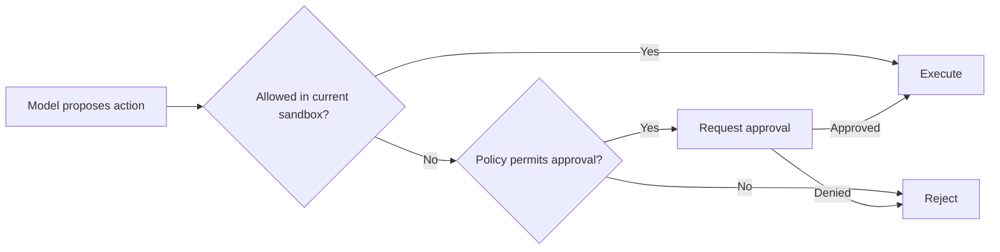

# Sandbox 與 Approvals

Coding agent 的安全不能只靠一句「請小心」。Codex 把「模型想做的事」與「環境允許做的事」拆開，核心概念是 **sandbox + approval**。

## 兩個不同問題

### Sandbox：技術上做得到嗎？

限制 filesystem、process、network 等 capability。例如 read-only 不允許 workspace write；workspace-write 只開放特定寫入範圍。

### Approval：這次要不要讓它做？

即使某種 action 理論上可以被升級執行，也可能必須先交給 user 或 reviewer 決策。



## 常見 Sandbox 模式

概念上可理解成：

- `read-only`：只讀，適合分析/審查。
- `workspace-write`：可修改工作區，但仍限制更廣泛系統資源。
- `danger-full-access`：接近 unrestricted execution，風險最高。

實際 capability 會依 OS、permission profiles、managed policy 而不同，不要只看模式名字推測所有細節。

## Approval Policy

Interactive 使用常見的是 on-request 類型：agent 在遇到超出目前權限但可被批准的操作時，提出 approval request。

CI 則通常不能停下來等人按按鈕，因此設計會不同：

- 盡量給最小且足夠的 deterministic permission；
- 不需要的 network/paths 關掉；
- 需要 destructive operation 時改成產生 plan/patch，而不是直接執行；
- 或把 approval 交給自動 reviewer/policy layer。

## Sandbox ≠ Prompt Safety

即使模型被明確告知「只能讀檔」，真正安全邊界仍應由 sandbox enforcement 提供。Prompt 是 guidance，sandbox 是 capability boundary。

如果把安全要求只放在 AGENTS.md：

```md
永遠不要讀 ~/.ssh
```

這最多是行為指示。真正要保證，應讓 execution layer 根本拿不到該路徑。

## MCP 是重要例外

Codex agent-loop 官方說明特別提醒：本地 Codex shell sandbox 的保護不會自動包住所有 MCP server。MCP 工具可能在自己的 process/remote service 執行，因此它們必須有**自己的 guardrails 與 credential scope**。

這意味著：

```text
Model
 ├─ shell tool → Codex sandbox
 └─ MCP tool   → MCP server's own security boundary
```

不要因為 CLI 顯示 `workspace-write` 就假設某個 SaaS MCP connector 也只能改 workspace。

## Approval UX 也是安全機制

一個好的 approval request 應該讓 reviewer 看懂：

- 要執行什麼；
- 為什麼需要；
- 影響範圍；
- 是否有 network / secret / destructive side effect；
- 拒絕後 agent 是否有替代方案。

「Allow? [y/N]」但看不見完整命令，安全價值很低。

## Production 原則

1. Default deny，逐步開 capability。
2. 把 read 與 write、local 與 network 分開。
3. 不要把 user approval 當成唯一安全機制。
4. CI 使用 machine policy，不要模擬點擊 approval。
5. 每個外部 tool 都要重新畫 trust boundary。
6. Secret scope 應比 filesystem scope 更窄。

## 來源

- [Sandboxing](https://learn.chatgpt.com/docs/sandboxing)
- [Permissions](https://learn.chatgpt.com/docs/permissions)
- [Agent loop: sandbox boundary](https://openai.com/index/unrolling-the-codex-agent-loop/)
