# Sandbox 與 Approvals

Coding agent 的安全不能只靠一句：

> 請小心，不要做危險的事。

真正安全的系統，要把兩件事分開：

1. **Model 想做什麼？**
2. **系統實際允許它做什麼？**

Codex 裡最重要的兩個概念就是：

```text
Sandbox  = 能力邊界
Approval = 本次行動是否獲准
```

## 初學者版：Sandbox 是圍牆，Approval 是門禁

可以把 Agent 想成在一個工作區裡活動。

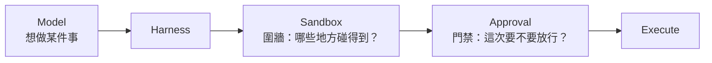

### Sandbox 像圍牆

它回答：

> **技術上允許碰哪些資源？**

例如：

- 能不能寫 workspace？
- 能不能讀 workspace 外的路徑？
- 能不能開 process？
- 能不能使用 network？

### Approval 像門禁

它回答：

> **這一次特定行動，要不要讓它通過？**

例如：

- 這個命令需要更高權限；
- 這次 network access 是否值得批准；
- 這個 destructive action 要不要讓 user/reviewer 決定。

## 為什麼兩個都需要？

只有 Sandbox：

```text
能做的事情一律能做
```

可能太粗。

只有 Approval：

```text
所有事情都靠人判斷
```

又可能太慢，而且 user 也可能看漏風險。

比較成熟的設計是：

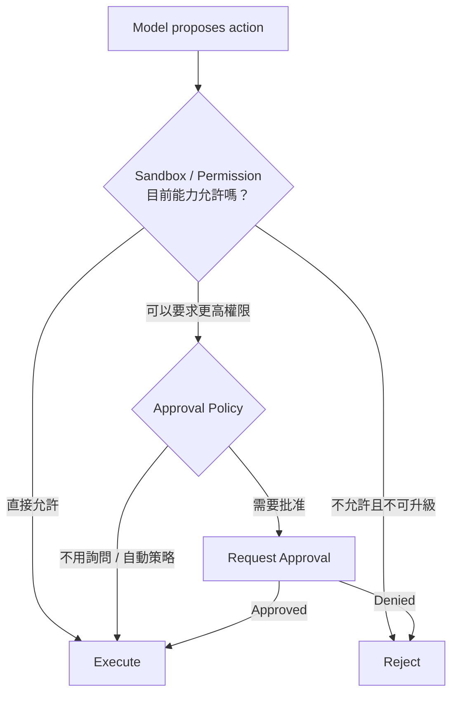

## Capability 和 Intent 要分開

這是 agent security 最重要的設計原則之一。

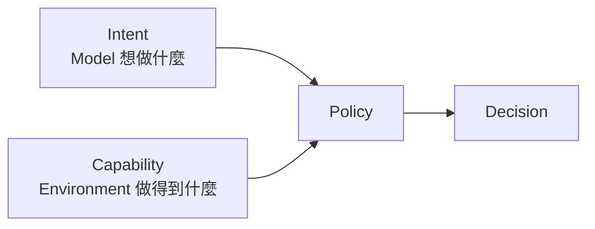

Model 有能力想到：

```text
rm -rf ...
git push --force
curl external-site
```

不代表 execution environment 必須允許。

**推理能力越強，不代表執行權限要越大。**

## 常見 Sandbox 模式怎麼理解？

概念上可以先理解成三個風險層次。

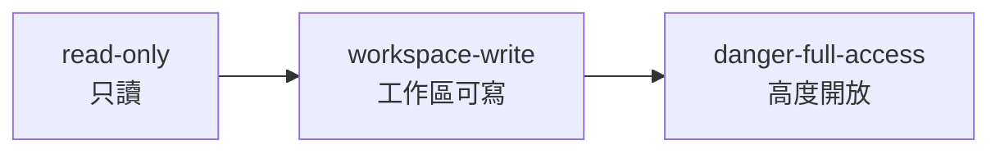

### `read-only`

適合：

- code review；
- 分析；
- repository exploration。

重點是 Agent 可以理解，但不能直接修改主要工作區。

### `workspace-write`

適合一般 coding workflow。

通常可以修改工作區，但仍不代表整個主機與網路都是 unrestricted。

### `danger-full-access`

接近高度開放 execution。

這不等於「Agent 變聰明」，只是 blast radius 變大。

> 實際 capability 仍會受到 OS、permission profiles、managed policy 等影響，不要只從模式名稱推測全部細節。

## Prompt、Sandbox、Approval 三者完全不同

這是最常見的混淆之一。

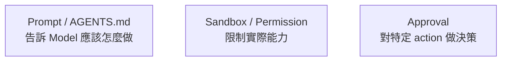

例如你在 AGENTS.md 寫：

```md
永遠不要讀 ~/.ssh
```

這是一個 instruction。

它的意思是：

> Model 應該不要這麼做。

但真正強安全保證應該是：

> Execution layer 根本無法取得 `~/.ssh`。

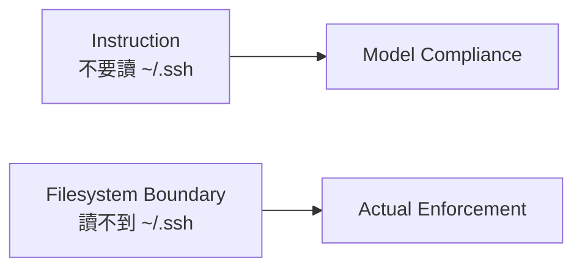

**Guidance 和 Enforcement 不能混為一談。**

## Approval 不是「所有危險事都問人」

好的 approval system 不應該一直跳出毫無資訊的：

```text
Allow? [y/N]
```

Reviewer 應該看得懂：

- 要做什麼；
- 為什麼需要；
- 影響哪些資源；
- 是否碰 network；
- 是否使用 secret；
- 是否 destructive；
- 拒絕後有沒有替代方案。

概念上：

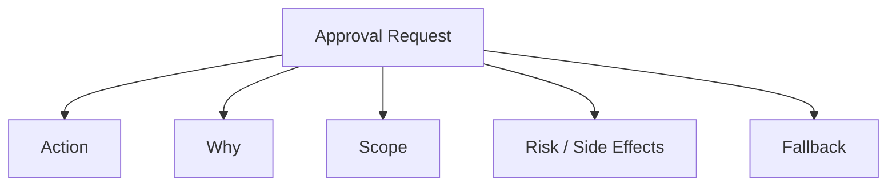

Approval UX 本身就是 security design 的一部分。

## Interactive 和 CI 的安全模型不同

### Interactive

User 在場，可以：

```text
Agent → Ask Approval → User Decides → Continue
```

### CI

CI 通常不能停下來等人按按鈕。

所以更適合：

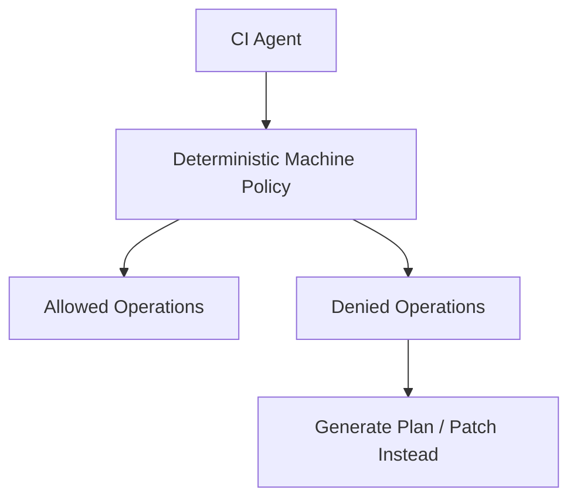

CI 的設計原則通常是：

- 給最小且足夠的 permission；
- 不需要的 network 關掉；
- destructive action 改成輸出 plan / patch；
- 或交給專門 reviewer / policy layer。

不要把「模擬人工按 Yes」當成 CI 安全策略。

## MCP 是非常重要的例外

本地 shell 的 sandbox，不代表所有 MCP 工具都自動被同一個 sandbox 包住。

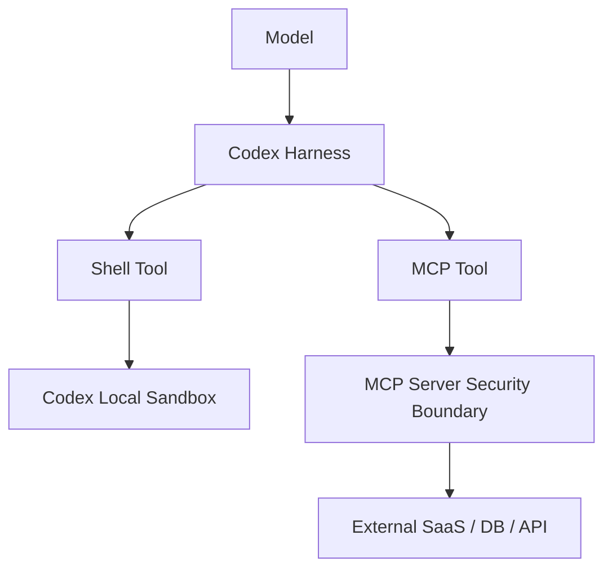

例如某個 MCP tool 可以：

- 寫 GitHub；
- 改資料庫；
- 發 Slack；
- 部署 cloud resources。

它的真正權限取決於：

- MCP server 自身；
- OAuth / API token；
- IAM；
- tool implementation；
- remote service policy。

不是只看 Codex shell 顯示什麼 sandbox mode。

## Trust Boundary 要重新畫

每新增一個外部 Tool，都應該問：

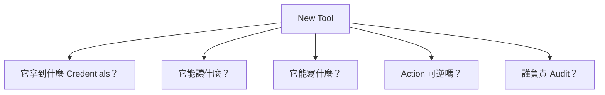

這也是為什麼「接上 MCP」不是只有增加功能，也等於新增一條 security boundary。

## Secret Scope 應該比 Filesystem Scope 更窄

假設 Agent 可以寫整個 workspace，不代表它需要：

```text
AWS Admin Key
Production DB Superuser
GitHub Org Owner Token
```

更好的設計是：

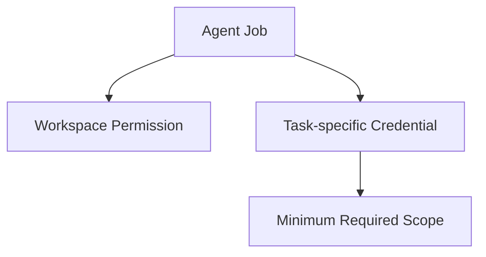

Credential 應該依：

- tool；
- task；
- environment；
- duration

做最小化。

## 一個完整的安全判斷流程

把前面的概念組起來：

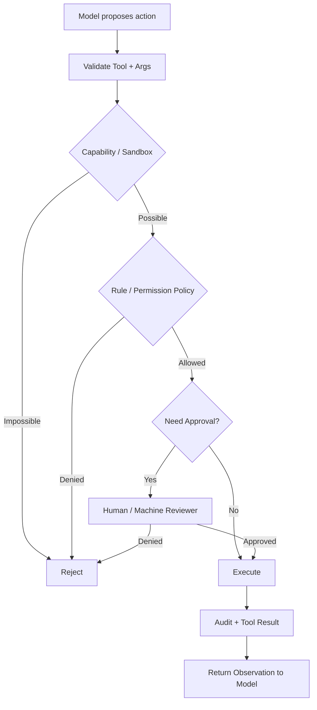

這才是一個比較接近 production 的心智模型。

## Production 原則

1. **Default deny，逐步開 capability。**
2. **把 read / write / network / external side effects 分開。**
3. **Prompt 是 guidance，不是 security boundary。**
4. **Approval 不是 sandbox 的替代品。**
5. **CI 優先使用 deterministic machine policy。**
6. **每個外部 Tool 都重新做 trust-boundary analysis。**
7. **Secret scope 應該比 filesystem scope 更窄。**
8. **高風險 action 應該可 audit、可追蹤、最好可回復。**

## 常見誤解

### 誤解 1：Sandbox 就是「Model 不會做壞事」

不是。Sandbox 限制的是 capability，不是思想。

### 誤解 2：有 Approval 就安全了

不是。User 可能誤按，而且不是所有風險都適合逐次人工判斷。

### 誤解 3：AGENTS.md 可以取代 Permission

不能。AGENTS.md 是 instruction，不是強制執行邊界。

### 誤解 4：Codex Sandbox 自動保護所有 MCP

不能這樣假設。MCP 有自己的 execution 與 credential boundary。

## 本章只要記住

1. **Sandbox = 能力邊界。**
2. **Approval = 特定 action 是否獲准。**
3. **Prompt = Guidance，不等於 Enforcement。**
4. **Model 想做什麼和 Environment 能做什麼必須分離。**
5. **每增加一個外部 Tool，就等於新增一條 Trust Boundary。**

接下來的 permission、rules、network 章節，就是把這套模型再細分。

## 來源

- [Sandboxing](https://learn.chatgpt.com/docs/sandboxing)
- [Permissions](https://learn.chatgpt.com/docs/permissions)
- [Agent loop: sandbox boundary](https://openai.com/index/unrolling-the-codex-agent-loop/)
