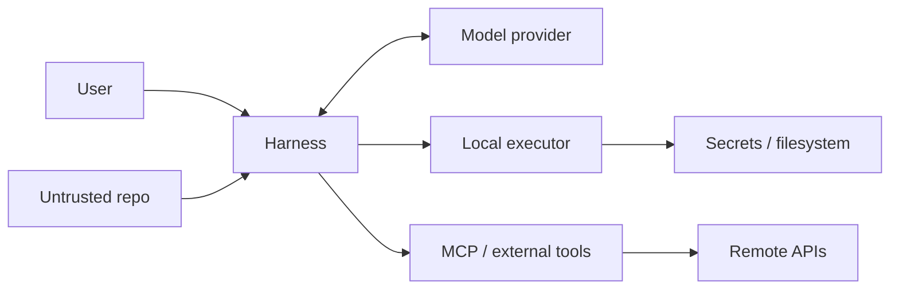

# Trust Boundaries 與常見安全誤區

安全設計最實用的方法不是背設定，而是畫 trust boundary。Codex harness 至少同時接觸 user、repository、model、local machine、MCP servers、network services、CI secrets。

每條箭頭都有不同 threat model。

## 誤區 1：模型是「可信程式」

模型輸出是 probabilistic。即使它通常遵守 instructions，也不能拿來當 authorization engine。

正確分工：

- Model：提出 action + rationale。
- Deterministic policy：判斷 capability。
- Reviewer：處理需要語意判斷的例外。

## 誤區 2：Repository 是可信資料

Repo 可能包含：

- prompt injection 文字；
- 惡意 AGENTS.md；
- package scripts；
- test fixture 中的欺騙指示；
- hooks/config；
- shell script。

Agent 「讀到一句叫它上傳 secret 的 README」不代表應該照做。Harness 必須維持來源/角色區隔，execution policy 也不能被 repository prose 改寫。

## 誤區 3：Hook 就是 Security Boundary

Hooks 很適合：

- block 常見危險 action；
- rewrite tool input；
- 加 context；
- audit；
- integration workflow。

但官方文件也把 hooks 定位成 guardrail，而非完整 enforcement boundary。原因很簡單：不是所有 hosted action 都一定走同一 hook path，而且 hook 本身也是程式碼。

真正不可跨越的限制要落在 sandbox / permission / OS / remote service IAM。

## 誤區 4：MCP 受到本地 Sandbox 完整保護

不一定。MCP server 可能拿著 GitHub、Slack、DB、cloud token；它的作用域由 server credentials 與 remote API 決定。

所以每個 MCP server 都要問：

1. 它能列出哪些 tools？
2. 每個 tool 有沒有 side effect？
3. credential scope 是 read-only 還是 admin？
4. server 在哪裡執行？
5. 是否需要二次 approval？
6. tool output 是否可能包含敏感資料？

## 誤區 5：CI Secret 放 env 就安全

如果 agent 可以執行 repo-controlled shell，那 environment secret 可能被任意 script 讀到。Codex non-interactive 文件也提醒不要在不受信任 repo code 可讀取的 job-level environment 中暴露 API key。

更好的方式：

- secret 只注入必要 step/process；
- 使用 short-lived credential；
- network allowlist；
- read-only token；
- release/prod action 使用另一個明確 gate。

## 誤區 6：Approval Fatigue 沒關係

如果每個 `git status` 都問一次，使用者很快會無腦按 Allow。安全 UX 應把低風險 action deterministic allow，把高風險 action 留給真正有資訊價值的 approval。

## Threat-model checklist

部署自製 harness 前至少回答：

- 模型能碰哪些檔案？
- 哪些 path 永遠不可讀？
- 哪些 path 可寫？
- 是否可執行任意 binary？
- network default deny 還是 allow？
- 有哪些 credentials？
- MCP tools 的 IAM scope？
- user 是否看得到完整 action？
- tool output 是否會被持久化？
- transcript 是否包含秘密？
- fork/subagent 是否繼承權限？
- CI retry 會不會重複副作用？

## 來源

- [Hooks](https://learn.chatgpt.com/docs/hooks)
- [Sandboxing](https://learn.chatgpt.com/docs/sandboxing)
- [Permissions](https://learn.chatgpt.com/docs/permissions)
- [Non-interactive mode](https://learn.chatgpt.com/docs/non-interactive-mode)
