# Codex CLI：Interactive Harness

Codex CLI 不只是「在終端機輸入 Prompt」。

更準確地說，它是：

> **讓人直接操作 Codex Harness 的互動式 Client。**

它把 Model、Tools、Approvals、Diff、Steering、Thread Lifecycle 都包成一個人可以操作的介面。

## 先看 CLI 在整體架構的位置

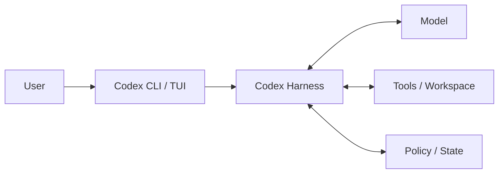

所以 CLI 是 **Client Surface**，不是整個 Codex Harness 本身。

## 什麼情況最適合 Interactive CLI？

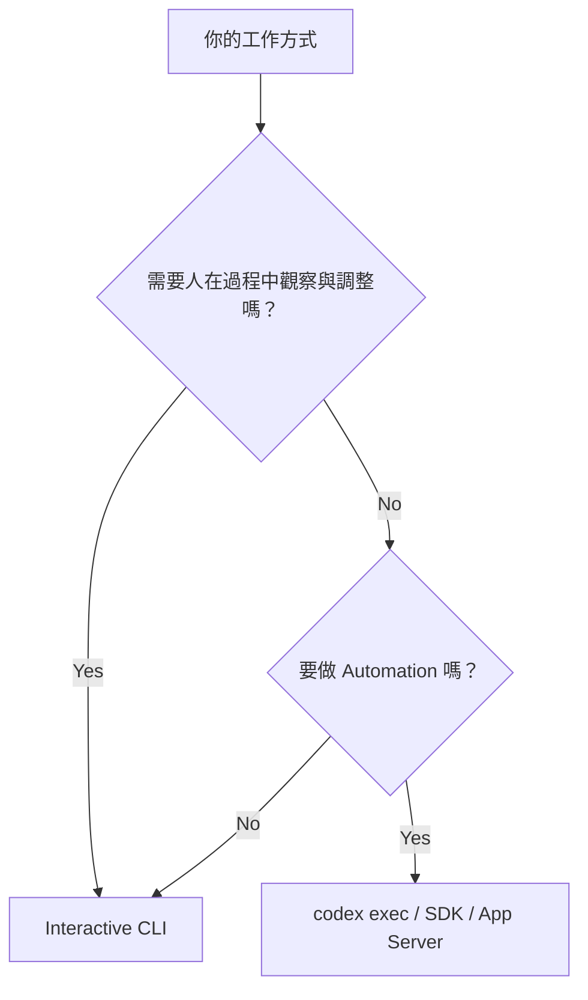

CLI 特別適合：

- 探索陌生 repository；
- 邊看 Agent 做事邊補充要求；
- 需要 approval 的工作；
- 一次性的 debugging / refactor；
- 人機共同決策。

如果是 deterministic automation，通常應考慮 `codex exec`、SDK 或 App Server。

## 啟動位置不是小事

最常見的操作：

```bash
cd my-repo
codex
```

這個 `cd` 其實會影響 Harness 看待專案的方式。

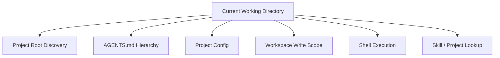

所以如果 Codex 行為奇怪，先確認自己是不是從正確目錄啟動。

## 安裝與登入

安裝方式與登入介面可能隨版本調整，請以官方文件為準。

常見登入方式包括：

- ChatGPT account；
- API / Provider 設定。

真正需要理解的是：登入只解決「你是誰 / Model Provider 怎麼授權」，不代表 repository permission、sandbox、MCP credential 都自動相同。

## 不要先背所有 Flags

使用 CLI 時，先建立三層設定心智模型：

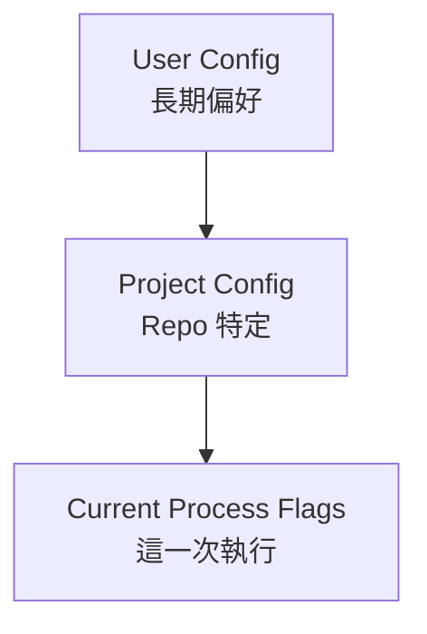

遇到行為不符預期，先找「真正生效的設定來源」，而不是只檢查一份 TOML。

## Prompt 最重要的是 Outcome + Constraints + Verification

一個好任務描述，不需要寫成長篇 Prompt Engineering。

只要回答三題：

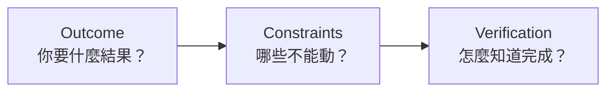

### 太模糊

```text
幫我改 auth
```

### 更可執行

```text
找出登入後偶發 401 的原因。
先重現並確認 session refresh 流程。
不要更換 auth library，只修改必要檔案。
完成後跑相關 unit / integration tests，
最後列出根因、修改與尚未驗證的風險。
```

這會讓 Agent Loop 更容易收斂。

## 一個推薦的 Interactive Workflow

對大部分 repository 任務，可以先用這個節奏：

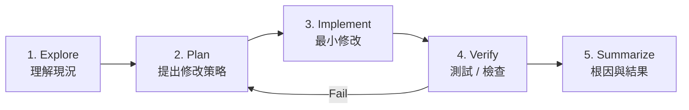

這比「一開始就叫 Agent 全部改掉」更可控。

## 高風險任務：先 Research 再 Write

如果 repository 風險高，可以刻意拆兩階段。

### 第一階段

```text
先只分析，不修改。
找出可能根因、涉及檔案、風險與修改計畫。
```

### 第二階段

確認方向後再：

```text
依計畫實作，完成後跑指定驗證。
```

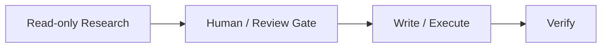

這是一種很實用的人機 guardrail。

## Steering：不用等 Agent 停下來

Interactive Harness 的價值之一，是工作進行中可以補充限制。

例如：

```text
先不要改 migration，改從 repository layer 解。
```

概念上：

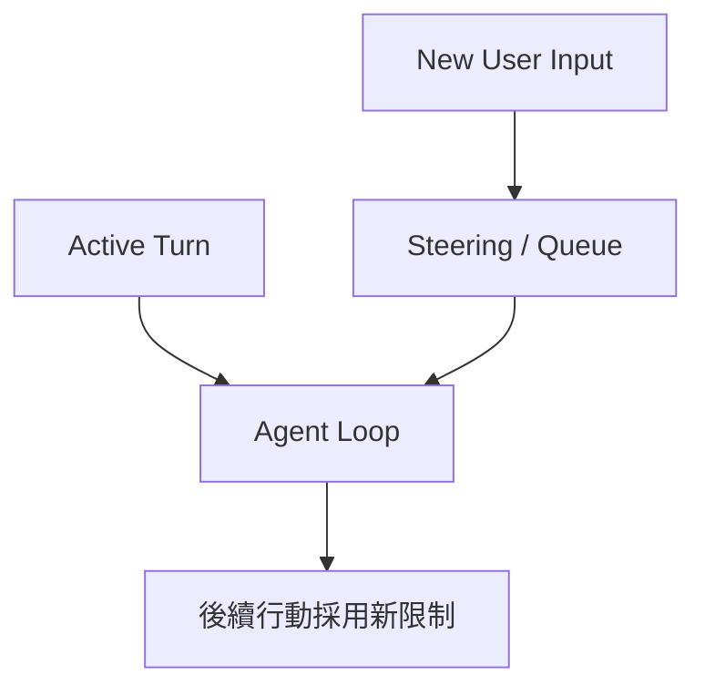

這比「整個任務跑完再重來」有效率。

## 什麼時候該繼續原 Thread？

適合延續：

- 同一 feature 的後續修改；
- 剛做完 exploration，現在要 implementation；
- 需要保留已驗證 assumptions。

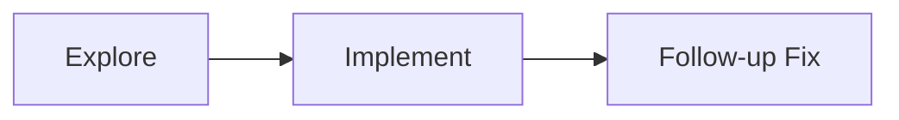

這些資訊高度相關，保留 Thread 很有價值。

## 什麼時候該開新 Thread？

適合新開：

- 任務目標完全改變；
- 舊 Thread 累積大量無關 Context；
- 想避免舊假設污染；
- 想從共同歷史 Fork 另一種方案。

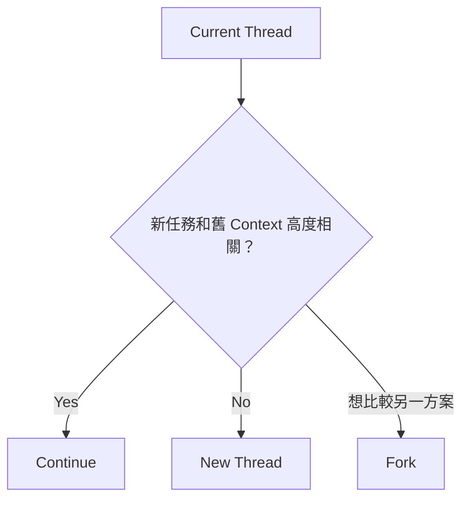

## CLI 顯示的 Progress 從哪裡來？

你看到的：

```text
Searching...
Running command...
Editing file...
Waiting for approval...
```

不是 Model 一次輸出完整文字，而是 Harness 內部 Item / Event Lifecycle 被 CLI 呈現出來。

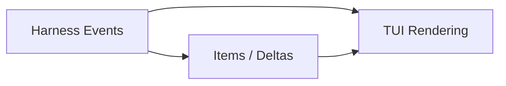

這也是為什麼自動化不要去解析 Terminal 畫面。

## CLI 是 UI，不是 Machine API

錯誤方向：

```bash
expect codex
# scrape terminal text
```

因為 UI 文案可以改，格式也不一定是穩定 contract。

如果要 machine integration：

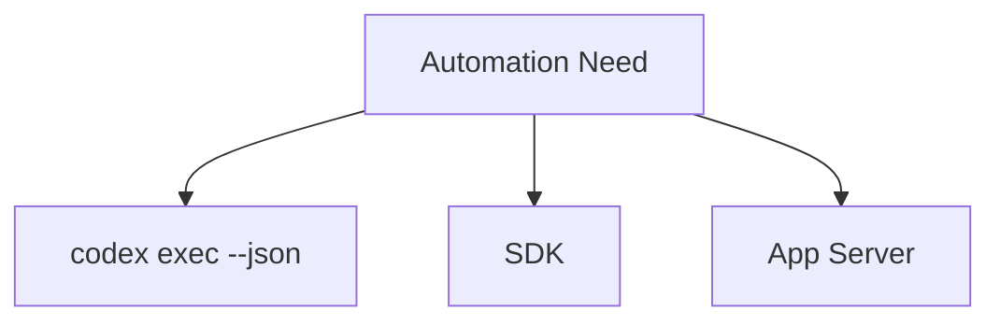

使用 structured events，而不是 terminal scraping。

## 一個實際選擇表

| 情境 | 建議入口 |
|---|---|
| 人在場、邊做邊調整 | Interactive CLI |
| 一次性 script / CI task | `codex exec` |
| 程式內直接控制 | SDK |
| 自製 Rich UI / IDE integration | App Server |

## 常見誤解

### 誤解 1：CLI 就是 Codex 本體

不是。CLI 是 Client Surface。

### 誤解 2：Prompt 越長越好

不是。Outcome、Constraints、Verification 清楚通常更重要。

### 誤解 3：同一個 Thread 永遠延續最好

不是。無關 Context 會造成污染。

### 誤解 4：Automation 可以解析 CLI 輸出

不建議。應使用 structured machine interface。

## 本章只要記住

1. **CLI 是 Interactive Harness Client。**
2. **CWD 會影響 Project Context 與 Execution Scope。**
3. **Prompt 優先講清楚 Outcome、Constraints、Verification。**
4. **高風險工作可以先 Research，再 Write。**
5. **要 Automation 時改用 structured interface，不要 scrape UI。**

## 來源

- [Codex CLI](https://learn.chatgpt.com/docs/codex/cli)
- [Configuration](https://learn.chatgpt.com/docs/config-file/config-basic)
