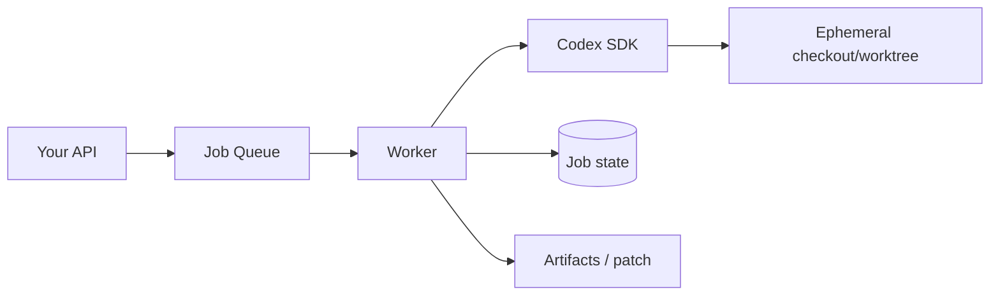

# Codex SDK：程式化使用 Harness

SDK 適合在應用程式內啟動與延續 Codex task，又不想直接處理 App Server 的完整 protocol。

## TypeScript 最小範例

```ts
import {Codex} from '@openai/codex-sdk';

const codex = new Codex();
const thread = codex.startThread();

const result = await thread.run(
  'Inspect the repository and explain the authentication flow.'
);

console.log(result.finalResponse);
```

實際 package API 會演進，請以當前 SDK 文件與 typings 為準。

## SDK 與直接 OpenAI API 的差別

如果你直接呼叫 model API：

```text
你要自己做 context、tools、shell、sandbox、history、agent loop...
```

如果你用 Codex SDK：

```text
你是在程式中消費 Codex harness，而不是重新打造它。
```

這是兩個完全不同的工程量。

## 何時 SDK 夠用

- internal developer tool；
- batch code analysis；
- web backend 觸發一次 Codex 工作；
- 自動產生 migration plan；
- repository assistant；
- 不需要完整自製 Codex UI。

## 何時改用 App Server

如果你需要：

- 每一個 item/delta 的 rich UI；
- approvals UI；
- thread list/fork/resume semantics；
- model/config/auth management；
- protocol-level experimental features；
- 多 client connection；

App Server 會更適合。

## 把 SDK 包在 Job System

Production pattern：



不要讓 HTTP request 長時間同步等待 agent。雖然本 ChatGPT 回覆不能替你做 background work，但在你自己的 production architecture 中，coding agent 任務本來就適合由 job worker 管理長生命周期。

## Idempotency

Job retry 時要先知道：

- repo checkout 是否全新？
- 前一次是否已 push commit？
- external MCP 是否已建立 issue/PR？
- output artifact 是否已存在？

SDK 讓你比較容易啟動 harness，但 side-effect idempotency 仍是你應用層責任。

## 來源

- [Codex SDK](https://learn.chatgpt.com/docs/codex-sdk)
